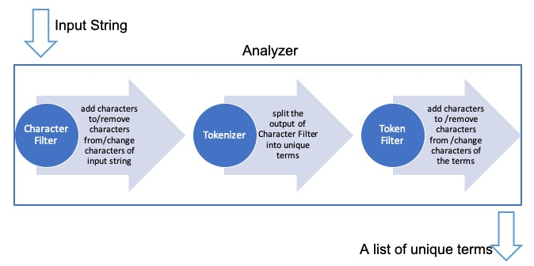

# Learning ES
## Installation
```shell
docker pull elasticsearch:7.10.1

docker run --name elasticsearch -p 9200:9200 -p 9300:9300  -e "discovery.type=single-node" -e ES_JAVA_OPTS="-Xms256m -Xmx512m" -d elasticsearch:7.10.1

http://localhost:9200/
```


Please use docker compose version.


## Index

### Index aliases

The index aliases API allows you to create another name for an index or multiple indices and then use it as an alternative name in an index operation. The alias APIs give us flexibility in the following aspects:

- Re-indexing with zero downtime
- Grouping multiple indices
- Views on a subset of documents


### Reindexing with zero downtime                   

 It is recommended to use aliases instead of indices in production. Since your current index design may not be perfect, you'll need to reindex later. For example, some fields of the documents have changed. By using an alias, you can transparently switch your application from using the old index to the new index without downtime. 


# Analyzer

