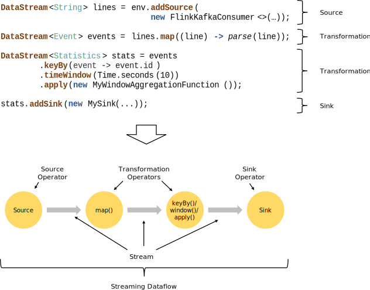

# Flink

## Fraud Detection with the DataStream API

https://ci.apache.org/projects/flink/flink-docs-release-1.12/try-flink/datastream_api.html

The most basic type of state in Flink is [ValueState](https://ci.apache.org/projects/flink/flink-docs-release-1.12/dev/stream/state/state.html#using-managed-keyed-state), a data type that adds fault tolerance to any variable it wraps. `ValueState` is a form of *keyed state*, meaning it is only available in operators that are applied in a *keyed context*; any operator immediately following `DataStream#keyBy`. 


 Flink’s `**KeyedProcessFunction**` allows you to set timers which invoke a callback method at some point in time in the future.

```java
package spendreport;

import org.apache.flink.api.common.state.ValueState;
import org.apache.flink.api.common.state.ValueStateDescriptor;
import org.apache.flink.api.common.typeinfo.Types;
import org.apache.flink.configuration.Configuration;
import org.apache.flink.streaming.api.functions.KeyedProcessFunction;
import org.apache.flink.util.Collector;
import org.apache.flink.walkthrough.common.entity.Alert;
import org.apache.flink.walkthrough.common.entity.Transaction;

public class FraudDetector extends KeyedProcessFunction<Long, Transaction, Alert> {

    private static final long serialVersionUID = 1L;

    private static final double SMALL_AMOUNT = 1.00;
    private static final double LARGE_AMOUNT = 500.00;
    private static final long ONE_MINUTE = 60 * 1000;

    private transient ValueState<Boolean> flagState;
    private transient ValueState<Long> timerState;

    @Override
    public void open(Configuration parameters) {
        ValueStateDescriptor<Boolean> flagDescriptor = new ValueStateDescriptor<>(
                "flag",
                Types.BOOLEAN);
        flagState = getRuntimeContext().getState(flagDescriptor);

        ValueStateDescriptor<Long> timerDescriptor = new ValueStateDescriptor<>(
                "timer-state",
                Types.LONG);
        timerState = getRuntimeContext().getState(timerDescriptor);
    }

    @Override
    public void processElement(
            Transaction transaction,
            Context context,
            Collector<Alert> collector) throws Exception {

        // Get the current state for the current key
        Boolean lastTransactionWasSmall = flagState.value();

        // Check if the flag is set
        if (lastTransactionWasSmall != null) {
            if (transaction.getAmount() > LARGE_AMOUNT) {
                //Output an alert downstream
                Alert alert = new Alert();
                alert.setId(transaction.getAccountId());

                collector.collect(alert);
            }
            // Clean up our state
            cleanUp(context);
        }

        if (transaction.getAmount() < SMALL_AMOUNT) {
            // set the flag to true
            flagState.update(true);

            long timer = context.timerService().currentProcessingTime() + ONE_MINUTE;
            context.timerService().registerProcessingTimeTimer(timer);

            timerState.update(timer);
        }
    }

    @Override
    public void onTimer(long timestamp, OnTimerContext ctx, Collector<Alert> out) {
        // remove flag after 1 minute
        timerState.clear();
        flagState.clear();
    }

    private void cleanUp(Context ctx) throws Exception {
        // delete timer
        Long timer = timerState.value();
        ctx.timerService().deleteProcessingTimeTimer(timer);

        // clean up all state
        timerState.clear();
        flagState.clear();
    }
}
```


## Stream Processing





# Intro to the DataStream API

The DataStream API calls made in your application build a job graph that is attached to the `StreamExecutionEnvironment`. When `env.execute()` is called this graph is packaged up and sent to the JobManager, which parallelizes the job and distributes slices of it to the Task Managers for execution. Each parallel slice of your job will be executed in a *task slot*.


# Data Pipelines & ETL


A `MapFunction` is suitable only when performing a one-to-one transformation. With the `Collector` provided in this interface, the `flatmap()` method can emit as many stream elements as you like, including none at all.

### Aggregations on Keyed Streams


```java
import org.joda.time.Interval;

DataStream<Tuple2<Integer, Minutes>> minutesByStartCell = enrichedNYCRides
    .flatMap(new FlatMapFunction<EnrichedRide, Tuple2<Integer, Minutes>>() {

        @Override
        public void flatMap(EnrichedRide ride,
                            Collector<Tuple2<Integer, Minutes>> out) throws Exception {
            if (!ride.isStart) {
                Interval rideInterval = new Interval(ride.startTime, ride.endTime);
                Minutes duration = rideInterval.toDuration().toStandardMinutes();
                out.collect(new Tuple2<>(ride.startCell, duration));
            }
        }
    });

minutesByStartCell
  .keyBy(value -> value.f0) // .keyBy(value -> value.startCell)
  .maxBy(1) // duration
  .print();
```


### Rich Functions

**Rich functions can have keyed states**.

- `open(Configuration c)`
- `close()`
- `getRuntimeContext()`

```java
public static class Deduplicator extends RichFlatMapFunction<Event, Event> {
    ValueState<Boolean> keyHasBeenSeen;

    @Override
    public void open(Configuration conf) {
        ValueStateDescriptor<Boolean> desc = new ValueStateDescriptor<>("keyHasBeenSeen", Types.BOOLEAN);
        keyHasBeenSeen = getRuntimeContext().getState(desc);
    }

    @Override
    public void flatMap(Event event, Collector<Event> out) throws Exception {
        if (keyHasBeenSeen.value() == null) {
            out.collect(event);
            keyHasBeenSeen.update(true);
        }
    }
}
```


## Connected Streams


```java
public static void main(String[] args) throws Exception {
    StreamExecutionEnvironment env = StreamExecutionEnvironment.getExecutionEnvironment();

    DataStream<String> control = env.fromElements("DROP", "IGNORE").keyBy(x -> x);
    DataStream<String> streamOfWords = env.fromElements("Apache", "DROP", "Flink", "IGNORE").keyBy(x -> x);
  
    control
        .connect(datastreamOfWords)
        .flatMap(new ControlFunction())
        .print();

    env.execute();
}

public static class ControlFunction extends RichCoFlatMapFunction<String, String, String> {
    private ValueState<Boolean> blocked;
      
    @Override
    public void open(Configuration config) {
        blocked = getRuntimeContext().getState(new ValueStateDescriptor<>("blocked", Boolean.class));
    }
      
    @Override
    public void flatMap1(String control_value, Collector<String> out) throws Exception {
        blocked.update(Boolean.TRUE);
    }
      
    @Override
    public void flatMap2(String data_value, Collector<String> out) throws Exception {
        if (blocked.value() == null) {
            out.collect(data_value);
        }
    }
}
```

A `RichCoFlatMapFunction` is a kind of `FlatMapFunction` that can be applied to a pair of connected streams, and it has access to the rich function interface. This means that it can be made stateful.


`flatMap1` and `flatMap2` are called by the Flink runtime with elements from each of the two connected streams – in our case, elements from the `control` stream are passed into `flatMap1`, and elements from `streamOfWords` are passed into `flatMap2`. This was determined by the order in which the two streams are connected with `control.connect(datastreamOfWords)`.

## Event Time and Watermarks

The Taxi data sources used in the hands-on exercises take care of these details for you. But in your own applications you will have to take care of this yourself, which is usually done by implementing a class that extracts the timestamps from the events, and generates watermarks on demand. The easiest way to do this is by using a `WatermarkStrategy`:

```java
DataStream<Event> stream = ...

WatermarkStrategy<Event> strategy = WatermarkStrategy
        .<Event>forBoundedOutOfOrderness(Duration.ofSeconds(20))
        .withTimestampAssigner((event, timestamp) -> event.timestamp);

DataStream<Event> withTimestampsAndWatermarks =
    stream.assignTimestampsAndWatermarks(strategy);
```


## Windows


In its basic form, you apply windowing to a keyed stream like this:

```
stream.
    .keyBy(<key selector>)
    .window(<window assigner>)
    .reduce|aggregate|process(<window function>)
```

You can also use windowing with non-keyed streams, but keep in mind that in this case, the processing will *not* be done in parallel:

```
stream.
    .windowAll(<window assigner>)
    .reduce|aggregate|process(<window function>)
```

- Tumbling time windows
  - *page views per minute*
  - `TumblingEventTimeWindows.of(Time.minutes(1))`
- Sliding time windows
  - *page views per minute computed every 10 seconds*
  - `SlidingEventTimeWindows.of(Time.minutes(1), Time.seconds(10))`
- Session windows
  - *page views per session, where sessions are defined by a gap of at least 30 minutes between sessions*
  - `EventTimeSessionWindows.withGap(Time.minutes(30))`

#### **ProcessWindowFunction** Example

```
DataStream<SensorReading> input = ...

input
    .keyBy(x -> x.key)
    .window(TumblingEventTimeWindows.of(Time.minutes(1)))
    .process(new MyWastefulMax());

public static class MyWastefulMax extends ProcessWindowFunction<
        SensorReading,                  // input type
        Tuple3<String, Long, Integer>,  // output type
        String,                         // key type
        TimeWindow> {                   // window type
    
    @Override
    public void process(
            String key,
            Context context, 
            Iterable<SensorReading> events,
            Collector<Tuple3<String, Long, Integer>> out) {

        int max = 0;
        for (SensorReading event : events) {
            max = Math.max(event.value, max);
        }
        out.collect(Tuple3.of(key, context.window().getEnd(), max));
    }
}
```


#### Incremental Aggregation Example

```
DataStream<SensorReading> input = ...

input
    .keyBy(x -> x.key)
    .window(TumblingEventTimeWindows.of(Time.minutes(1)))
    .reduce(new MyReducingMax(), new MyWindowFunction());

private static class MyReducingMax implements ReduceFunction<SensorReading> {
    public SensorReading reduce(SensorReading r1, SensorReading r2) {
        return r1.value() > r2.value() ? r1 : r2;
    }
}

private static class MyWindowFunction extends ProcessWindowFunction<
    SensorReading, Tuple3<String, Long, SensorReading>, String, TimeWindow> {

    @Override
    public void process(
            String key,
            Context context,
            Iterable<SensorReading> maxReading,
            Collector<Tuple3<String, Long, SensorReading>> out) {

        SensorReading max = maxReading.iterator().next();
        out.collect(Tuple3.of(key, context.window().getEnd(), max));
    }
}
```

Notice that the `Iterable<SensorReading>` will contain exactly one reading – the pre-aggregated maximum computed by `MyReducingMax`.


### Late Events

You can arrange for the events that would be dropped to be collected to an alternate output stream instead, using a mechanism called [Side Outputs](https://ci.apache.org/projects/flink/flink-docs-release-1.12/learn-flink/event_driven.html#side-outputs). Here is an example of what that might look like:

```
OutputTag<Event> lateTag = new OutputTag<Event>("late"){};

SingleOutputStreamOperator<Event> result = stream.
    .keyBy(...)
    .window(...)
    .sideOutputLateData(lateTag)
    .process(...);
  
DataStream<Event> lateStream = result.getSideOutput(lateTag);
```

By default the allowed lateness is 0. In other words, elements behind the watermark are dropped (or sent to the side output).

For example:

```
stream.
    .keyBy(...)
    .window(...)
    .allowedLateness(Time.seconds(10))
    .process(...);
```

When the allowed lateness is greater than zero, only those events that are so late that they would be dropped are sent to the side output (if it has been configured).


#### Windows Can Follow Windows

For example, it works to do this:

```
stream
    .keyBy(t -> t.key)
    .window(<window assigner>)
    .reduce(<reduce function>)
    .windowAll(<same window assigner>)
    .reduce(<same reduce function>)
```

You might expect Flink’s runtime to be smart enough to do this parallel pre-aggregation for you (provided you are using a ReduceFunction or AggregateFunction), but it’s not.


#### Late Events Can Cause Late Merges

**Session windows** are based on an abstraction of windows that can *merge*. Each element is initially assigned to a new window, after which windows are merged whenever the gap between them is small enough. In this way, a late event can bridge the gap separating two previously separate sessions, producing a late merge.

# Event-driven Applications

```java
KeyedProcessFunction
```

```java
// Compute the sum of the tips for each driver in hour-long windows.
// The keys are driverIds.
public static class PseudoWindow extends 
        KeyedProcessFunction<Long, TaxiFare, Tuple3<Long, Long, Float>> {

    private final long durationMsec;

    public PseudoWindow(Time duration) {
        this.durationMsec = duration.toMilliseconds();
    }

    @Override
    // Called once during initialization.
    public void open(Configuration conf) {
        . . .
    }

    @Override
    // Called as each fare arrives to be processed.
    public void processElement(
            TaxiFare fare,
            Context ctx,
            Collector<Tuple3<Long, Long, Float>> out) throws Exception {

        long eventTime = fare.getEventTime();
        TimerService timerService = ctx.timerService();

        if (eventTime <= timerService.currentWatermark()) {
            // This event is late; its window has already been triggered.
        } else {
            // Round up eventTime to the end of the window containing this event.
            long endOfWindow = (eventTime - (eventTime % durationMsec) + durationMsec - 1);

            // Schedule a callback for when the window has been completed.
            timerService.registerEventTimeTimer(endOfWindow);

            // Add this fare's tip to the running total for that window.
            Float sum = sumOfTips.get(endOfWindow);
            if (sum == null) {
                sum = 0.0F;
            }
            sum += fare.tip;
            sumOfTips.put(endOfWindow, sum);
        }
    }

    @Override
    // Called when the current watermark indicates that a window is now complete.
    public void onTimer(long timestamp, 
            OnTimerContext context, 
            Collector<Tuple3<Long, Long, Float>> out) throws Exception {

        . . .
    }
}
```

In this example you have seen how a `ProcessFunction` can be used to reimplement a straightforward time window. Of course, if Flink’s built-in windowing API meets your needs, by all means, go ahead and use it. But if you find yourself considering doing something contorted with Flink’s windows, don’t be afraid to roll your own.


Another common use case for ProcessFunctions is for expiring stale state. If you think back to the [Rides and Fares Exercise](https://github.com/apache/flink-training/tree/release-1.12/rides-and-fares), where a `RichCoFlatMapFunction` is used to compute a simple join, the sample solution assumes that the TaxiRides and TaxiFares are perfectly matched, one-to-one for each `rideId`. If an event is lost, the other event for the same `rideId` will be held in state forever. **This could instead be implemented as a `KeyedCoProcessFunction`, and a timer could be used to detect and clear any stale state**.


# Stateful Stream Processing


## Keyed State

Keyed State is further organized into so-called *Key Groups*. Key Groups are the atomic unit by which Flink can redistribute Keyed State; there are exactly as many Key Groups as the defined maximum parallelism. During execution each parallel instance of a keyed operator works with the keys for one or more Key Groups.


## State Persistence


Flink implements fault tolerance using a combination of **stream replay** and **checkpointing**.

By default, checkpointing is disabled. See [Checkpointing](https://ci.apache.org/projects/flink/flink-docs-release-1.12/dev/stream/state/checkpointing.html) for details on how to enable and configure checkpointing.

For this mechanism to realize its full guarantees, the data stream source (such as message queue or broker) needs to be able to rewind the stream to a defined recent point. [Apache Kafka](http://kafka.apache.org/) has this ability and Flink’s connector to Kafka exploits this. See [Fault Tolerance Guarantees of Data Sources and Sinks](https://ci.apache.org/projects/flink/flink-docs-release-1.12/dev/connectors/guarantees.html) for more information about the guarantees provided by Flink’s connectors.

Because Flink’s checkpoints are realized through distributed snapshots, we use the words *snapshot* and *checkpoint* interchangeably. Often we also use the term *snapshot* to mean either *checkpoint* or *savepoint*.


### Checkpointing

Keep in mind that everything to do with checkpointing can be done asynchronously. The checkpoint barriers don’t travel in lock step and operations can asynchronously snapshot their state.

Each barrier carries the ID of the snapshot whose records it pushed in front of it. Barriers do not interrupt the flow of the stream and are hence very lightweight. Multiple barriers from different snapshots can be in the stream at the same time, which means that various snapshots may happen concurrently.


in Apache Kafka, this position would be the last record’s offset in the partition. This position *Sn* is reported to the *checkpoint coordinator* (Flink’s JobManager).


#### Snapshotting Operator State

When operators contain any form of *state*, this state must be part of the snapshots as well.

Because the state of a snapshot may be large, it is stored in a configurable *[state backend](https://ci.apache.org/projects/flink/flink-docs-release-1.12/ops/state/state_backends.html)*. By default, this is the JobManager’s memory, but for production use a distributed reliable storage should be configured (such as HDFS). After the state has been stored, the operator acknowledges the checkpoint, emits the snapshot barrier into the output streams, and proceeds.

The resulting snapshot now contains:

- For each parallel stream data source, the offset/position in the stream when the snapshot was started
- For each operator, a pointer to the state that was stored as part of the snapshot


#### Recovery

Recovery under this mechanism is straightforward: Upon a failure, Flink selects the latest completed checkpoint *k*. The system then re-deploys the entire distributed dataflow, and gives each operator the state that was snapshotted as part of checkpoint *k*. The sources are set to start reading the stream from position *Sk*. For example in Apache Kafka, that means telling the consumer to start fetching from offset *Sk*.

If state was snapshotted incrementally, the operators start with the state of the latest full snapshot and then apply a series of incremental snapshot updates to that state.


Savepoints are similar to checkpoints except that they are **triggered by the user** and **don’t automatically expire** when newer checkpoints are completed.


## State and Fault Tolerance in Batch Programs

Flink executes [batch programs](https://ci.apache.org/projects/flink/flink-docs-release-1.12/dev/batch/) as a special case of streaming programs, where the streams are bounded (finite number of elements). A *DataSet* is treated internally as a stream of data. The concepts above thus apply to batch programs in the same way as well as they apply to streaming programs, with minor exceptions:

- [Fault tolerance for batch programs](https://ci.apache.org/projects/flink/flink-docs-release-1.12/dev/task_failure_recovery.html) does not use checkpointing. Recovery happens by fully replaying the streams. That is possible, because inputs are bounded. This pushes the cost more towards the recovery, but makes the regular processing cheaper, because it avoids checkpoints.
- Stateful operations in the DataSet API use simplified in-memory/out-of-core data structures, rather than key/value indexes.
- The DataSet API introduces special synchronized (superstep-based) iterations, which are only possible on bounded streams. For details, check out the [iteration docs](https://ci.apache.org/projects/flink/flink-docs-release-1.12/dev/batch/iterations.html).

