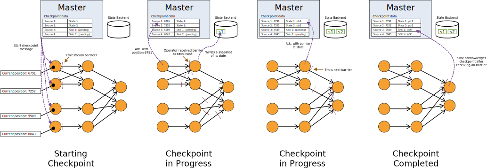
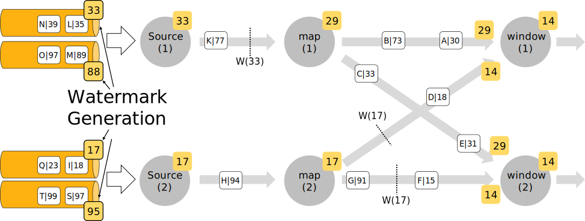

# Flink

## Fraud Detection with the DataStream API

https://ci.apache.org/projects/flink/flink-docs-release-1.12/try-flink/datastream_api.html

The most basic type of state in Flink is [ValueState](https://ci.apache.org/projects/flink/flink-docs-release-1.12/dev/stream/state/state.html#using-managed-keyed-state), a data type that adds fault tolerance to any variable it wraps. `ValueState` is a form of *keyed state*, meaning it is only available in operators that are applied in a *keyed context*; any operator immediately following `DataStream#keyBy`. 


 Flink’s `**KeyedProcessFunction**` allows you to set timers which invoke a callback method at some point in time in the future.

```java
package spendreport;

import org.apache.flink.api.common.state.ValueState;
import org.apache.flink.api.common.state.ValueStateDescriptor;
import org.apache.flink.api.common.typeinfo.Types;
import org.apache.flink.configuration.Configuration;
import org.apache.flink.streaming.api.functions.KeyedProcessFunction;
import org.apache.flink.util.Collector;
import org.apache.flink.walkthrough.common.entity.Alert;
import org.apache.flink.walkthrough.common.entity.Transaction;

public class FraudDetector extends KeyedProcessFunction<Long, Transaction, Alert> {

    private static final long serialVersionUID = 1L;

    private static final double SMALL_AMOUNT = 1.00;
    private static final double LARGE_AMOUNT = 500.00;
    private static final long ONE_MINUTE = 60 * 1000;

    private transient ValueState<Boolean> flagState;
    private transient ValueState<Long> timerState;

    @Override
    public void open(Configuration parameters) {
        ValueStateDescriptor<Boolean> flagDescriptor = new ValueStateDescriptor<>(
                "flag",
                Types.BOOLEAN);
        flagState = getRuntimeContext().getState(flagDescriptor);

        ValueStateDescriptor<Long> timerDescriptor = new ValueStateDescriptor<>(
                "timer-state",
                Types.LONG);
        timerState = getRuntimeContext().getState(timerDescriptor);
    }

    @Override
    public void processElement(
            Transaction transaction,
            Context context,
            Collector<Alert> collector) throws Exception {

        // Get the current state for the current key
        Boolean lastTransactionWasSmall = flagState.value();

        // Check if the flag is set
        if (lastTransactionWasSmall != null) {
            if (transaction.getAmount() > LARGE_AMOUNT) {
                //Output an alert downstream
                Alert alert = new Alert();
                alert.setId(transaction.getAccountId());

                collector.collect(alert);
            }
            // Clean up our state
            cleanUp(context);
        }

        if (transaction.getAmount() < SMALL_AMOUNT) {
            // set the flag to true
            flagState.update(true);

            long timer = context.timerService().currentProcessingTime() + ONE_MINUTE;
            context.timerService().registerProcessingTimeTimer(timer);

            timerState.update(timer);
        }
    }

    @Override
    public void onTimer(long timestamp, OnTimerContext ctx, Collector<Alert> out) {
        // remove flag after 1 minute
        timerState.clear();
        flagState.clear();
    }

    private void cleanUp(Context ctx) throws Exception {
        // delete timer
        Long timer = timerState.value();
        ctx.timerService().deleteProcessingTimeTimer(timer);

        // clean up all state
        timerState.clear();
        flagState.clear();
    }
}
```


## Stream Processing


# Intro to the DataStream API

The DataStream API calls made in your application build a job graph that is attached to the `StreamExecutionEnvironment`. When `env.execute()` is called this graph is packaged up and sent to the JobManager, which parallelizes the job and distributes slices of it to the Task Managers for execution. Each parallel slice of your job will be executed in a *task slot*.


# Data Pipelines & ETL


A `MapFunction` is suitable only when performing a one-to-one transformation. With the `Collector` provided in this interface, the `flatmap()` method can emit as many stream elements as you like, including none at all.

### Aggregations on Keyed Streams


```java
import org.joda.time.Interval;

DataStream<Tuple2<Integer, Minutes>> minutesByStartCell = enrichedNYCRides
    .flatMap(new FlatMapFunction<EnrichedRide, Tuple2<Integer, Minutes>>() {

        @Override
        public void flatMap(EnrichedRide ride,
                            Collector<Tuple2<Integer, Minutes>> out) throws Exception {
            if (!ride.isStart) {
                Interval rideInterval = new Interval(ride.startTime, ride.endTime);
                Minutes duration = rideInterval.toDuration().toStandardMinutes();
                out.collect(new Tuple2<>(ride.startCell, duration));
            }
        }
    });

minutesByStartCell
  .keyBy(value -> value.f0) // .keyBy(value -> value.startCell)
  .maxBy(1) // duration
  .print();
```


### Rich Functions

**Rich functions can have keyed states**.

- `open(Configuration c)`
- `close()`
- `getRuntimeContext()`

```java
public static class Deduplicator extends RichFlatMapFunction<Event, Event> {
    ValueState<Boolean> keyHasBeenSeen;

    @Override
    public void open(Configuration conf) {
        ValueStateDescriptor<Boolean> desc = new ValueStateDescriptor<>("keyHasBeenSeen", Types.BOOLEAN);
        keyHasBeenSeen = getRuntimeContext().getState(desc);
    }

    @Override
    public void flatMap(Event event, Collector<Event> out) throws Exception {
        if (keyHasBeenSeen.value() == null) {
            out.collect(event);
            keyHasBeenSeen.update(true);
        }
    }
}
```


## Connected Streams


```java
public static void main(String[] args) throws Exception {
    StreamExecutionEnvironment env = StreamExecutionEnvironment.getExecutionEnvironment();

    DataStream<String> control = env.fromElements("DROP", "IGNORE").keyBy(x -> x);
    DataStream<String> streamOfWords = env.fromElements("Apache", "DROP", "Flink", "IGNORE").keyBy(x -> x);
  
    control
        .connect(datastreamOfWords)
        .flatMap(new ControlFunction())
        .print();

    env.execute();
}

public static class ControlFunction extends RichCoFlatMapFunction<String, String, String> {
    private ValueState<Boolean> blocked;
      
    @Override
    public void open(Configuration config) {
        blocked = getRuntimeContext().getState(new ValueStateDescriptor<>("blocked", Boolean.class));
    }
      
    @Override
    public void flatMap1(String control_value, Collector<String> out) throws Exception {
        blocked.update(Boolean.TRUE);
    }
      
    @Override
    public void flatMap2(String data_value, Collector<String> out) throws Exception {
        if (blocked.value() == null) {
            out.collect(data_value);
        }
    }
}
```

A `RichCoFlatMapFunction` is a kind of `FlatMapFunction` that can be applied to a pair of connected streams, and it has access to the rich function interface. This means that it can be made stateful.


`flatMap1` and `flatMap2` are called by the Flink runtime with elements from each of the two connected streams – in our case, elements from the `control` stream are passed into `flatMap1`, and elements from `streamOfWords` are passed into `flatMap2`. This was determined by the order in which the two streams are connected with `control.connect(datastreamOfWords)`.

## Event Time and Watermarks

The Taxi data sources used in the hands-on exercises take care of these details for you. But in your own applications you will have to take care of this yourself, which is usually done by implementing a class that extracts the timestamps from the events, and generates watermarks on demand. The easiest way to do this is by using a `WatermarkStrategy`:

```java
DataStream<Event> stream = ...

WatermarkStrategy<Event> strategy = WatermarkStrategy
        .<Event>forBoundedOutOfOrderness(Duration.ofSeconds(20))
        .withTimestampAssigner((event, timestamp) -> event.timestamp);

DataStream<Event> withTimestampsAndWatermarks =
    stream.assignTimestampsAndWatermarks(strategy);
```


## Windows


In its basic form, you apply windowing to a keyed stream like this:

```
stream.
    .keyBy(<key selector>)
    .window(<window assigner>)
    .reduce|aggregate|process(<window function>)
```

You can also use windowing with non-keyed streams, but keep in mind that in this case, the processing will *not* be done in parallel:

```
stream.
    .windowAll(<window assigner>)
    .reduce|aggregate|process(<window function>)
```

- Tumbling time windows
  - *page views per minute*
  - `TumblingEventTimeWindows.of(Time.minutes(1))`
- Sliding time windows
  - *page views per minute computed every 10 seconds*
  - `SlidingEventTimeWindows.of(Time.minutes(1), Time.seconds(10))`
- Session windows
  - *page views per session, where sessions are defined by a gap of at least 30 minutes between sessions*
  - `EventTimeSessionWindows.withGap(Time.minutes(30))`

#### **ProcessWindowFunction** Example

```
DataStream<SensorReading> input = ...

input
    .keyBy(x -> x.key)
    .window(TumblingEventTimeWindows.of(Time.minutes(1)))
    .process(new MyWastefulMax());

public static class MyWastefulMax extends ProcessWindowFunction<
        SensorReading,                  // input type
        Tuple3<String, Long, Integer>,  // output type
        String,                         // key type
        TimeWindow> {                   // window type
    
    @Override
    public void process(
            String key,
            Context context, 
            Iterable<SensorReading> events,
            Collector<Tuple3<String, Long, Integer>> out) {

        int max = 0;
        for (SensorReading event : events) {
            max = Math.max(event.value, max);
        }
        out.collect(Tuple3.of(key, context.window().getEnd(), max));
    }
}
```


#### Incremental Aggregation Example

```
DataStream<SensorReading> input = ...

input
    .keyBy(x -> x.key)
    .window(TumblingEventTimeWindows.of(Time.minutes(1)))
    .reduce(new MyReducingMax(), new MyWindowFunction());

private static class MyReducingMax implements ReduceFunction<SensorReading> {
    public SensorReading reduce(SensorReading r1, SensorReading r2) {
        return r1.value() > r2.value() ? r1 : r2;
    }
}

private static class MyWindowFunction extends ProcessWindowFunction<
    SensorReading, Tuple3<String, Long, SensorReading>, String, TimeWindow> {

    @Override
    public void process(
            String key,
            Context context,
            Iterable<SensorReading> maxReading,
            Collector<Tuple3<String, Long, SensorReading>> out) {

        SensorReading max = maxReading.iterator().next();
        out.collect(Tuple3.of(key, context.window().getEnd(), max));
    }
}
```

Notice that the `Iterable<SensorReading>` will contain exactly one reading – the pre-aggregated maximum computed by `MyReducingMax`.


### Late Events

You can arrange for the events that would be dropped to be collected to an alternate output stream instead, using a mechanism called [Side Outputs](https://ci.apache.org/projects/flink/flink-docs-release-1.12/learn-flink/event_driven.html#side-outputs). Here is an example of what that might look like:

```
OutputTag<Event> lateTag = new OutputTag<Event>("late"){};

SingleOutputStreamOperator<Event> result = stream.
    .keyBy(...)
    .window(...)
    .sideOutputLateData(lateTag)
    .process(...);
  
DataStream<Event> lateStream = result.getSideOutput(lateTag);
```

By default the allowed lateness is 0. In other words, elements behind the watermark are dropped (or sent to the side output).

For example:

```
stream.
    .keyBy(...)
    .window(...)
    .allowedLateness(Time.seconds(10))
    .process(...);
```

When the allowed lateness is greater than zero, only those events that are so late that they would be dropped are sent to the side output (if it has been configured).


#### Windows Can Follow Windows

For example, it works to do this:

```
stream
    .keyBy(t -> t.key)
    .window(<window assigner>)
    .reduce(<reduce function>)
    .windowAll(<same window assigner>)
    .reduce(<same reduce function>)
```

You might expect Flink’s runtime to be smart enough to do this parallel pre-aggregation for you (provided you are using a ReduceFunction or AggregateFunction), but it’s not.


#### Late Events Can Cause Late Merges

**Session windows** are based on an abstraction of windows that can *merge*. Each element is initially assigned to a new window, after which windows are merged whenever the gap between them is small enough. In this way, a late event can bridge the gap separating two previously separate sessions, producing a late merge.

# Event-driven Applications

```java
KeyedProcessFunction
```

```java
// Compute the sum of the tips for each driver in hour-long windows.
// The keys are driverIds.
public static class PseudoWindow extends 
        KeyedProcessFunction<Long, TaxiFare, Tuple3<Long, Long, Float>> {

    private final long durationMsec;

    public PseudoWindow(Time duration) {
        this.durationMsec = duration.toMilliseconds();
    }

    @Override
    // Called once during initialization.
    public void open(Configuration conf) {
        . . .
    }

    @Override
    // Called as each fare arrives to be processed.
    public void processElement(
            TaxiFare fare,
            Context ctx,
            Collector<Tuple3<Long, Long, Float>> out) throws Exception {

        long eventTime = fare.getEventTime();
        TimerService timerService = ctx.timerService();

        if (eventTime <= timerService.currentWatermark()) {
            // This event is late; its window has already been triggered.
        } else {
            // Round up eventTime to the end of the window containing this event.
            long endOfWindow = (eventTime - (eventTime % durationMsec) + durationMsec - 1);

            // Schedule a callback for when the window has been completed.
            timerService.registerEventTimeTimer(endOfWindow);

            // Add this fare's tip to the running total for that window.
            Float sum = sumOfTips.get(endOfWindow);
            if (sum == null) {
                sum = 0.0F;
            }
            sum += fare.tip;
            sumOfTips.put(endOfWindow, sum);
        }
    }

    @Override
    // Called when the current watermark indicates that a window is now complete.
    public void onTimer(long timestamp, 
            OnTimerContext context, 
            Collector<Tuple3<Long, Long, Float>> out) throws Exception {

        . . .
    }
}
```

In this example you have seen how a `ProcessFunction` can be used to reimplement a straightforward time window. Of course, if Flink’s built-in windowing API meets your needs, by all means, go ahead and use it. But if you find yourself considering doing something contorted with Flink’s windows, don’t be afraid to roll your own.


Another common use case for ProcessFunctions is for expiring stale state. If you think back to the [Rides and Fares Exercise](https://github.com/apache/flink-training/tree/release-1.12/rides-and-fares), where a `RichCoFlatMapFunction` is used to compute a simple join, the sample solution assumes that the TaxiRides and TaxiFares are perfectly matched, one-to-one for each `rideId`. If an event is lost, the other event for the same `rideId` will be held in state forever. **This could instead be implemented as a `KeyedCoProcessFunction`, and a timer could be used to detect and clear any stale state**.


# Stateful Stream Processing


## Keyed State

Keyed State is further organized into so-called *Key Groups*. Key Groups are the atomic unit by which Flink can redistribute Keyed State; there are exactly as many Key Groups as the defined maximum parallelism. During execution each parallel instance of a keyed operator works with the keys for one or more Key Groups.


## State Persistence


Flink implements fault tolerance using a combination of **stream replay** and **checkpointing**.

By default, checkpointing is disabled. See [Checkpointing](https://ci.apache.org/projects/flink/flink-docs-release-1.12/dev/stream/state/checkpointing.html) for details on how to enable and configure checkpointing.

For this mechanism to realize its full guarantees, the data stream source (such as message queue or broker) needs to be able to rewind the stream to a defined recent point. [Apache Kafka](http://kafka.apache.org/) has this ability and Flink’s connector to Kafka exploits this. See [Fault Tolerance Guarantees of Data Sources and Sinks](https://ci.apache.org/projects/flink/flink-docs-release-1.12/dev/connectors/guarantees.html) for more information about the guarantees provided by Flink’s connectors.

Because Flink’s checkpoints are realized through distributed snapshots, we use the words *snapshot* and *checkpoint* interchangeably. Often we also use the term *snapshot* to mean either *checkpoint* or *savepoint*.


### Checkpointing

Keep in mind that everything to do with checkpointing can be done asynchronously. The checkpoint barriers don’t travel in lock step and operations can asynchronously snapshot their state.

Each barrier carries the ID of the snapshot whose records it pushed in front of it. Barriers do not interrupt the flow of the stream and are hence very lightweight. Multiple barriers from different snapshots can be in the stream at the same time, which means that various snapshots may happen concurrently.


in Apache Kafka, this position would be the last record’s offset in the partition. This position *Sn* is reported to the *checkpoint coordinator* (Flink’s JobManager).


#### Snapshotting Operator State

When operators contain any form of *state*, this state must be part of the snapshots as well.

Because the state of a snapshot may be large, it is stored in a configurable *[state backend](https://ci.apache.org/projects/flink/flink-docs-release-1.12/ops/state/state_backends.html)*. By default, this is the JobManager’s memory, but for production use a distributed reliable storage should be configured (such as HDFS). After the state has been stored, the operator acknowledges the checkpoint, emits the snapshot barrier into the output streams, and proceeds.

The resulting snapshot now contains:

- For each parallel stream data source, the offset/position in the stream when the snapshot was started
- For each operator, a pointer to the state that was stored as part of the snapshot



#### Recovery

Recovery under this mechanism is straightforward: Upon a failure, Flink selects the latest completed checkpoint *k*. The system then re-deploys the entire distributed dataflow, and gives each operator the state that was snapshotted as part of checkpoint *k*. The sources are set to start reading the stream from position *Sk*. For example in Apache Kafka, that means telling the consumer to start fetching from offset *Sk*.

If state was snapshotted incrementally, the operators start with the state of the latest full snapshot and then apply a series of incremental snapshot updates to that state.


Savepoints are similar to checkpoints except that they are **triggered by the user** and **don’t automatically expire** when newer checkpoints are completed.


## State and Fault Tolerance in Batch Programs

Flink executes [batch programs](https://ci.apache.org/projects/flink/flink-docs-release-1.12/dev/batch/) as a special case of streaming programs, where the streams are bounded (finite number of elements). A *DataSet* is treated internally as a stream of data. The concepts above thus apply to batch programs in the same way as well as they apply to streaming programs, with minor exceptions:

- [Fault tolerance for batch programs](https://ci.apache.org/projects/flink/flink-docs-release-1.12/dev/task_failure_recovery.html) does not use checkpointing. Recovery happens by fully replaying the streams. That is possible, because inputs are bounded. This pushes the cost more towards the recovery, but makes the regular processing cheaper, because it avoids checkpoints.
- Stateful operations in the DataSet API use simplified in-memory/out-of-core data structures, rather than key/value indexes.
- The DataSet API introduces special synchronized (superstep-based) iterations, which are only possible on bounded streams. For details, check out the [iteration docs](https://ci.apache.org/projects/flink/flink-docs-release-1.12/dev/batch/iterations.html).


# Execution Mode (Batch/Streaming)


Here’s how you can configure the execution mode via the command line:

```
$ bin/flink run -Dexecution.runtime-mode=BATCH examples/streaming/WordCount.jar
```

This example shows how you can configure the execution mode in code:

```
StreamExecutionEnvironment env = StreamExecutionEnvironment.getExecutionEnvironment();
env.setRuntimeMode(RuntimeExecutionMode.BATCH);
```

 **Note:** We recommend users to NOT set the runtime mode in their program but to instead set it using the command-line when submitting the application. Keeping the application code configuration-free allows for more flexibility as the same application can be executed in any execution mode.


```java
StreamExecutionEnvironment env = StreamExecutionEnvironment.getExecutionEnvironment();

DataStreamSource<String> source = env.fromElements(...);

source.name("source")
	.map(...).name("map1")
	.map(...).name("map2")
	.rebalance()
	.map(...).name("map3")
	.map(...).name("map4")
	.keyBy((value) -> value)
	.map(...).name("map5")
	.map(...).name("map6")
	.sinkTo(...).name("sink");
```

Operations that imply a 1-to-1 connection pattern between operations, such as `map()`, `flatMap()`, or `filter()` can just forward data straight to the next operation, which allows these operations to be chained together. This means that Flink would not normally insert a network shuffle between them.

Operation such as `keyBy()` or `rebalance()` on the other hand require data to be shuffled between different parallel instances of tasks. This induces a network shuffle.

For the above example Flink would group operations together as tasks like this:

- Task1: `source`, `map1`, and `map2`
- Task2: `map3`, `map4`
- Task3: `map5`, `map6`, and `sink`

And we have a network shuffle between Tasks 1 and 2, and also Tasks 2 and 3. This is a visual representation of that job:


### Network Shuffle

In `BATCH` execution mode, **the tasks of a job can be separated into stages that can be executed one after another.** 

Instead of sending records immediately to downstream tasks, as explained above for `STREAMING` mode, processing in stages requires Flink to materialize intermediate results of tasks to some non-ephemeral storage which allows downstream tasks to read them after upstream tasks have already gone off line. This will increase the latency of processing but comes with other interesting properties. For one, this allows Flink to backtrack to the latest available results when a failure happens instead of restarting the whole job. Another side effect is that `BATCH` jobs can execute on fewer resources (in terms of available slots at TaskManagers) because the system can execute tasks sequentially one after the other.

### State Backends / State

In `BATCH` mode, the configured state backend is ignored. Instead, **the input of a keyed operation is grouped by key (using sorting) and then we process all records of a key in turn**. This allows keeping only the state of only one key at the same time. State for a given key will be discarded when moving on to the next key.

### Event Time / Watermarks

in `BATCH` mode, we only need a `MAX_WATERMARK` **at the end of the input associated with each key, or at the end of input if the input stream is not keyed**. Based on this scheme, all registered timers will fire at the *end of time* and user-defined `WatermarkAssigners` or `WatermarkGenerators` are ignored. Specifying a `WatermarkStrategy` is still important, though, because its `TimestampAssigner` will still be used to assign timestamps to records.

Behavior Change in BATCH mode:

- “Rolling” operations such as [reduce()](https://ci.apache.org/projects/flink/flink-docs-release-1.12/dev/stream/operators/#reduce) or [sum()](https://ci.apache.org/projects/flink/flink-docs-release-1.12/dev/stream/operators/#aggregations) emit an incremental update for every new record that arrives in `STREAMING` mode. In `BATCH` mode, these operations are not “rolling”. They emit only the final result.


### Failure Recovery

In `BATCH` execution mode, Flink will try and backtrack to previous processing stages for which intermediate results are still available. Potentially, only the tasks that failed (or their predecessors in the graph) will have to be restarted, which can improve processing efficiency and overall processing time of the job compared to restarting all tasks from a checkpoint.

### Writing Custom Operators

First of all you should not cache the last seen watermark within an operator. In `BATCH` mode we process records key by key. As a result, the Watermark will switch from `MAX_VALUE` to `MIN_VALUE` between each key. You should not assume that the Watermark will always be ascending in an operator. For the same reasons timers will fire first in key order and then in timestamp order within each key. Moreover, operations that change a key manually are not supported.


# Generating Watermarks

The Flink API expects a `WatermarkStrategy` that contains both a `TimestampAssigner` and `WatermarkGenerator`. A number of common strategies are available out of the box as static methods on `WatermarkStrategy`, but users can also build their own strategies when required.

Here is the interface for completeness’ sake:

```java
public interface WatermarkStrategy<T> extends TimestampAssignerSupplier<T>, WatermarkGeneratorSupplier<T>{

    /**
     * Instantiates a {@link TimestampAssigner} for assigning timestamps according to this
     * strategy.
     */
    @Override
    TimestampAssigner<T> createTimestampAssigner(TimestampAssignerSupplier.Context context);

    /**
     * Instantiates a WatermarkGenerator that generates watermarks according to this strategy.
     */
    @Override
    WatermarkGenerator<T> createWatermarkGenerator(WatermarkGeneratorSupplier.Context context);
}
```

```java
WatermarkStrategy
        .<Tuple2<Long, String>>forBoundedOutOfOrderness(Duration.ofSeconds(20))
        .withTimestampAssigner((event, timestamp) -> event.f0);
```


## Writing WatermarkGenerators

A periodic generator usually observes the incoming events via `onEvent()` and then emits a watermark when the framework calls `onPeriodicEmit()`.


A puncutated generator will look at events in `onEvent()` and wait for special *marker events* or *punctuations* that carry watermark information in the stream. 

```java
/**
 * This generator generates watermarks assuming that elements arrive out of order,
 * but only to a certain degree. The latest elements for a certain timestamp t will arrive
 * at most n milliseconds after the earliest elements for timestamp t.
 */
public class BoundedOutOfOrdernessGenerator implements WatermarkGenerator<MyEvent> {

    private final long maxOutOfOrderness = 3500; // 3.5 seconds

    private long currentMaxTimestamp;

    @Override
    public void onEvent(MyEvent event, long eventTimestamp, WatermarkOutput output) {
        currentMaxTimestamp = Math.max(currentMaxTimestamp, eventTimestamp);
    }

    @Override
    public void onPeriodicEmit(WatermarkOutput output) {
        // emit the watermark as current highest timestamp minus the out-of-orderness bound
        output.emitWatermark(new Watermark(currentMaxTimestamp - maxOutOfOrderness - 1));
    }

}

/**
 * This generator generates watermarks that are lagging behind processing time by a fixed amount.
 * It assumes that elements arrive in Flink after a bounded delay.
 */
public class TimeLagWatermarkGenerator implements WatermarkGenerator<MyEvent> {

    private final long maxTimeLag = 5000; // 5 seconds

    @Override
    public void onEvent(MyEvent event, long eventTimestamp, WatermarkOutput output) {
        // don't need to do anything because we work on processing time
    }

    @Override
    public void onPeriodicEmit(WatermarkOutput output) {
        output.emitWatermark(new Watermark(System.currentTimeMillis() - maxTimeLag));
    }
}

public class PunctuatedAssigner implements WatermarkGenerator<MyEvent> {

    @Override
    public void onEvent(MyEvent event, long eventTimestamp, WatermarkOutput output) {
        if (event.hasWatermarkMarker()) {
            output.emitWatermark(new Watermark(event.getWatermarkTimestamp()));
        }
    }

    @Override
    public void onPeriodicEmit(WatermarkOutput output) {
        // don't need to do anything because we emit in reaction to events above
    }
}
```

## Watermark Strategies and the Kafka Connector

you can use Flink’s Kafka-partition-aware watermark generation. Using that feature, watermarks are generated inside the Kafka consumer, per Kafka partition, and the per-partition watermarks are merged in the same way as watermarks are merged on stream shuffles.


```java
FlinkKafkaConsumer<MyType> kafkaSource = new FlinkKafkaConsumer<>("myTopic", schema, props);
kafkaSource.assignTimestampsAndWatermarks(
        WatermarkStrategy.
                .forBoundedOutOfOrderness(Duration.ofSeconds(20)));

DataStream<MyType> stream = env.addSource(kafkaSource);
```




## How Operators Process Watermarks

As a general rule, operators are required to completely process a given watermark before forwarding it downstream. For example, `WindowOperator` will first evaluate all windows that should be fired, and only after producing all of the output triggered by the watermark will the watermark itself be sent downstream. In other words, **all elements produced due to occurrence of a watermark will be emitted before the watermark.**


The same rule applies to `TwoInputStreamOperator`. However, in this case the current watermark of the operator is defined as the minimum of both of its inputs.


# Working with State


## Using Keyed State


- `ValueState<T>`: This keeps a value that can be updated and retrieved (scoped to key of the input element as mentioned above, so there will possibly be one value for each key that the operation sees). The value can be set using `update(T)` and retrieved using `T value()`.
- `ListState<T>`: This keeps a list of elements. You can append elements and retrieve an `Iterable` over all currently stored elements. Elements are added using `add(T)` or `addAll(List<T>)`, the Iterable can be retrieved using `Iterable<T> get()`. You can also override the existing list with `update(List<T>)`
- `ReducingState<T>`: This keeps a single value that represents the aggregation of all values added to the state. The interface is similar to `ListState` but elements added using `add(T)` are reduced to an aggregate using a specified `ReduceFunction`.
- `AggregatingState<IN, OUT>`: This keeps a single value that represents the aggregation of all values added to the state. Contrary to `ReducingState`, the aggregate type may be different from the type of elements that are added to the state. The interface is the same as for `ListState` but elements added using `add(IN)` are aggregated using a specified `AggregateFunction`.
- `MapState<UK, UV>`: This keeps a list of mappings. You can put key-value pairs into the state and retrieve an `Iterable` over all currently stored mappings. Mappings are added using `put(UK, UV)` or `putAll(Map<UK, UV>)`. The value associated with a user key can be retrieved using `get(UK)`. The iterable views for mappings, keys and values can be retrieved using `entries()`, `keys()` and `values()` respectively. You can also use `isEmpty()` to check whether this map contains any key-value mappings.

All types of state also have a method `clear()` that clears the state for the currently active key, i.e. the key of the input element.

### State Time-To-Live (TTL)

```
import org.apache.flink.api.common.state.StateTtlConfig;
import org.apache.flink.api.common.state.ValueStateDescriptor;
import org.apache.flink.api.common.time.Time;

StateTtlConfig ttlConfig = StateTtlConfig
    .newBuilder(Time.seconds(1))
    .setUpdateType(StateTtlConfig.UpdateType.OnCreateAndWrite)
    .setStateVisibility(StateTtlConfig.StateVisibility.NeverReturnExpired)
    .build();
    
ValueStateDescriptor<String> stateDescriptor = new ValueStateDescriptor<>("text state", String.class);
stateDescriptor.enableTimeToLive(ttlConfig);
```

The configuration has several options to consider:

The first parameter of the `newBuilder` method is mandatory, it is the time-to-live value.

The update type configures when the state TTL is refreshed (by default `OnCreateAndWrite`):

- `StateTtlConfig.UpdateType.OnCreateAndWrite` - only on creation and write access
- `StateTtlConfig.UpdateType.OnReadAndWrite` - also on read access

The state visibility configures whether the expired value is returned on read access if it is not cleaned up yet (by default `NeverReturnExpired`):

- `StateTtlConfig.StateVisibility.NeverReturnExpired` - expired value is never returned
- `StateTtlConfig.StateVisibility.ReturnExpiredIfNotCleanedUp` - returned if still available

## Operator State

*Operator State* (or *non-keyed state*) is state that is is bound to one parallel operator instance. The [Kafka Connector](https://ci.apache.org/projects/flink/flink-docs-release-1.12/dev/connectors/kafka.html) is a good motivating example for the use of Operator State in Flink. Each parallel instance of the Kafka consumer maintains a map of topic partitions and offsets as its Operator State.

The Operator State interfaces support redistributing state among parallel operator instances when the parallelism is changed. There are different schemes for doing this redistribution.

#### CheckpointedFunction

The `CheckpointedFunction` interface provides access to non-keyed state with different redistribution schemes. It requires the implementation of two methods:

```java
void snapshotState(FunctionSnapshotContext context) throws Exception;

void initializeState(FunctionInitializationContext context) throws Exception;
```

**Even-split redistribution:** Each operator returns a List of state elements. The whole state is logically a concatenation of all lists. On restore/redistribution, the list is evenly divided into as many sublists as there are parallel operators. Each operator gets a sublist, which can be empty, or contain one or more elements. As an example, if with parallelism 1 the checkpointed state of an operator contains elements `element1` and `element2`, when increasing the parallelism to 2, `element1` may end up in operator instance 0, while `element2` will go to operator instance 1.


### Stateful Source Functions

Stateful sources require a bit more care as opposed to other operators. In order to make the updates to the state and output collection atomic (required for exactly-once semantics on failure/recovery), the user is required to get a lock from the source’s context.

```java
public static class CounterSource
        extends RichParallelSourceFunction<Long>
        implements CheckpointedFunction {

    /**  current offset for exactly once semantics */
    private Long offset = 0L;

    /** flag for job cancellation */
    private volatile boolean isRunning = true;
    
    /** Our state object. */
    private ListState<Long> state;

    @Override
    public void run(SourceContext<Long> ctx) {
        final Object lock = ctx.getCheckpointLock();

        while (isRunning) {
            // output and state update are atomic
            synchronized (lock) {
                ctx.collect(offset);
                offset += 1;
            }
        }
    }

    @Override
    public void cancel() {
        isRunning = false;
    }

    @Override
    public void initializeState(FunctionInitializationContext context) throws Exception {
        state = context.getOperatorStateStore().getListState(new ListStateDescriptor<>(
                "state",
                LongSerializer.INSTANCE));
                
        // restore any state that we might already have to our fields, initialize state
        // is also called in case of restore.
        for (Long l : state.get()) {
            offset = l;
        }
    }

    @Override
    public void snapshotState(FunctionSnapshotContext context) throws Exception {
        state.clear();
        state.add(offset);
    }
}
```


# The Broadcast State Pattern


This is similar to Global KTable in Kafka, it feed the global data to other stream.


Coming back to our original example, our `KeyedBroadcastProcessFunction` could look like the following:

```java
new KeyedBroadcastProcessFunction<Color, Item, Rule, String>() {

    // store partial matches, i.e. first elements of the pair waiting for their second element
    // we keep a list as we may have many first elements waiting
    private final MapStateDescriptor<String, List<Item>> mapStateDesc =
        new MapStateDescriptor<>(
            "items",
            BasicTypeInfo.STRING_TYPE_INFO,
            new ListTypeInfo<>(Item.class));

    // identical to our ruleStateDescriptor above
    private final MapStateDescriptor<String, Rule> ruleStateDescriptor = 
        new MapStateDescriptor<>(
            "RulesBroadcastState",
            BasicTypeInfo.STRING_TYPE_INFO,
            TypeInformation.of(new TypeHint<Rule>() {}));
	//更新rule的规则，这个规则是更新到全部的stream的。
    @Override
    public void processBroadcastElement(Rule value,
                                        Context ctx,
                                        Collector<String> out) throws Exception {
        ctx.getBroadcastState(ruleStateDescriptor).put(value.name, value);
    }

    @Override
    public void processElement(Item value,
                               ReadOnlyContext ctx,
                               Collector<String> out) throws Exception {

        final MapState<String, List<Item>> state = getRuntimeContext().getMapState(mapStateDesc);
        final Shape shape = value.getShape();
    
        for (Map.Entry<String, Rule> entry :
                ctx.getBroadcastState(ruleStateDescriptor).immutableEntries()) {
            final String ruleName = entry.getKey();
            final Rule rule = entry.getValue();
    
            List<Item> stored = state.get(ruleName);
            if (stored == null) {
                stored = new ArrayList<>();
            }
    //和最新的rule的规则对比。
            if (shape == rule.second && !stored.isEmpty()) {
                for (Item i : stored) {
                    out.collect("MATCH: " + i + " - " + value);
                }
                stored.clear();
            }
    
            // there is no else{} to cover if rule.first == rule.second
            if (shape.equals(rule.first)) {
                stored.add(value);
            }
    
            if (stored.isEmpty()) {
                state.remove(ruleName);
            } else {
                state.put(ruleName, stored);
            }
        }
    }
}
```

# Checkpointing


```java
StreamExecutionEnvironment env = StreamExecutionEnvironment.getExecutionEnvironment();

// start a checkpoint every 1000 ms
env.enableCheckpointing(1000);

// advanced options:

// set mode to exactly-once (this is the default)
env.getCheckpointConfig().setCheckpointingMode(CheckpointingMode.EXACTLY_ONCE);

// make sure 500 ms of progress happen between checkpoints
env.getCheckpointConfig().setMinPauseBetweenCheckpoints(500);

// checkpoints have to complete within one minute, or are discarded
env.getCheckpointConfig().setCheckpointTimeout(60000);

// allow only one checkpoint to be in progress at the same time
env.getCheckpointConfig().setMaxConcurrentCheckpoints(1);

// enable externalized checkpoints which are retained after job cancellation
env.getCheckpointConfig().enableExternalizedCheckpoints(ExternalizedCheckpointCleanup.RETAIN_ON_CANCELLATION);

// enables the experimental unaligned checkpoints
env.getCheckpointConfig.enableUnalignedCheckpoints();
```


# Queryable State Beta

The following example extends the `CountWindowAverage` example (see [Using Managed Keyed State](https://ci.apache.org/projects/flink/flink-docs-release-1.12/dev/stream/state/state.html#using-managed-keyed-state)) by making it queryable and shows how to query this value:


```java
public class CountWindowAverage extends RichFlatMapFunction<Tuple2<Long, Long>, Tuple2<Long, Long>> {

    private transient ValueState<Tuple2<Long, Long>> sum; // a tuple containing the count and the sum

    @Override
    public void flatMap(Tuple2<Long, Long> input, Collector<Tuple2<Long, Long>> out) throws Exception {
        Tuple2<Long, Long> currentSum = sum.value();
        currentSum.f0 += 1;
        currentSum.f1 += input.f1;
        sum.update(currentSum);

        if (currentSum.f0 >= 2) {
            out.collect(new Tuple2<>(input.f0, currentSum.f1 / currentSum.f0));
            sum.clear();
        }
    }

    @Override
    public void open(Configuration config) {
        ValueStateDescriptor<Tuple2<Long, Long>> descriptor =
                new ValueStateDescriptor<>(
                        "average", // the state name
                        TypeInformation.of(new TypeHint<Tuple2<Long, Long>>() {})); // type information
        descriptor.setQueryable("query-name");
        sum = getRuntimeContext().getState(descriptor);
    }
}
```

Once used in a job, you can retrieve the job ID and then query any key’s current state from this operator:

```java
CompletableFuture<S> getKvState(
    JobID jobId,
    String queryableStateName,
    K key,
    TypeInformation<K> keyTypeInfo,
    StateDescriptor<S, V> stateDescriptor)
```

```java
QueryableStateClient client = new QueryableStateClient(tmHostname, proxyPort);

// the state descriptor of the state to be fetched.
ValueStateDescriptor<Tuple2<Long, Long>> descriptor =
        new ValueStateDescriptor<>(
          "average",
          TypeInformation.of(new TypeHint<Tuple2<Long, Long>>() {}));

CompletableFuture<ValueState<Tuple2<Long, Long>>> resultFuture =
        client.getKvState(jobId, "query-name", key, BasicTypeInfo.LONG_TYPE_INFO, descriptor);

// now handle the returned value
resultFuture.thenAccept(response -> {
        try {
            Tuple2<Long, Long> res = response.get();
        } catch (Exception e) {
            e.printStackTrace();
        }
});
```

# State Schema Evolution

### POJO types

Flink supports evolving schema of [POJO types](https://ci.apache.org/projects/flink/flink-docs-release-1.12/dev/types_serialization.html#rules-for-pojo-types), based on the following set of rules:

1. Fields can be removed. Once removed, the previous value for the removed field will be dropped in future checkpoints and savepoints.
2. New fields can be added. The new field will be initialized to the default value for its type, as [defined by Java](https://docs.oracle.com/javase/tutorial/java/nutsandbolts/datatypes.html).
3. Declared fields types cannot change.
4. Class name of the POJO type cannot change, including the namespace of the class.

Note that the schema of POJO type state can only be evolved when restoring from a previous savepoint with Flink versions newer than 1.8.0. When restoring with Flink versions older than 1.8.0, the schema cannot be changed.

### Avro types

Flink fully supports evolving schema of Avro type state, as long as the schema change is considered compatible by [Avro’s rules for schema resolution](http://avro.apache.org/docs/current/spec.html#Schema+Resolution).


When registering a managed operator or keyed state, a `StateDescriptor` is required to specify the state’s name, as well as information about the type of the state. The type information is used by Flink’s [type serialization framework](https://ci.apache.org/projects/flink/flink-docs-release-1.12/dev/types_serialization.html) to create appropriate serializers for the state.

It is also possible to completely bypass this and let Flink use your own custom serializer to serialize managed states, simply by directly instantiating the `StateDescriptor` with your own `TypeSerializer` implementation:

- [**Java**](https://ci.apache.org/projects/flink/flink-docs-release-1.12/dev/stream/state/custom_serialization.html#tab_Java_0)
- [**Scala**](https://ci.apache.org/projects/flink/flink-docs-release-1.12/dev/stream/state/custom_serialization.html#tab_Scala_0)

```
public class CustomTypeSerializer extends TypeSerializer<Tuple2<String, Integer>> {...};

ListStateDescriptor<Tuple2<String, Integer>> descriptor =
    new ListStateDescriptor<>(
        "state-name",
        new CustomTypeSerializer());

checkpointedState = getRuntimeContext().getListState(descriptor);
```

# Operators

https://ci.apache.org/projects/flink/flink-docs-release-1.12/dev/stream/operators/

# Windows


## Keyed vs Non-Keyed Windows


Having a keyed stream will allow your windowed computation to be performed in parallel by multiple tasks, as each logical keyed stream can be processed independently from the rest. All elements referring to the same key will be sent to the same parallel task.

**In case of non-keyed streams, your original stream will not be split into multiple logical streams and all the windowing logic will be performed by a single task, *i.e.* with parallelism of 1.**

### Tumbling Windows

A *tumbling windows* assigner assigns each element to a window of a specified *window size*.

### Sliding Windows

The *sliding windows* assigner assigns elements to windows of fixed length. Similar to a tumbling windows assigner, the size of the windows is configured by the *window size* parameter. An additional *window slide* parameter controls how frequently a sliding window is started. Hence, sliding windows can be overlapping if the slide is smaller than the window size. In this case elements are assigned to multiple windows.


### Session Windows

The *session windows* assigner groups elements by sessions of activity. Session windows do not overlap and do not have a fixed start and end time, in contrast to *tumbling windows* and *sliding windows*.


### Global Windows

A *global windows* assigner assigns all elements with the same key to the same single *global window*. This windowing scheme is only useful if you also specify a custom [trigger](https://ci.apache.org/projects/flink/flink-docs-release-1.12/dev/stream/operators/windows.html#triggers). Otherwise, no computation will be performed, as the global window does not have a natural end at which we could process the aggregated elements.


### ReduceFunction

A `ReduceFunction` specifies how two elements from the input are combined to produce an output element of the same type. Flink uses a `ReduceFunction` to incrementally aggregate the elements of a window.

A `ReduceFunction` can be defined and used like this:

- [**Java**](https://ci.apache.org/projects/flink/flink-docs-release-1.12/dev/stream/operators/windows.html#tab_Java_4)
- [**Scala**](https://ci.apache.org/projects/flink/flink-docs-release-1.12/dev/stream/operators/windows.html#tab_Scala_4)

```java
DataStream<Tuple2<String, Long>> input = ...;

input
    .keyBy(<key selector>)
    .window(<window assigner>)
    .reduce(new ReduceFunction<Tuple2<String, Long>> {
      public Tuple2<String, Long> reduce(Tuple2<String, Long> v1, Tuple2<String, Long> v2) {
        return new Tuple2<>(v1.f0, v1.f1 + v2.f1);
      }
    });
```

The above example sums up the second fields of the tuples for all elements in a window.

### AggregateFunction

An `AggregateFunction` is a generalized version of a `ReduceFunction` that has three types: an input type (`IN`), accumulator type (`ACC`), and an output type (`OUT`). The input type is the type of elements in the input stream and the `AggregateFunction` has a method for adding one input element to an accumulator. The interface also has methods for creating an initial accumulator, for merging two accumulators into one accumulator and for extracting an output (of type `OUT`) from an accumulator. We will see how this works in the example below.

Same as with `ReduceFunction`, Flink will incrementally aggregate input elements of a window as they arrive.

```java
/**
 * The accumulator is used to keep a running sum and a count. The {@code getResult} method
 * computes the average.
 */
private static class AverageAggregate
    implements AggregateFunction<Tuple2<String, Long>, Tuple2<Long, Long>, Double> {
  @Override
  public Tuple2<Long, Long> createAccumulator() {
    return new Tuple2<>(0L, 0L);
  }

  @Override
  public Tuple2<Long, Long> add(Tuple2<String, Long> value, Tuple2<Long, Long> accumulator) {
    return new Tuple2<>(accumulator.f0 + value.f1, accumulator.f1 + 1L);
  }

  @Override
  public Double getResult(Tuple2<Long, Long> accumulator) {
    return ((double) accumulator.f0) / accumulator.f1;
  }

  @Override
  public Tuple2<Long, Long> merge(Tuple2<Long, Long> a, Tuple2<Long, Long> b) {
    return new Tuple2<>(a.f0 + b.f0, a.f1 + b.f1);
  }
}

DataStream<Tuple2<String, Long>> input = ...;

input
    .keyBy(<key selector>)
    .window(<window assigner>)
    .aggregate(new AverageAggregate());
```

The above example computes the average of the second field of the elements in the window.

### ProcessWindowFunction

A ProcessWindowFunction gets an Iterable containing all the elements of the window, and a Context object with access to time and state information, which enables it to provide more flexibility than other window functions. This comes at the cost of performance and resource consumption, because elements cannot be incrementally aggregated but instead need to be buffered internally until the window is considered ready for processing.

```java
public abstract class ProcessWindowFunction<IN, OUT, KEY, W extends Window> implements Function {

    /**
     * Evaluates the window and outputs none or several elements.
     *
     * @param key The key for which this window is evaluated.
     * @param context The context in which the window is being evaluated.
     * @param elements The elements in the window being evaluated.
     * @param out A collector for emitting elements.
     *
     * @throws Exception The function may throw exceptions to fail the program and trigger recovery.
     */
    public abstract void process(
            KEY key,
            Context context,
            Iterable<IN> elements,
            Collector<OUT> out) throws Exception;

   	/**
   	 * The context holding window metadata.
   	 */
   	public abstract class Context implements java.io.Serializable {
   	    /**
   	     * Returns the window that is being evaluated.
   	     */
   	    public abstract W window();

   	    /** Returns the current processing time. */
   	    public abstract long currentProcessingTime();

   	    /** Returns the current event-time watermark. */
   	    public abstract long currentWatermark();

   	    /**
   	     * State accessor for per-key and per-window state.
   	     *
   	     * <p><b>NOTE:</b>If you use per-window state you have to ensure that you clean it up
   	     * by implementing {@link ProcessWindowFunction#clear(Context)}.
   	     */
   	    public abstract KeyedStateStore windowState();

   	    /**
   	     * State accessor for per-key global state.
   	     */
   	    public abstract KeyedStateStore globalState();
   	}

}
```


#### Incremental Window Aggregation with ReduceFunction

When the window is closed, the `ProcessWindowFunction` will be provided with the aggregated result(**only one result,not buffer all the event in the window**). This allows it to incrementally compute windows while having access to the additional window meta information of the `ProcessWindowFunction`.


The following example shows how an incremental `ReduceFunction` can be combined with a `ProcessWindowFunction` to return the smallest event in a window along with the start time of the window.

```java
DataStream<SensorReading> input = ...;

input
  .keyBy(<key selector>)
  .window(<window assigner>)
  .reduce(new MyReduceFunction(), new MyProcessWindowFunction());

// Function definitions

private static class MyReduceFunction implements ReduceFunction<SensorReading> {

  public SensorReading reduce(SensorReading r1, SensorReading r2) {
      return r1.value() > r2.value() ? r2 : r1;
  }
}

private static class MyProcessWindowFunction
    extends ProcessWindowFunction<SensorReading, Tuple2<Long, SensorReading>, String, TimeWindow> {

  public void process(String key,
                    Context context,
                    Iterable<SensorReading> minReadings,
                    Collector<Tuple2<Long, SensorReading>> out) {
      SensorReading min = minReadings.iterator().next();
      out.collect(new Tuple2<Long, SensorReading>(context.window().getStart(), min));
  }
}
```

#### Incremental Window Aggregation with AggregateFunction

The following example shows how an incremental `AggregateFunction` can be combined with a `ProcessWindowFunction` to compute the average and also emit the key and window along with the average.

```java
DataStream<Tuple2<String, Long>> input = ...;

input
  .keyBy(<key selector>)
  .window(<window assigner>)
  .aggregate(new AverageAggregate(), new MyProcessWindowFunction());

// Function definitions

/**
 * The accumulator is used to keep a running sum and a count. The {@code getResult} method
 * computes the average.
 */
private static class AverageAggregate
    implements AggregateFunction<Tuple2<String, Long>, Tuple2<Long, Long>, Double> {
  @Override
  public Tuple2<Long, Long> createAccumulator() {
    return new Tuple2<>(0L, 0L);
  }

  @Override
  public Tuple2<Long, Long> add(Tuple2<String, Long> value, Tuple2<Long, Long> accumulator) {
    return new Tuple2<>(accumulator.f0 + value.f1, accumulator.f1 + 1L);
  }

  @Override
  public Double getResult(Tuple2<Long, Long> accumulator) {
    return ((double) accumulator.f0) / accumulator.f1;
  }

  @Override
  public Tuple2<Long, Long> merge(Tuple2<Long, Long> a, Tuple2<Long, Long> b) {
    return new Tuple2<>(a.f0 + b.f0, a.f1 + b.f1);
  }
}

private static class MyProcessWindowFunction
    extends ProcessWindowFunction<Double, Tuple2<String, Double>, String, TimeWindow> {

  public void process(String key,
                    Context context,
                    Iterable<Double> averages,
                    Collector<Tuple2<String, Double>> out) {
      Double average = averages.iterator().next();
      out.collect(new Tuple2<>(key, average));
  }
}
```

## Useful state size considerations

Windows can be defined over long periods of time (such as days, weeks, or months) and therefore accumulate very large state. There are a couple of rules to keep in mind when estimating the storage requirements of your windowing computation:

1. Flink creates one copy of each element per window to which it belongs. Given this, tumbling windows keep one copy of each element (an element belongs to exactly one window unless it is dropped late). In contrast, sliding windows create several of each element, as explained in the [Window Assigners](https://ci.apache.org/projects/flink/flink-docs-release-1.12/dev/stream/operators/windows.html#window-assigners) section. Hence, a sliding window of size 1 day and slide 1 second might not be a good idea.
2. `ReduceFunction` and `AggregateFunction` can significantly reduce the storage requirements, as they eagerly aggregate elements and store only one value per window. In contrast, just using a `ProcessWindowFunction` requires accumulating all elements.
3. Using an `Evictor` prevents any pre-aggregation, as all the elements of a window have to be passed through the evictor before applying the computation (see [Evictors](https://ci.apache.org/projects/flink/flink-docs-release-1.12/dev/stream/operators/windows.html#evictors)).

