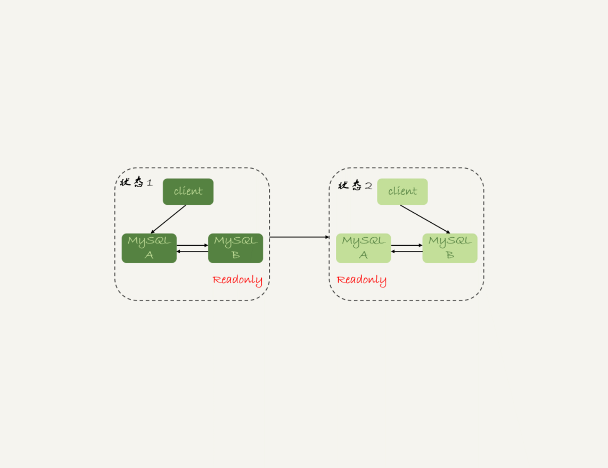
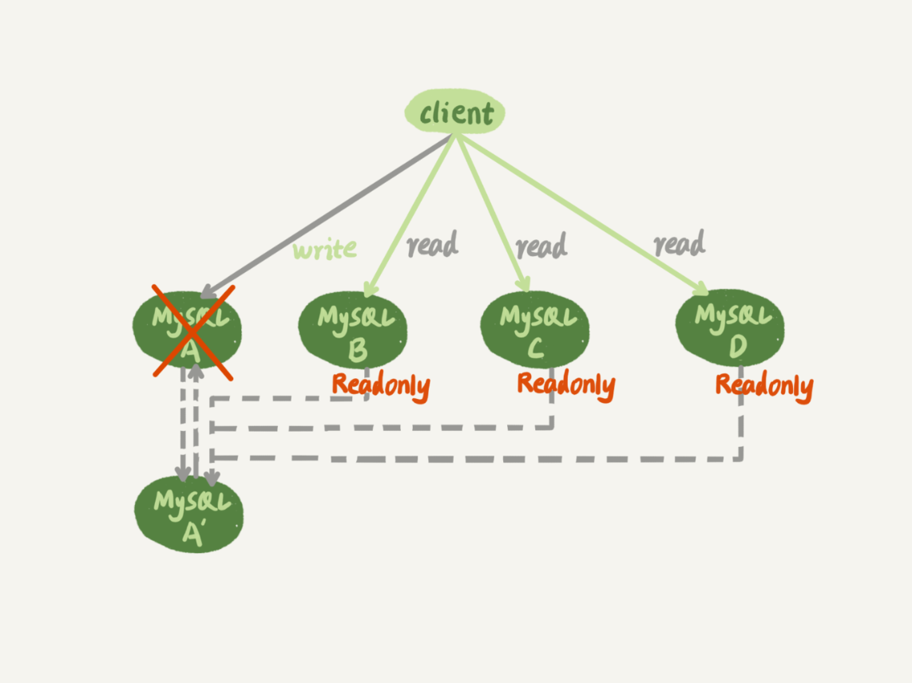
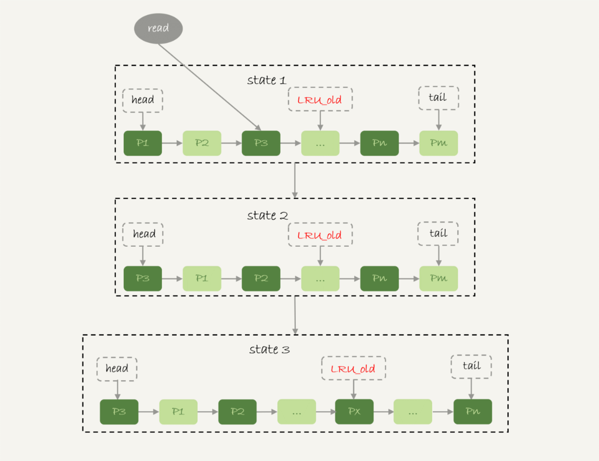
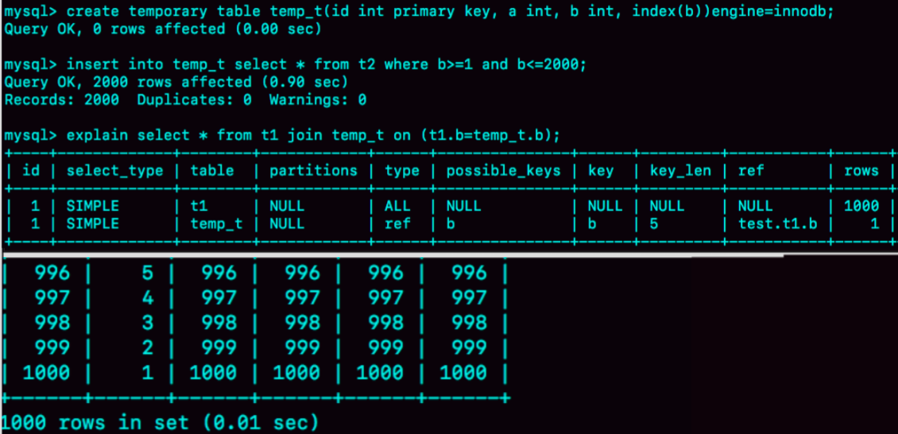
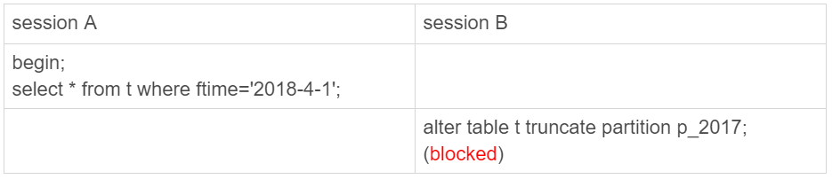
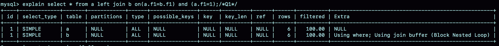

# MySQL Notes
## 01 | 基础架构：一条SQL查询语句是如何执行的？


### 查询缓存
连接建立完成后，你就可以执行 select 语句了。执行逻辑就会来到第二步：查询缓存。

**但是大多数情况下我会建议你不要使用查询缓存**，为什么呢？因为查询缓存往往弊大于利。查询缓存的失效非常频繁，只要有对一个表的更新，这个表上所有的查询缓存都会被清空。

### 执行器

```sql

mysql> select * from T where ID=10;

ERROR 1142 (42000): SELECT command denied to user 'b'@'localhost' for table 'T'
```

比如我们这个例子中的表 T 中，ID 字段没有索引，那么执行器的执行流程是这样的：
1. 调用 InnoDB 引擎接口取这个表的第一行，判断 ID 值是不是 10，如果不是则跳过，如果是则将这行存在结果集中；
2. 调用引擎接口取“下一行”，重复相同的判断逻辑，直到取到这个表的最后一行。
3. 执行器将上述遍历过程中所有满足条件的行组成的记录集作为结果集返回给客户端。

至此，这个语句就执行完成了。

## 02 | 日志系统：一条SQL更新语句是如何执行的


### 重要的日志模块：redo log

如果每一次的更新操作都需要写进磁盘，然后磁盘也要找到对应的那条记录，然后再更新，整个过程 IO 成本、查找成本都很高。为了解决这个问题，MySQL 的设计者就用了类似酒店掌柜粉板的思路来提升更新效率。

其实就是 MySQL 里经常说到的 WAL 技术，WAL 的全称是 Write-Ahead Logging，它的关键点就是先写日志，再写磁盘，也就是先写粉板，等不忙的时候再写账本。

InnoDB 引擎就会先把记录写到 redo log（粉板）里面，并更新内存，这个时候更新就算完成了。同时，InnoDB 引擎会在适当的时候，将这个操作记录更新到磁盘里面，

InnoDB 的 redo log 是固定大小的，比如可以配置为一组 4 个文件，每个文件的大小是 1GB，那么这块“粉板”总共就可以记录 4GB 的操作。从头开始写，写到末尾就又回到开头循环写，如下面这个图所示。


write pos 是当前记录的位置，一边写一边后移，写到第 3 号文件末尾后就回到 0 号文件开头。checkpoint 是当前要擦除的位置，也是往后推移并且循环的，擦除记录前要把记录更新到数据文件。


write pos 和 checkpoint 之间的是“粉板”上还空着的部分，可以用来记录新的操作。如果 write pos 追上 checkpoint，表示“粉板”满了，这时候不能再执行新的更新，得停下来先擦掉一些记录，把 checkpoint 推进一下。

有了 redo log，InnoDB 就可以保证即使数据库发生异常重启，之前提交的记录都不会丢失，这个能力称为 crash-safe。


### 重要的日志模块：binlog

上面我们聊到的粉板 redo log 是 InnoDB 引擎特有的日志，而 Server 层也有自己的日志，称为 binlog（归档日志）。

这两种日志有以下三点不同。
1. redo log 是 InnoDB 引擎特有的；binlog 是 MySQL 的 Server 层实现的，所有引擎都可以使用。
2. redo log 是物理日志，记录的是“在某个数据页上做了什么修改”；binlog 是逻辑日志，记录的是这个语句的原始逻辑，比如“给 ID=2 这一行的 c 字段加 1 ”。
3. redo log 是循环写的，空间固定会用完；binlog 是可以追加写入的。“追加写”是指 binlog 文件写到一定大小后会切换到下一个，并不会覆盖以前的日志。

我们再来看执行器和 InnoDB 引擎在执行这个简单的 update 语句时的内部流程。


1. 执行器先找引擎取 ID=2 这一行。ID 是主键，引擎直接用树搜索找到这一行。如果 ID=2 这一行所在的数据页本来就在内存中，就直接返回给执行器；否则，需要先从磁盘读入内存，然后再返回。
2. 执行器拿到引擎给的行数据，把这个值加上 1，比如原来是 N，现在就是 N+1，得到新的一行数据，再调用引擎接口写入这行新数据。
3. 引擎将这行新数据更新到内存中，同时将这个更新操作记录到 redo log 里面，此时 redo log 处于 prepare 状态。然后告知执行器执行完成了，随时可以提交事务。
4. 执行器生成这个操作的 binlog，并把 binlog 写入磁盘。
5. 执行器调用引擎的提交事务接口，引擎把刚刚写入的 redo log 改成提交（commit）状态，更新完成。


简单说，redo log 和 binlog 都可以用于表示事务的提交状态，而两阶段提交就是让这两个状态保持逻辑上的一致。

如果出现问题，下面两种情况：

**因为是两阶段提交，如果redolog只是完成了prepare, 而binlog又失败，那么事务本身会回滚**

**Binlog如果已经接受，那么redolog是prepare, binlog已经完整，这时候崩溃恢复过程会认可这个事务，提交掉. 正常执行是要commit 才算完，但是崩溃恢复过程的话，可以接受“redolog prepare 并且binlog完整” 的情况**

把innodb_flush_log_at_trx_commit 和 sync_binlog都设置成0,page cache就交给操作系统更新了。

## 事务隔离：为什么你改了我还看不见？

SQL 标准的事务隔离级别包括：读未提交（read uncommitted）、读提交（read committed）、可重复读（repeatable read）和串行化（serializable ）。

1. 读未提交是指，一个事务还没提交时，它做的变更就能被别的事务看到。
2. 读提交是指，一个事务提交之后，它做的变更才会被其他事务看到。
3. 可重复读是指，一个事务执行过程中看到的数据，总是跟这个事务在启动时看到的数据是一致的。当然在可重复读隔离级别下，未提交变更对其他事务也是不可见的。
4. 串行化，顾名思义是对于同一行记录，“写”会加“写锁”，“读”会加“读锁”。当出现读写锁冲突的时候，后访问的事务必须等前一个事务执行完成，才能继续执行。


在实现上，数据库里面会创建一个视图，访问的时候以视图的逻辑结果为准。**在“可重复读”隔离级别下，这个视图是在事务启动时创建的，整个事务存在期间都用这个视图。在“读提交”隔离级别下，这个视图是在每个 SQL 语句开始执行的时候创建的。** 这里需要注意的是，“读未提交”隔离级别下直接返回记录上的最新值，没有视图概念；而“串行化”隔离级别下直接用加锁的方式来避免并行访问。

### 事务隔离的实现
实际上每条记录在更新的时候都会同时记录一条回滚操作。记录上的最新值，通过回滚操作，都可以得到前一个状态的值。


同一条记录在系统中可以存在多个版本，就是数据库的多版本并发控制（MVCC）。

回滚日志总不能一直保留吧，什么时候删除呢？答案是，在不需要的时候才删除。也就是说，系统会判断，当没有事务再需要用到这些回滚日志时，回滚日志会被删除。什么时候才不需要了呢？就是当系统里没有比这个回滚日志更早的 read-view 的时候。

**general_log** 开启可以记录发给mysql的语句，可以判断一些框架是否使用了 set autocommit=0

## 04 | 深入浅出索引

**哈希表**这种结构适用于只有等值查询的场景，比如 Memcached 及其他一些 NoSQL 引擎。而有序数组在等值查询和范围查询场景中的性能就都非常优秀。**有序数组**索引只适用于静态存储引擎，比如你要保存的是 2017 年某个城市的所有人口信息，这类不会再修改的数据。

### InnoDB 的索引模型
### B+ Tree
为了让一个查询尽量少地读磁盘，就必须让查询过程访问尽量少的数据块。那么，我们就不应该使用二叉树，而是要使用“N 叉”树。这里，“N 叉”树中的“N”取决于数据块的大小。以 InnoDB 的一个整数字段索引为例，这个 **N 差不多是 1200**。这棵树高是 4 的时候，就可以存 1200 的 3 次方个值，这已经 17 亿了。考虑到树根的数据块总是在内存中的，一个 10 亿行的表上一个整数字段的索引，**查找一个值最多只需要访问 3 次磁盘。其实，树的第二层也有很大概率在内存中，那么访问磁盘的平均次数就更少了**。

* 主键索引的叶子节点存的是整行数据。在 InnoDB 里，主键索引也被称为聚簇索引（clustered index）。
* 非主键索引的叶子节点内容是主键的值。在 InnoDB 里，非主键索引也被称为二级索引（secondary index）。 需要先搜索 k 索引树，得到 ID 的值为 500，再到 ID 索引树搜索一次。这个过程称为 **回表**
  
也就是说，**基于非主键索引的查询需要多扫描一棵索引树**。

一个数据页满了，按照B+Tree算法，新增加一个数据页，叫做页分裂，会导致性能下降。空间利用率降低大概50%。当相邻的两个数据页利用率很低的时候会做数据页合并，合并的过程是分裂过程的逆过程。

显然，主键长度越小，普通索引的叶子节点就越小，普通索引占用的空间也就越小。
所以，从性能和存储空间方面考量，自增主键往往是更合理的选择。


### 覆盖索引  Using index

如果执行的语句是 select ID from T where k between 3 and 5，这时只需要查 ID 的值，而 ID 的值已经在 k 索引树上了，因此可以直接提供查询结果，不需要回表。也就是说，在这个查询里面，索引 k 已经“覆盖了”我们的查询需求，我们称为覆盖索引。

**由于覆盖索引可以减少树的搜索次数，显著提升查询性能，所以使用覆盖索引是一个常用的性能优化手段。**

### 最左前缀原则

我们用（name，age）这个联合索引来分析


如果你要查的是所有名字第一个字是“张”的人，你的 SQL 语句的条件是"where name like ‘张 %’"。这时，你也能够用上这个索引.

在建立联合索引的时候，如何安排索引内的字段顺序。

1. 第一原则是，如果通过调整顺序，可以少维护一个索引，那么这个顺序往往就是需要优先考虑采用的。
2. 考虑的原则就是空间了。比如上面这个市民表的情况，name 字段是比 age 字段大的 ，那我就建议你创建一个（name,age) 的联合索引和一个 (age) 的单字段索引。

### 索引下推 Using index condition

```sql
mysql> select * from tuser where name like '张%' and age=10 and ismale=1;
```

* 在 MySQL 5.6 之前，只能从 ID3 开始一个个回表。到主键索引上找出数据行，再对比字段值。
* 而 MySQL 5.6 引入的索引下推优化（index condition pushdown)， 可以在索引遍历过程中，对索引中包含的字段先做判断，直接过滤掉不满足条件的记录，减少回表次数。


### 重建主键
alter table T engine=InnoDB

### Explain

* Using where：表示优化器需要通过索引回表查询数据,然后再过滤数据。
* Using index：表示直接访问索引就足够获取到所需要的数据，不需要通过索引回表；
* Using index condition：在5.6版本后加入的新特性（Index Condition Pushdown）;


##06 | 全局锁和表锁 ：给表加个字段怎么有这么多阻碍？

根据加锁的范围，MySQL 里面的锁大致可以分成全局锁、表级锁和行锁三类。

**全局锁**就是对整个数据库实例加锁。MySQL 提供了一个加全局读锁的方法，命令是 Flush tables with read lock (FTWRL)。当你需要让整个库处于只读状态的时候，可以使用这个命令，之后其他线程的以下语句会被阻塞：数据更新语句（数据的增删改）、数据定义语句（包括建表、修改表结构等）和更新类事务的提交语句。

官方自带的逻辑备份工具是 mysqldump。当 mysqldump 使用参数–single-transaction 的时候，导数据之前就会启动一个事务，来确保拿到一致性视图。而由于 MVCC 的支持，这个过程中数据是可以正常更新的。
你一定在疑惑，有了这个功能，为什么还需要 FTWRL 呢？**一致性读是好，但前提是引擎要支持这个隔离级别。**

### 表级锁

表锁的语法是 lock tables … read/write。

**lock tables 语法除了会限制别的线程的读写外，也限定了本线程接下来的操作对象**。举个例子, 如果在某个线程 A 中执行 lock tables t1 read, t2 write; 这个语句，则其他线程写 t1、读写 t2 的语句都会被阻塞。同时，线程 A 在执行 unlock tables 之前，也只能执行读 t1、读写 t2 的操作。连写 t1 都不允许，自然也不能访问其他表。

另一类表级的锁是 **MDL（metadata lock)**。

* 当对一个表做增删改查操作的时候，加 MDL 读锁；
* 当要对表做结构变更操作的时候，加 MDL 写锁。
* 读锁之间不互斥，因此你可以有多个线程同时对一张表增删改查。
* 读写锁之间、写锁之间是互斥的，用来保证变更表结构操作的安全性。因此，如果有两个线程要同时给一个表加字段，其中一个要等另一个执行完才能开始执行。


我们可以看到 session A 先启动，这时候会对表 t 加一个 MDL 读锁。由于 session B 需要的也是 MDL 读锁，因此可以正常执行。之后 session C 会被 blocked，是因为 session A 的 MDL 读锁还没有释放，而 session C 需要 MDL 写锁，因此只能被阻塞。
如果只有 session C 自己被阻塞还没什么关系，但是之后所有要在表 t 上新申请 MDL 读锁的请求也会被 session C 阻塞。前面我们说了，所有对表的增删改查操作都需要先申请 MDL 读锁，就都被锁住，等于这个表现在完全不可读写了。

这个不是读写锁，是锁队列，一进去就开始影响后面的


**事务中的 MDL 锁，在语句执行开始时申请，但是语句结束后并不会马上释放，而会等到整个事务提交后再释放**

Online DDL的过程是这样的：
1. 拿MDL写锁
2. 降级成MDL读锁
3. 真正做DDL
4. 升级成MDL写锁
5. 释放MDL锁

1、2、4、5如果没有锁冲突，执行时间非常短。第3步占用了DDL绝大部分时间，这期间这个表可以正常读写数据，是因此称为“online ”

## 07 行锁功过：怎么减少行锁对性能的影响？

在 InnoDB 事务中，行锁是在需要的时候才加上的，但并不是不需要了就立刻释放，而是要等到事务结束时才释放。这个就是两阶段锁协议。

**如果你的事务中需要锁多个行，要把最可能造成锁冲突、最可能影响并发度的锁尽量往后放**

当出现死锁以后，有两种策略：
1. 一种策略是，直接进入等待，直到超时。这个超时时间可以通过参数 innodb_lock_wait_timeout 来设置。在 InnoDB 中，innodb_lock_wait_timeout 的默认值是 50s
2. 另一种策略是，发起死锁检测，发现死锁后，主动回滚死锁链条中的某一个事务，让其他事务得以继续执行。将参数 innodb_deadlock_detect 设置为 on，表示开启这个逻辑。主动死锁检测，而且 innodb_deadlock_detect 的默认值本身就是 on。主动死锁检测在发生死锁的时候，是能够快速发现并进行处理的，但是它也是有额外负担的。

假设有 1000 个并发线程要同时更新同一行，那么死锁检测操作就是 100 万这个量级的。虽然最终检测的结果是没有死锁，但是这期间要消耗大量的 CPU 资源。

一个思路是控制并发度。根据上面的分析，你会发现如果并发能够控制住，比如同一行同时最多只有 10 个线程在更新，那么死锁检测的成本很低，就不会出现这个问题。一个直接的想法就是，在客户端做并发控制。但是，你会很快发现这个方法不太可行，因为客户端很多。我见过一个应用，有 600 个客户端，这样即使每个客户端控制到只有 5 个并发线程，汇总到数据库服务端以后，峰值并发数也可能要达到 3000。

你可以考虑通过将一行改成逻辑上的多行来减少锁冲突。还是以影院账户为例，可以考虑放在多条记录上，比如 10 个记录，影院的账户总额等于这 10 个记录的值的总和。这样每次要给影院账户加金额的时候，随机选其中一条记录来加。这样每次冲突概率变成原来的 1/10，可以减少锁等待个数，也就减少了死锁检测的 CPU 消耗。

### Summary from others

两阶段锁：在 InnoDB 事务中，行锁是在需要的时候才加上的，但并不是不需要了就立刻释放， 而是要等到事务结束时才释放。

建议：如果你的事务中需要锁多个行，要把最可能造成锁冲突、最可能影响并发度的锁尽量往后放。

死锁：当并发系统中不同线程出现循环资源依赖，涉及的线程都在等待别的线程释放资源时，就会导致这几个线程都进入无限等待的状态。

解决方案：
1. 通过参数 innodb_lock_wait_timeout 根据实际业务场景来设置超时时间，InnoDB引擎默认值是50s。
2. 发起死锁检测，发现死锁后，主动回滚死锁链条中的某一个事务，让其他事务得以继续执行。将参数 innodb_deadlock_detect 设置为 on，表示开启这个逻辑（默认是开启状态）。
如何解决热点行更新导致的性能问题？

1. 如果你能确保这个业务一定不会出现死锁，可以临时把死锁检测关闭掉。一般不建议采用
2. 控制并发度，对应相同行的更新，在进入引擎之前排队。这样在InnoDB内部就不会有大量的死锁检测工作了。
3. 将热更新的行数据拆分成逻辑上的多行来减少锁冲突，但是业务复杂度可能会大大提高。

innodb行级锁是通过锁索引记录实现的，如果更新的列没建索引是会锁住整个表的。

## 08 | 事务到底是隔离的还是不隔离的？

begin/start transaction 命令并不是一个事务的起点，在执行到它们之后的第一个操作 InnoDB 表的语句，事务才真正启动。

* 第一种启动方式，一致性视图是在执行第一个快照读语句时创建的；
* 第二种启动方式，一致性视图是在执行 start transaction with consistent snapshot 时创建的。

### “快照”在 MVCC 里是怎么工作的？


图中虚线框里是同一行数据的 4 个版本，当前最新版本是 V4，k 的值是 22，它是被 transaction id 为 25 的事务更新的，因此它的 row trx_id 也是 25。

undo log 在哪呢？

实际上，图 2 中的三个虚线箭头，就是 undo log；而 V1、V2、V3 并不是物理上真实存在的，而是每次需要的时候根据当前版本和 undo log 计算出来的。比如，需要 V2 的时候，就是通过 V4 依次执行 U3、U2 算出来。

因此，一个事务只需要在启动的时候声明说，“以我启动的时刻为准，如果一个数据版本是在我启动之前生成的，就认；如果是我启动以后才生成的，我就不认，我必须要找到它的上一个版本”。

在实现上， InnoDB 为每个事务构造了一个数组，用来保存这个事务启动瞬间，当前正在“活跃”的所有事务 ID。“活跃”指的就是，启动了但还没提交。

**数组里面事务 ID 的最小值记为低水位，当前系统里面已经创建过的事务 ID 的最大值加 1 记为高水位。**这里只读事务一开始可能没有txid。


如果落在黄色部分，那就包括两种情况a. 若 row trx_id 在数组中，表示这个版本是由还没提交的事务生成的，不可见；b. 若 row trx_id 不在数组中，表示这个版本是已经提交了的事务生成的，可见。

### 更新逻辑


update 语句，如果按照一致性读，好像结果不对哦？

这里就用到了这样一条规则：更新数据都是先读后写的，而这个读，只能读当前的值，称为“**当前读**”（current read）。

原来在同一行数据，最新版本的 row trx_id 是可能会小于旧版本的 row trx_id的

除了 update 语句外，**select 语句如果加锁**，也是当前读。

```sql
mysql> select k from t where id=1 lock in share mode;
mysql> select k from t where id=1 for update;
```


事务 C’没提交，也就是说 (1,2) 这个版本上的写锁还没释放。而事务 B 是当前读，必须要读最新版本，而且必须加锁，因此就被锁住了，必须等到事务 C’释放这个锁，才能继续它的当前读。

可重复读的核心就是一致性读（consistent read）；而事务更新数据的时候，只能用当前读。如果当前的记录的行锁被其他事务占用的话，就需要进入锁等待。

而读提交的逻辑和可重复读的逻辑类似，它们最主要的区别是：
1. 在可重复读隔离级别下，只需要在事务开始的时候创建一致性视图，之后事务里的其他查询都共用这个一致性视图；
2. 在读提交隔离级别下，每一个语句执行前都会重新算出一个新的视图。
3. 对于可重复读，查询只承认在事务启动前就已经提交完成的数据；
4. 对于读提交，查询只承认在语句启动前就已经提交完成的数据；

判断可见性两个规则：**一个是up_limit_id** ,**另一个是“自己修改的”**；这里用到第二个规则

只读事务不分配id，是5.6以后的优化；
第45讲提到，其实也不是不分配id，只是不分配自增的id，随机分配的那个也是事务id的。

## 09 | 普通索引和唯一索引，应该怎么选择？

### 查询过程

执行查询的语句是 select id from T where k=5

* 对于普通索引来说，查找到满足条件的第一个记录 (5,500) 后，需要查找下一个记录，直到碰到第一个不满足 k=5 条件的记录。

* 对于唯一索引来说，由于索引定义了唯一性，查找到第一个满足条件的记录后，就会停止继续检索。

你知道的，InnoDB 的数据是按数据页为单位来读写的。也就是说，当需要读一条记录的时候，并不是将这个记录本身从磁盘读出来，而是以页为单位，将其整体读入内存。在 InnoDB 中，每个数据页的大小默认是 16KB。对于普通索引来说，要多做的那一次“查找和判断下一条记录”的操作，就只需要一次指针寻找和一次计算。

### 更新过程

当需要更新一个数据页时，如果数据页在内存中就直接更新，而如果这个数据页还没有在内存中的话，在不影响数据一致性的前提下，InnoDB 会将这些更新操作缓存在 change buffer 中，这样就不需要从磁盘中读入这个数据页了。在下次查询需要访问这个数据页的时候，将数据页读入内存，然后执行 change buffer 中与这个页有关的操作。

虽然名字叫作 change buffer，实际上它是可以持久化的数据。也就是说，change buffer 在内存中有拷贝，也会被写入到磁盘上。

除了访问这个数据页会触发 merge 外，系统有后台线程会定期 merge。在数据库正常关闭（shutdown）的过程中，也会执行 merge 操作。

**什么条件下可以使用 change buffer 呢？**

对于唯一索引来说，所有的更新操作都要先判断这个操作是否违反唯一性约束。而**这必须要将数据页读入内存才能判断**。如果都已经读入到内存了，那直接更新内存会更快，就没必要使用 change buffer 了。

因此，唯一索引的更新就不能使用 change buffer，实际上也只有普通索引可以使用。

change buffer 用的是 buffer pool 里的内存，因此不能无限增大。change buffer 的大小，可以通过参数 innodb_change_buffer_max_size 来动态设置。这个参数设置为 50 的时候，表示 change buffer 的大小最多只能占用 buffer pool 的 50%。

如果要在这张表中插入一个新记录 (4,400) 的话，InnoDB 的处理流程是怎样的。

如果这个记录要更新的目标页在内存中，普通索引和唯一索引对更新语句性能影响的差别，只是一个判断，只会耗费微小的 CPU 时间。

如果这个记录要更新的目标页不在内存中

* 对于唯一索引来说，需要将数据页读入内存，判断到没有冲突，插入这个值，语句执行结束；
* 对于普通索引来说，则是将更新记录在 change buffer，语句执行就结束了。

### 索引选择和实践

其实，这两类索引在查询能力上是没差别的，主要考虑的是对更新性能的影响。所以，我建议你尽量选择普通索引。

如果所有的更新后面，都马上伴随着对这个记录的查询，那么你应该关闭 change buffer。而在其他情况下，change buffer 都能提升更新性能。

在使用机械硬盘时，change buffer 这个机制的收效是非常显著的。

### change buffer 和 redo log

mysql> insert into t(id,k) values(id1,k1),(id2,k2);


分析这条更新语句，你会发现它涉及了四个部分：内存、redo log（ib_log_fileX）、 数据表空间（t.ibd）、系统表空间（ibdata1）。

1. Page 1 在内存中，直接更新内存；
2. Page 2 没有在内存中，就在内存的 change buffer 区域，记录下“我要往 Page 2 插入一行”这个信息
3. 将上述两个动作记入 redo log 中（图中 3 和 4）。

我们现在要执行 select * from t where k in (k1, k2)


要读 Page 2 的时候，需要把 Page 2 从磁盘读入内存中，然后应用 change buffer 里面的操作日志，生成一个正确的版本并返回结果。

所以，如果要简单地对比这两个机制在提升更新性能上的收益的话，**redo log 主要节省的是随机写磁盘的 IO 消耗（转成顺序写），而 change buffer 主要节省的则是随机读磁盘的 IO 消耗**。

### 课后

redo log里记录了数据页的修改以及change buffer新写入的信息
如果掉电,持久化的change buffer数据已经purge,不用恢复。主要分析没有持久化的数据
情况又分为以下几种:

(1) change buffer写入,redo log虽然做了fsync但未commit,binlog未fsync到磁盘,这部分数据丢失

(2) change buffer写入,redo log写入但没有commit,binlog已经fsync到磁盘,先从binlog恢复redo log,再从redo log恢复change buffer

(3) change buffer写入,redo log和binlog都已经fsync.那么直接从redo log里恢复。

change buffer的前身是insert buffer,只能对insert 操作优化；后来升级了，增加了update/delete的支持，名字也改叫change buffer.主要就是优化二级索引。

merge 的执行流程是这样的：
1. 从磁盘读入数据页到内存（老版本的数据页）；
2. 从 change buffer 里找出这个数据页的 change buffer 记录 (可能有多个），依次应用，得到新版数据页；
3. 写 redo log。这个 redo log 包含了数据的变更和 change buffer 的变更。

这时候，数据页和内存中 change buffer 对应的磁盘位置都还没有修改，属于脏页，之后各自刷回自己的物理数据，就是另外一个过程了.


## 10 | MySQL为什么有时候会选错索引？

MySQL 在真正开始执行语句之前，并不能精确地知道满足这个条件的记录有多少条，而只能根据统计信息来估算记录数。

这个统计信息就是索引的“区分度”。显然，一个索引上不同的值越多，这个索引的区分度就越好。而一个索引上不同的值的个数，我们称之为“基数”（cardinality）。也就是说，这个基数越大，索引的区分度越好。

**analyze table t** 命令，可以用来重新统计索引信息。

### 索引选择异常和处理

一种方法是，像我们第一个例子一样，采用 **force index** 强行选择一个索引

第二种方法就是，我们可以考虑修改语句，引导 MySQL 使用我们期望的索引。比如，在这个例子里，显然把“order by b limit 1” 改成 “order by b,a limit 1” ，语义的逻辑是相同的。

第三种方法是，在有些场景下，我们可以新建一个更合适的索引，来提供给优化器做选择，或删掉误用的索引。

## 11 | 怎么给字符串字段加索引？

```sql
mysql> alter table SUser add index index2(email(6));
select id,name,email from SUser where email='zhangssxyz@xxx.com';
```

如果使用的是 index2（即 email(6) 索引结构），执行顺序是这样的：
1. 从 index2 索引树找到满足索引值是’zhangs’的记录，找到的第一个是 ID1；
2. 到主键上查到主键值是 ID1 的行，判断出 email 的值不是’zhangssxyz@xxx.com’，这行记录丢弃；
3. 取 index2 上刚刚查到的位置的下一条记录，发现仍然是’zhangs’，取出 ID2，再到 ID 索引上取整行然后判断，这次值对了，将这行记录加入结果集；
4. 重复上一步，直到在 idxe2 上取到的值不是’zhangs’时，循环结束。

使用前缀索引，定义好长度，就可以做到既节省空间，又不用额外增加太多的查询成本。我们在建立索引时关注的是区分度，区分度越高越好。因为**区分度越高**，意味着重复的键值越少。

但是**使用前缀索引就用不上覆盖索引对查询性能的优化了**，这也是你在选择是否使用前缀索引时需要考虑的一个因素。

### 其他方式
1. 第一种方式是使用倒序存储。如果你存储身份证号的时候把它倒过来存。 倒序存储，再创建前缀索引，用于绕过字符串本身前缀的区分度不够的问题。
2. 第二种方式是使用 hash 字段。你可以在表上再创建一个整数字段，来保存身份证的校验码，同时在这个字段上创建索引。创建 hash 字段索引，查询性能稳定，有额外的存储和计算消耗，跟第三种方式一样，都不支持范围扫描。

## 12 | 为什么我的MySQL会“抖”一下？

当内存数据页跟磁盘数据页内容不一致的时候，我们称这个内存页为“脏页”。内存数据写入到磁盘后，内存和磁盘上的数据页的内容就一致了，称为“干净页”。

其实就是在写内存和日志，而 MySQL 偶尔“抖”一下的那个瞬间，可能就是在刷脏页（flush）。


1. 这个场景，对应的就是 InnoDB 的 redo log 写满了。这时候系统会停止所有更新操作，把 checkpoint 往前推进，redo log 留出空间可以继续写。我在第二讲画了一个 redo log 的示意图，这里我改成环形，便于大家理解。checkpoint 可不是随便往前修改一下位置就可以的。比如图 2 中，把 checkpoint 位置从 CP 推进到 CP’，就需要将两个点之间的日志（浅绿色部分），对应的所有脏页都 flush 到磁盘上。之后，图中从 write pos 到 CP’之间就是可以再写入的 redo log 的区域。


2. 系统内存不足。当需要新的内存页，而内存不够用的时候，就要淘汰一些数据页，空出内存给别的数据页使用。如果淘汰的是“脏页”，就要先将脏页写到磁盘。
3. MySQL 认为系统“空闲”的时候。当然，MySQL“这家酒店”的生意好起来可是会很快就能把粉板记满的，所以“掌柜”要合理地安排时间，即使是“生意好”的时候，也要见缝插针地找时间，只要有机会就刷一点“脏页”
4. MySQL 正常关闭的情况。这时候，MySQL 会把内存的脏页都 flush 到磁盘上，这样下次 MySQL 启动的时候，就可以直接从磁盘上读数据，启动速度会很快。

### 对性能的影响

第一种是“redo log 写满了，要 flush 脏页”，这种情况是 InnoDB 要尽量避免的。因为出现这种情况的时候，整个系统就不能再接受更新了，所有的更新都必须堵住。如果你从监控上看，这时候更新数会跌为 0。

第二种是“内存不够用了，要先将脏页写到磁盘”，这种情况其实是常态。而当要读入的数据页没有在内存的时候，就必须到缓冲池中申请一个数据页。这时候只能把最久不使用的数据页从内存中淘汰掉：如果要淘汰的是一个干净页，就直接释放出来复用；但如果是脏页呢，就必须将脏页先刷到磁盘，变成干净页后才能复用。

**淘汰的时候，刷脏页过程不用动redo log文件的。这个有个额外的保证，是redo log在“重放”的时候，如果一个数据页已经是刷过的，会识别出来并跳过。**

每个数据页头部有LSN，8字节，每次修改都会变大。对比这个LSN跟checkpoint 的LSN，比checkpoint小的一定是干净页.

如果突然重启了就从**checkpoint** 的位置往后扫。 如果已经之前刷过盘的, 不会重复应用redi log。

### InnoDB 刷脏页的控制策略

这就要用到 **innodb_io_capacity** 这个参数了，它会告诉 InnoDB 你的磁盘能力。这个值我建议你设置成磁盘的 IOPS。磁盘的 IOPS 可以通过 fio 这个工具来测试，

```sql
 fio -filename=$filename -direct=1 -iodepth 1 -thread -rw=randrw -ioengine=psync -bs=16k -size=500M -numjobs=10 -runtime=10 -group_reporting -name=mytest 
```

其实，因为没能正确地设置 innodb_io_capacity 参数，而导致的性能问题也比比皆是。之前，就曾有其他公司的开发负责人找我看一个库的性能问题，说 MySQL 的写入速度很慢，TPS 很低，但是数据库主机的 IO 压力并不大。经过一番排查，发现罪魁祸首就是这个参数的设置出了问题。

InnoDB 的刷盘速度就是要参考这两个因素：一个是脏页比例，一个是 redo log 写盘速度。

你就要合理地设置 innodb_io_capacity 的值，并且平时要多关注脏页比例，不要让它经常接近 75%。

一旦一个查询请求需要在执行过程中先 flush 掉一个脏页时，这个查询就可能要比平时慢了。而 MySQL 中的一个机制，可能让你的查询会更慢：在准备刷一个脏页的时候，如果这个数据页旁边的数据页刚好是脏页，就会把这个“邻居”也带着一起刷掉；而且这个把“邻居”拖下水的逻辑还可以继续蔓延，也就是对于每个邻居数据页，如果跟它相邻的数据页也还是脏页的话，也会被放到一起刷。

在 InnoDB 中，**innodb_flush_neighbors** 参数就是用来控制这个行为的，值为 1 的时候会有上述的“连坐”机制，值为 0 时表示不找邻居，自己刷自己的。


## 13 | 为什么表数据删掉一半，表文件大小不变？

### 参数 innodb_file_per_table

从 MySQL 5.6.6 版本开始，它的默认值就是 ON 了。我建议你不论使用 MySQL 的哪个版本，都将这个值设置为 ON。因为，一个表单独存储为一个文件更容易管理，而且在你不需要这个表的时候，通过 drop table 命令，系统就会直接删除这个文件。而如果是放在共享表空间中，即使表删掉了，空间也是不会回收的。


### 数据删除流程

InnoDB 的数据是按页存储的，那么如果我们删掉了一个数据页上的所有记录，会怎么样？答案是，整个数据页就可以被复用了。

但是，**数据页的复用跟记录的复用是不同的**。

记录的复用，只限于符合范围条件的数据。比如上面的这个例子，R4 这条记录被删除后，如果插入一个 ID 是 400 的行，可以直接复用这个空间。但如果插入的是一个 ID 是 800 的行，就不能复用这个位置了。

而当整个页从 B+ 树里面摘掉以后，可以复用到任何位置。以图 1 为例，如果将数据页 page A 上的所有记录删除以后，page A 会被标记为可复用。这时候如果要插入一条 ID=50 的记录需要使用新页的时候，page A 是可以被复用的。

如果我们用 delete 命令把整个表的数据删除呢？结果就是，所有的数据页都会被标记为可复用。但是磁盘上，文件不会变小。

**不止是删除数据会造成空洞，插入数据也会**


### 重建表

你可以使用 alter table A engine=InnoDB 命令来重建表.

我给你简单描述一下引入了 Online DDL 之后，重建表的流程：
1. 建立一个临时文件，扫描表 A 主键的所有数据页；
2. 用数据页中表 A 的记录生成 B+ 树，存储到临时文件中；
3. 生成临时文件的过程中，将所有对 A 的操作记录在一个日志文件（row log）中，对应的是图中 state2 的状态；
4. 临时文件生成后，将日志文件中的操作应用到临时文件，得到一个逻辑数据上与表 A 相同的数据文件，对应的就是图中 state3 的状态；
5. 用临时文件替换表 A 的数据文件。


alter 语句在启动的时候需要获取 MDL 写锁，但是这个写锁在真正拷贝数据之前就退化成读锁了。为什么要退化呢？为了实现 Online，MDL 读锁不会阻塞增删改操作。那为什么不干脆直接解锁呢？为了保护自己，禁止其他线程对这个表同时做 DDL。

### Online 和 inplace

在图中，根据表 A 重建出来的数据是放在“tmp_file”里的，这个临时文件是 InnoDB 在内部创建出来的。整个 DDL 过程都在 InnoDB 内部完成。对于 server 层来说，没有把数据挪动到临时表，是一个“原地”操作，这就是“inplace”名称的来源。

如果你有一个 1TB 的表，现在磁盘间是 1.2TB，能不能做一个 inplace 的 DDL 呢？答案是不能。因为，tmp_file 也是要占用临时空间的。

1. DDL 过程如果是 Online 的，就一定是 inplace 的；
2. 反过来未必，也就是说 inplace 的 DDL，有可能不是 Online 的。截止到 MySQL 8.0，添加全文索引（FULLTEXT index）和空间索引 (SPATIAL index) 就属于这种情况。

* 从 MySQL 5.6 版本开始，alter table t engine = InnoDB（也就是 recreate）默认的就是上面图 4 的流程了；
* analyze table t 其实不是重建表，只是对表的索引信息做重新统计，没有修改数据，这个过程中加了 MDL 读锁；
* optimize table t 等于 recreate+analyze。

## 14 | count(*)这么慢，我该怎么办？

### count(*) 的实现方式

* MyISAM 引擎把一个表的总行数存在了磁盘上，因此执行 count(*) 的时候会直接返回这个数，效率很高；
* 而 InnoDB 引擎就麻烦了，它执行 count(*) 的时候，需要把数据一行一行地从引擎里面读出来，然后累积计数。

InnoDB 是索引组织表，主键索引树的叶子节点是数据，而普通索引树的叶子节点是主键值。所以，普通索引树比主键索引树小很多。对于 count(*) 这样的操作，遍历哪个索引树得到的结果逻辑上都是一样的。因此，**MySQL 优化器会找到最小的那棵树来遍历**。在保证逻辑正确的前提下，尽量减少扫描的数据量，是数据库系统设计的通用法则之一。

### 不同的 count 用法

所以，count(*)、count(主键 id) 和 count(1) 都表示返回满足条件的结果集的总行数；而 count(字段），则表示返回满足条件的数据行里面，参数“字段”不为 NULL 的总个数.

至于分析性能差别的时候，你可以记住这么几个原则：
1. server 层要什么就给什么；
2. InnoDB 只给必要的值；
3. 现在的优化器只优化了 count(*) 的语义为“取行数”，其他“显而易见”的优化并没有做。

所以结论是：按照效率排序的话，count(字段)<count(主键 id)<count(1)≈count(*)，所以我建议你，尽量使用 count(*)。


## 15 | 答疑文章（一）：日志和索引相关问题

### 在两阶段提交的不同时刻，MySQL 异常重启会出现什么现象。

大家出现问题的地方，主要集中在时刻 B，也就是 binlog 写完，redo log 还没 commit 前发生 crash，那崩溃恢复的时候 MySQL 会怎么处理？

我们先来看一下崩溃恢复时的判断规则。
1. 如果 redo log 里面的事务是完整的，也就是已经有了 commit 标识，则直接提交；
2. 如果 redo log 里面的事务只有完整的 prepare，则判断对应的事务 binlog 是否存在并完整：
    1. a. 如果是，则提交事务；
    2. b. 否则，回滚事务。
3. 这里，时刻 B 发生 crash 对应的就是 2(a) 的情况，崩溃恢复过程中事务会被提交。

### 追问 1：MySQL 怎么知道 binlog 是完整的?

一个事务的 binlog 是有完整格式的：
* statement 格式的 binlog，最后会有 COMMIT；
* row 格式的 binlog，最后会有一个 XID event。

### 追问 2：redo log 和 binlog 是怎么关联起来的?
崩溃恢复的时候，会按顺序扫描 redo log：
1. 如果碰到既有 prepare、又有 commit 的 redo log，就直接提交；
2. 如果碰到只有 parepare、而没有 commit 的 redo log，就拿着 XID 去 binlog 找对应的事务。

### 追问 4：如果这样的话，为什么还要两阶段提交呢？干脆先 redo log 写完，再写 binlog。崩溃恢复的时候，必须得两个日志都完整才可以。是不是一样的逻辑？

对于 InnoDB 引擎来说，如果 redo log 提交完成了，事务就不能回滚（如果这还允许回滚，就可能覆盖掉别的事务的更新）。而如果 redo log 直接提交，然后 binlog 写入的时候失败，InnoDB 又回滚不了，数据和 binlog 日志又不一致了。

###追问 5：不引入两个日志，也就没有两阶段提交的必要了。只用 binlog 来支持崩溃恢复，又能支持归档，不就可以了？

binlog 还是不能支持崩溃恢复的。我说一个不支持的点吧：**binlog 没有能力恢复“数据页”**。

InnoDB 引擎使用的是 WAL 技术，执行事务的时候，写完内存和日志，事务就算完成了。如果之后崩溃，要依赖于日志来恢复数据页。

执行过的事务如果没有刷盘（fsync）也是可能丢失了的，而且是数据页级的丢失。此时，binlog 里面并没有记录数据页的更新细节，是补不回来的。

一个事务的binlog如果回放，就是重做这个事务，一个事务更新的可能不止一个page。

比如一个事务更新了page ABC
然后崩溃回复了，B坏了，AC没问题，而且AC还落盘了。
这样如果重做事务，B好了，AC又坏了

### 追问 6：那能不能反过来，只用 redo log，不要 binlog？

1. 一个是归档。redo log 是循环写，写到末尾是要回到开头继续写的。这样历史日志没法保留，redo log 也就起不到归档的作用。
2. 一个就是 MySQL 系统依赖于 binlog。binlog 作为 MySQL 一开始就有的功能，被用在了很多地方。其中，MySQL 系统高可用的基础，就是 binlog 复制。
3. 还有很多公司有异构系统（比如一些数据分析系统），这些系统就靠消费 MySQL 的 binlog 来更新自己的数据。

### redo log 一般设置多大？

直接将 redo log 设置为 4 个文件、每个文件 1GB 吧。

### 追问 8：正常运行中的实例，数据写入后的最终落盘，是从 redo log 更新过来的还是从 buffer pool 更新过来的呢？

* 如果是正常运行的实例的话，数据页被修改以后，跟磁盘的数据页不一致，称为脏页。最终数据落盘，就是把内存中的数据页写盘。这个过程，甚至与 redo log 毫无关系。
* 在崩溃恢复场景中，InnoDB 如果判断到一个数据页可能在崩溃恢复的时候丢失了更新，就会将它读到内存，然后让 redo log 更新内存内容。更新完成后，内存页变成脏页，就回到了第一种情况的状态。

### 追问 9：redo log buffer 是什么？是先修改内存，还是先写 redo log 文件？

redo log buffer 就是一块内存，用来先存 redo 日志的。真正把日志写到 redo log 文件（文件名是 ib_logfile+ 数字），是在执行 commit 语句的时候做的。具体可以看22节。

## 16 | “order by”是怎么工作的？

MySQL 会给每个线程分配一块内存用于排序，称为 **sort_buffer。**

sort_buffer_size，就是 MySQL 为排序开辟的内存（sort_buffer）的大小。如果要排序的数据量小于 sort_buffer_size，排序就在内存中完成。但如果排序数据量太大，内存放不下，则不得不利用磁盘临时文件辅助排序。

如果 MySQL 认为排序的单行长度太大会怎么做呢？

新的算法放入 sort_buffer 的字段，只有要排序的列（即 name 字段）和主键 id。最后回表拿数据。

* 如果 MySQL 实在是担心排序内存太小，会影响排序效率，才会采用 rowid 排序算法，这样排序过程中一次可以排序更多行，但是需要再回到原表去取数据。
* 如果 MySQL 认为内存足够大，会优先选择全字段排序，把需要的字段都放到 sort_buffer 中，这样排序后就会直接从内存里面返回查询结果了，不用再回到原表去取数据。

对于 InnoDB 表来说，rowid 排序会要求回表多造成磁盘读，因此不会被优先选择。

如果有字段索引，数据本身有序，就可以使用覆盖索引排序，不需要sort buffer了。


把两个知识点连起来了。是的：
1. **rows_examined**就是“server层调用引擎取一行的时候”加1；
2. 引擎内部自己调用，读取行，不加1；

再补充一个例子：
加索引的时候，也要扫描全表，但如果是inplace DDL（@第13篇），你会看到扫描行数是0，也是因为这些扫描动作都是引擎内部自己调用的。

## 17 | 如何正确地显示随机消息？
这个用户每次访问首页的时候，都会随机滚动显示三个单词。他们发现随着单词表变大，选单词这个逻辑变得越来越慢，甚至影响到了首页的打开速度。

```sql
select word from words order by rand() limit 3;
```
### 内存临时表

首先，你会想到用 order by rand() 来实现这个逻辑。

Extra 字段显示 Using temporary，表示的是需要使用临时表；Using filesort，表示的是需要执行排序操作。

如果你创建的表没有主键，或者把一个表的主键删掉了，那么 InnoDB 会自己生成一个长度为 6 字节的 rowid 来作为主键。

这也就是排序模式里面，rowid 名字的来历。实际上它表示的是：每个引擎用来唯一标识数据行的信息。
1. 对于有主键的 InnoDB 表来说，这个 rowid 就是主键 ID；
2. 对于没有主键的 InnoDB 表来说，这个 rowid 就是由系统生成的；
3. MEMORY 引擎不是索引组织表。在这个例子里面，你可以认为它就是一个数组。因此，这个 rowid 其实就是数组的下标。

### 其他算法
```sql
mysql> select max(id),min(id) into @M,@N from t ;
set @X= floor((@M-@N+1)*rand() + @N);
select * from t where id >= @X limit 1;
```

这个方法效率很高，因为取 max(id) 和 min(id) 都是不需要扫描索引的，而第三步的 select 也可以用索引快速定位，可以认为就只扫描了 3 行。但实际上，这个算法本身并不严格满足题目的随机要求，因为 ID 中间可能有空洞.

其他的算法

```sql
mysql> select count(*) into @C from t;
set @Y1 = floor(@C * rand());
set @Y2 = floor(@C * rand());
set @Y3 = floor(@C * rand());
select * from t limit @Y1，1； //在应用代码里面取Y1、Y2、Y3值，拼出SQL后执行
select * from t limit @Y2，1；
select * from t limit @Y3，1；
```

可以按Y排个序，第一条取完，拿到对应id，然后有一条语句就是where id大于xxx，limit y2-y1，1

## 18 | 为什么这些SQL语句逻辑相同，性能却差异巨大？

### 案例一：条件字段函数操作

对索引字段做函数操作，可能会破坏索引值的有序性，因此优化器就决定放弃走树搜索功能。

### 案例二：隐式类型转换
```sql
mysql> select * from tradelog where tradeid=110717;
```
tradeid 的字段类型是 varchar(32)，而输入的参数却是整型，所以需要做类型转换。
字符串和数字做比较的话，是将字符串转换成数字。
这条语句触发了我们上面说到的规则：对索引字段做函数操作，优化器会放弃走树搜索功能。

### 案例三：隐式字符编码转换

因为这两个表的字符集不同，一个是 utf8，一个是 utf8mb4，所以做表连接查询的时候用不上关联字段的索引。
```sql

select * from trade_detail  where CONVERT(traideid USING utf8mb4)=$L2.tradeid.value; 
```
字符集不同只是条件之一，连接过程中要求在**被驱动表的索引字段上加函数操作**，是直接导致对被驱动表做全表扫描的原因。

## 19 | 为什么我只查一行的语句，也执行这么慢？

### 等 flush

```sql
mysql> select * from information_schema.processlist where id=1;
```

### 等行锁

可以通过 sys.innodb_lock_waits 表查到。

```sql
mysql> select * from t sys.innodb_lock_waits where locked_table='`test`.`t`'\G
```
### 第二类：查询慢
mysql> select * from t where id=1；
虽然扫描行数是 1，但执行时间却长达 800 毫秒。
select * from t where id=1 lock in share mode，执行时扫描行数也是 1 行，执行时间是 0.2 毫秒。

你看到了，session A 先用 start transaction with consistent snapshot 命令启动了一个事务，之后 session B 才开始执行 update 语句。session B 执行完 100 万次 update 语句后，id=1 这一行处于什么状态呢？你可以从图 16 中找到答案。


带 lock in share mode 的 SQL 语句，是当前读，因此会直接读到 1000001 这个结果，所以速度很快；而 select * from t where id=1 这个语句，是一致性读，因此需要从 1000001 开始，依次执行 undo log，执行了 100 万次以后，才将 1 这个结果返回。注意，undo log 里记录的其实是“把 2 改成 1”，“把 3 改成 2”这样的操作逻辑，画成减 1 的目的是方便你看图。

### 课后

rc模式下for update语句没有上gap锁,所以不阻塞insert对范围加插入意向锁,所以更新成功。

rr模式下对没有索引的更新,聚簇索引上的所有记录，都被加上了X锁。其次，聚簇索引每条记录间的间隙(GAP)，也同时被加上了GAP锁。由于gap锁阻塞了insert要加的插入意向锁,导致insert也处于等待状态。

RR隔离级别下，为保证binlog记录顺序，非索引更新会锁住全表记录，且事务结束前不会对不符合条件记录有逐步释放的过程。

**在 Read Committed 隔离级别下，会锁上聚簇索引中的所有记录； 
  在 Repeatable Read 隔离级别下，会锁上聚簇索引中的所有记录，并且会锁上聚簇索引内的所有 GAP；**

## 20 | 幻读是什么，幻读有什么问题？

### 幻读是什么？


**幻读指的是一个事务在前后两次查询同一个范围的时候，后一次查询看到了前一次查询没有看到的行。**

1. 在可重复读隔离级别下，普通的查询是快照读，是不会看到别的事务插入的数据的。因此，幻读在“当前读”下才会出现。
2. 上面 session B 的修改结果，被 session A 之后的 select 语句用“当前读”看到，不能称为幻读。幻读仅专指“新插入的行”
   
### 幻读有什么问题？

首先是语义上的。session A 在 T1 时刻就声明了，“我要把所有 d=5 的行锁住，不准别的事务进行读写操作”。而实际上，这个语义被破坏了。


由于在 T1 时刻，session A 还只是给 id=5 这一行加了行锁， 并没有给 id=0 这行加上锁。因此，session B 在 T2 时刻，是可以执行这两条 update 语句的。这样，就破坏了 session A 里 Q1 语句要锁住所有 d=5 的行的加锁声明。

**数据一致性的问题。**

```sql
update t set d=5 where id=0; /*(0,0,5)*/
update t set c=5 where id=0; /*(0,5,5)*/

insert into t values(1,1,5); /*(1,1,5)*/
update t set c=5 where id=1; /*(1,5,5)*/

update t set d=100 where d=5;/*所有d=5的行，d改成100*/
```
好，你应该看出问题了。这个语句序列，不论是拿到备库去执行，还是以后用 binlog 来克隆一个库，这三行的结果，都变成了 (0,5,100)、(1,5,100) 和 (5,5,100)。也就是说，id=0 和 id=1 这两行，发生了数据不一致。这个问题很严重，是不行的。

即使把所有的记录都加上锁，还是阻止不了新插入的记录，这也是为什么“幻读”会被单独拿出来解决的原因。

### 如何解决幻读？

为了解决幻读问题，InnoDB 只好引入新的锁，也就是间隙锁 (Gap Lock)。

当你执行 select * from t where d=5 for update 的时候，就不止是给数据库中已有的 6 个记录加上了行锁，还同时加了 7 个间隙锁。这样就确保了无法再插入新的记录。


**跟间隙锁存在冲突关系的，是“往这个间隙中插入一个记录”这个操作。间隙锁之间都不存在冲突关系。**

间隙锁和行锁合称 next-key lock，每个 next-key lock 是前开后闭区间。也就是说，我们的表 t 初始化以后，如果用 select * from t for update 要把整个表所有记录锁起来，就形成了 7 个 next-key lock，分别是 (-∞,0]、(0,5]、(5,10]、(10,15]、(15,20]、(20, 25]、(25, +supremum]。

如果没有特别说明，我们把间隙锁记为开区间，把 next-key lock 记为前开后闭区间。

**间隙锁和 next-key lock 的引入，帮我们解决了幻读的问题，但同时也带来了一些“困扰”。**


**间隙锁是在可重复读隔离级别下才会生效的。所以，你如果把隔离级别设置为读提交的话，就没有间隙锁了。但同时，你要解决可能出现的数据和日志不一致问题，需要把 binlog 格式设置为 row。这，也是现在不少公司使用的配置组合。**


## 21 | 为什么我只改一行的语句，锁这么多？

我总结的加锁规则里面，包含了两个“原则”、两个“优化”和一个“bug”。
* 原则 1：加锁的基本单位是 next-key lock。希望你还记得，next-key lock 是前开后闭区间。
* 原则 2：查找过程中访问到的对象才会加锁。
* 优化 1：索引上的等值查询，给唯一索引加锁的时候，next-key lock 退化为行锁。
* 优化 2：索引上的等值查询，向右遍历时且最后一个值不满足等值条件的时候，next-key lock 退化为间隙锁。
* 一个 bug：唯一索引上的范围查询会访问到不满足条件的第一个值为止。


只有访问到的对象才会加锁，如果查询使用覆盖索引，并不需要访问主键索引，所以主键索引上没有加任何锁。lock in share mode 只锁覆盖索引，但是如果是 for update 就不一样了。 执行 for update 时，系统会认为你接下来要更新数据，因此会顺便给主键索引上满足条件的行加上行锁。

具体更多的例子，看
https://time.geekbang.org/column/article/75659?utm_source=time_web&utm_medium=menu&utm_term=timewebmenu&gk_cus_user_wechat=university


next-key lock 实际上是间隙锁和行锁加起来的结果。

session B 的“加 next-key lock(5,10] ”操作，实际上分成了两步，先是加 (5,10) 的间隙锁，加锁成功；然后加 c=10 的行锁，这时候才被锁住的。

也就是说，我们在分析加锁规则的时候可以用 next-key lock 来分析。但是要知道，具体执行的时候，是要分成间隙锁和行锁两段来执行的。


如果切换到读提交隔离级别 (read-committed) 的话，就好理解了，过程中去掉间隙锁的部分，也就是只剩下行锁的部分。

在读提交隔离级别下还有一个优化，即：语句执行过程中加上的行锁，在语句执行完成后，就要把“不满足条件的行”上的行锁直接释放了，不需要等到事务提交。

读提交隔离级别下，锁的范围更小，锁的时间更短，这也是不少业务都默认使用读提交隔离级别的原因。

这里，我再啰嗦下，你会发现我在文章中，每次加锁都会说明是加在“哪个索引上”的。因为，锁就是加在索引上的，这是 InnoDB 的一个基础设定，需要你在分析问题的时候要一直记得。

### 课后

1. 查询过程中访问到的对象才会加锁，而加锁的基本单位是next-key lock（前开后闭）；
2. 等值查询上MySQL的优化：索引上的等值查询，如果是唯一索引，next-key lock会退化为行锁，如果不是唯一索引，需要访问到第一个不满足条件的值，此时next-key lock会退化为间隙锁；
3. 范围查询：无论是否是唯一索引，范围查询都需要访问到不满足条件的第一个值为止；

## 22 | MySQL有哪些“饮鸩止渴”提高性能的方法？

### 短连接风暴

短连接模型存在一个风险，就是一旦数据库处理得慢一些，连接数就会暴涨。max_connections 参数，用来控制一个 MySQL 实例同时存在的连接数的上限，超过这个值，系统就会拒绝接下来的连接请求

### 先处理掉那些占着连接但是不工作的线程

看事务具体状态的话，你可以查 information_schema 库的 innodb_trx 表。


这个结果里，trx_mysql_thread_id=4，表示 id=4 的线程还处在事务中。

一个客户端处于 sleep 状态时，它的连接被服务端主动断开后，这个客户端并不会马上知道。直到客户端在发起下一个请求的时候，才会收到这样的报错“ERROR 2013 (HY000): Lost connection to MySQL server during query”。

### 第二种方法：减少连接过程的消耗。

跳过权限验证的方法是：重启数据库，并使用–skip-grant-tables 参数启动。这样，整个 MySQL 会跳过所有的权限验证阶段，包括连接过程和语句执行过程在内。

### 慢查询问题

索引没设计好和语句没写好。而这两种情况，恰恰是完全可以避免的

1. 上线前，在测试环境，把慢查询日志（slow log）打开，并且把 long_query_time 设置成 0，确保每个语句都会被记录入慢查询日志；
2. 在测试表里插入模拟线上的数据，做一遍回归测试；
3. 观察慢查询日志里每类语句的输出，特别留意 Rows_examined 字段是否与预期一致。（我们在前面文章中已经多次用到过 Rows_examined 方法了，相信你已经动手尝试过了。如果还有不明白的，欢迎给我留言，我们一起讨论）。

这时候，你需要工具帮你检查所有的 SQL 语句的返回结果。比如，你可以使用开源工具 pt-query-digest(https://www.percona.com/doc/percona-toolkit/3.0/pt-query-digest.html)。

## 23 | MySQL是怎么保证数据不丢的？

### binlog 的写入机制

一个事务的 binlog 是不能被拆开的，因此不论这个事务多大，也要确保一次性写入。这就涉及到了 binlog cache 的保存问题。

事务提交的时候，执行器把 binlog cache 里的完整事务写入到 binlog 中，并清空 binlog cache。

每个线程有自己 binlog cache，但是共用同一份 binlog 文件。
1. 图中的 write，指的就是指把日志写入到文件系统的 page cache，并没有把数据持久化到磁盘，所以速度比较快。
2. 图中的 fsync，才是将数据持久化到磁盘的操作。一般情况下，我们认为 fsync 才占磁盘的 IOPS。

write 和 fsync 的时机，是由参数 sync_binlog 控制的：
1. sync_binlog=0 的时候，表示每次提交事务都只 write，不 fsync；
2. sync_binlog=1 的时候，表示每次提交事务都会执行 fsync；
3. sync_binlog=N(N>1) 的时候，表示每次提交事务都 write，但累积 N 个事务后才 fsync。

一般不建议将这个参数设成 0，比较常见的是将其设置为 100~1000 中的某个数值。

## redo log 的写入机制

日志写到 redo log buffer 是很快的，wirte 到 page cache 也差不多，但是持久化到磁盘的速度就慢多了。

为了控制 redo log 的写入策略，InnoDB 提供了 innodb_flush_log_at_trx_commit 参数，它有三种可能取值：

* 设置为 0 的时候，表示每次事务提交时都只是把 redo log 留在 redo log buffer 中 ;
* 设置为 1 的时候，表示每次事务提交时都将 redo log 直接持久化到磁盘；
* 设置为 2 的时候，表示每次事务提交时都只是把 redo log 写到 page cache。

InnoDB 有一个后台线程，每隔 1 秒，就会把 redo log buffer 中的日志，调用 write 写到文件系统的 page cache，然后调用 fsync 持久化到磁盘。

事务执行中间过程的 redo log 也是直接写在 redo log buffer 中的，这些 redo log 也会被后台线程一起持久化到磁盘。也就是说，一个没有提交的事务的 redo log，也是可能已经持久化到磁盘的。

还有两种场景会让一个没有提交的事务的 redo log 写入到磁盘中。
1. 一种是，redo log buffer 占用的空间即将达到 innodb_log_buffer_size 一半的时候，后台线程会主动写盘。
2. 另一种是，并行的事务提交的时候，顺带将这个事务的 redo log buffer 持久化到磁盘。

如果把 innodb_flush_log_at_trx_commit 设置成 1，那么 redo log 在 prepare 阶段就要持久化一次，因为有一个崩溃恢复逻辑是要依赖于 prepare 的 redo log，再加上 binlog 来恢复的。

InnoDB 就认为 redo log 在 commit 的时候就不需要 fsync 了，只会 write 到文件系统的 page cache 中就够了。

通常我们说 MySQL 的“双 1”配置，指的就是 sync_binlog 和 innodb_flush_log_at_trx_commit 都设置成 1。也就是说，一个事务完整提交前，需要等待两次刷盘，一次是 redo log（prepare 阶段），一次是 binlog。


了解（log sequence number，LSN）的概念。LSN 是单调递增的，用来对应 redo log 的一个个写入点。每次写入长度为 length 的 redo log， LSN 的值就会加上 length。

LSN 也会写到 InnoDB 的数据页中，来确保数据页不会被多次执行重复的 redo log。


在并发更新场景下，第一个事务写完 redo log buffer 以后，接下来这个 fsync 越晚调用，组员可能越多，节约 IOPS 的效果就越好。


不过通常情况下第 3 步执行得会很快，所以 binlog 的 write 和 fsync 间的间隔时间短，导致能集合到一起持久化的 binlog 比较少，因此 binlog 的组提交的效果通常不如 redo log 的效果那么好。

如果你想提升 binlog 组提交的效果，可以通过设置 binlog_group_commit_sync_delay 和 binlog_group_commit_sync_no_delay_count 来实现。

* binlog_group_commit_sync_delay 参数，表示延迟多少微秒后才调用 fsync；
* binlog_group_commit_sync_no_delay_count 参数，表示累积多少次以后才调用 fsync。

### 总结

现在你就能理解了，WAL 机制主要得益于两个方面：
1. redo log 和 binlog 都是顺序写，磁盘的顺序写比随机写速度要快；
2. 组提交机制，可以大幅度降低磁盘的 IOPS 消耗。

如果你的 MySQL 现在出现了性能瓶颈，而且瓶颈在 IO 上，可以通过哪些方法来提升性能呢？
针对这个问题，可以考虑以下三种方法：
1. 设置 binlog_group_commit_sync_delay 和 binlog_group_commit_sync_no_delay_count 参数，减少 binlog 的写盘次数。这个方法是基于“额外的故意等待”来实现的，因此可能会增加语句的响应时间，但没有丢失数据的风险。
2. 将 sync_binlog 设置为大于 1 的值（比较常见是 100~1000）。这样做的风险是，主机掉电时会丢 binlog 日志。
3. 将 innodb_flush_log_at_trx_commit 设置为 2。这样做的风险是，主机掉电的时候会丢数据。

一般情况下，把生产库改成“非双 1”配置，是设置 **innodb_flush_logs_at_trx_commit=2、sync_binlog=1000**。

问题 2：为什么 binlog cache 是每个线程自己维护的，而 redo log buffer 是全局共用的？

回答：MySQL 这么设计的主要原因是，binlog 是不能“被打断的”。一个事务的 binlog 必须连续写，因此要整个事务完成后，再一起写到文件里。而 redo log 并没有这个要求，中间有生成的日志可以写到 redo log buffer 中。redo log buffer 中的内容还能“搭便车”，其他事务提交的时候可以被一起写到磁盘中。

## 24 | MySQL是怎么保证主备一致的？

我们再看看节点 A 到 B 这条线的内部流程是什么样的。图 2 中画出的就是一个 update 语句在节点 A 执行，然后同步到节点 B 的完整流程图。


1. 在备库 B 上通过 change master 命令，设置主库 A 的 IP、端口、用户名、密码，以及要从哪个位置开始请求 binlog，这个位置包含文件名和日志偏移量。
2. 在备库 B 上执行 start slave 命令，这时候备库会启动两个线程，就是图中的 io_thread 和 sql_thread。
3. 其中 io_thread 负责与主库建立连接。主库 A 校验完用户名、密码后，开始按照备库 B 传过来的位置，从本地读取 binlog，发给 B。
4. 备库 B 拿到 binlog 后，写到本地文件，称为中转日志（relay log）。
5. sql_thread 读取中转日志，解析出日志里的命令，并执行。

### binlog 的三种格式对比

一种是 statement，一种是 row。可能你在其他资料上还会看到有第三种格式，叫作 mixed，其实它就是前两种格式的混合。

当 binlog_format 使用 row 格式的时候，binlog 里面记录了真实删除行的主键 id，这样 binlog 传到备库去的时候，就肯定会删除 id=4 的行，不会有主备删除不同行的问题。

#### 为什么会有 mixed 格式的 binlog？

* 因为有些 statement 格式的 binlog 可能会导致主备不一致，所以要使用 row 格式。
* 但 row 格式的缺点是，很占空间。比如你用一个 delete 语句删掉 10 万行数据，用 statement 的话就是一个 SQL 语句被记录到 binlog 中，占用几十个字节的空间。但如果用 row 格式的 binlog，就要把这 10 万条记录都写到 binlog 中。这样做，不仅会占用更大的空间，同时写 binlog 也要耗费 IO 资源，影响执行速度。
* 所以，MySQL 就取了个折中方案，也就是有了 mixed 格式的 binlog。mixed 格式的意思是，MySQL 自己会判断这条 SQL 语句是否可能引起主备不一致，如果有可能，就用 row 格式，否则就用 statement 格式。

也就是说，mixed 格式可以利用 statment 格式的优点，同时又避免了数据不一致的风险。


但是如果你要快速恢复数据的话，还是要使用row

* 即使我执行的是 delete 语句，row 格式的 binlog 也会把被删掉的行的整行信息保存起来。所以，如果你在执行完一条 delete 语句以后，发现删错数据了，可以直接把 binlog 中记录的 delete 语句转成 insert，把被错删的数据插入回去就可以恢复了。
* 如果你是执行错了 insert 语句呢？那就更直接了。row 格式下，insert 语句的 binlog 里会记录所有的字段信息，这些信息可以用来精确定位刚刚被插入的那一行。这时，你直接把 insert 语句转成 delete 语句，删除掉这被误插入的一行数据就可以了。
* 如果执行的是 update 语句的话，binlog 里面会记录修改前整行的数据和修改后的整行数据。所以，如果你误执行了 update 语句的话，只需要把这个 event 前后的两行信息对调一下，再去数据库里面执行，就能恢复这个更新操作了。

mixed 格式的 binlog 现在已经用得不多了

row格式的 Binlog回放是幂等的。

### 循环复制问题

MySQL 在 binlog 中记录了这个命令第一次执行时所在实例的 server id。
每个库在收到从自己的主库发过来的日志后，先判断 server id，如果跟自己的相同，表示这个日志是自己生成的，就直接丢弃这个日志。

### 课后
一个事务的binlog日志不会被拆到两个binlog文件，所以会等到这个事务的日志写完再rotate，所以你会看见超过配置大小上限的binlog 文件

## 25 | MySQL是怎么保证高可用的？

双 M 结构的主备切换流程图



### 主备延迟
你可以在备库上执行 show slave status 命令，它的返回结果里面会显示 seconds_behind_master，用于表示当前备库延迟了多少秒。


### 主备延迟的来源

#### 首先，有些部署条件下，备库所在机器的性能要比主库所在的机器性能差

#### 第二种常见的可能了，即备库的压力大

这种情况，我们一般可以这么处理：
1. 一主多从。除了备库外，可以多接几个从库，让这些从库来分担读的压力。
2. 通过 binlog 输出到外部系统，比如 Hadoop 这类系统，让外部系统提供统计类查询的能力。

#### 这就是第三种可能了，即大事务。
不要一次性地用 delete 语句删除太多数据。
另一种典型的大事务场景，就是大表 DDL。

### 可靠性优先策略

1. 判断备库 B 现在的 seconds_behind_master，如果小于某个值（比如 5 秒）继续下一步，否则持续重试这一步；
2. 把主库 A 改成只读状态，即把 readonly 设置为 true；
3. 判断备库 B 的 seconds_behind_master 的值，直到这个值变成 0 为止；
4. 把备库 B 改成可读写状态，也就是把 readonly 设置为 false；
5. 把业务请求切到备库 B。

### 可用性优先策略

强行把步骤 4、5 调整到最开始执行，也就是说不等主备数据同步，直接把连接切到备库 B，并且让备库 B 可以读写，那么系统几乎就没有不可用时间了。

使用 row 格式的 binlog 时，数据不一致的问题更容易被发现。而使用 mixed 或者 statement 格式的 binlog 时，数据很可能悄悄地就不一致了。如果你过了很久才发现数据不一致的问题，很可能这时的数据不一致已经不可查，或者连带造成了更多的数据逻辑不一致。

### 按照可靠性优先的思路，异常切换会是什么效果？

主库 A 掉电了，HA 系统要切换 B 作为主库，如果延迟严重，就没有办法了。

在满足数据可靠性的前提下，MySQL 高可用系统的可用性，是依赖于主备延迟的。延迟的时间越小，在主库故障的时候，服务恢复需要的时间就越短，可用性就越高。

## 26 | 备库为什么会延迟好几个小时？

### MySQL 5.5 版本的并行复制策略

### 按表分发策略

按表分发事务的基本思路是，如果两个事务更新不同的表，它们就可以并行。因为数据是存储在表里的，所以按表分发，可以保证两个 worker 不会更新同一行。


可以看到，每个 worker 线程对应一个 hash 表，用于保存当前正在这个 worker 的“执行队列”里的事务所涉及的表。hash 表的 key 是“库名. 表名”，value 是一个数字，表示队列中有多少个事务修改这个表。在有事务分配给 worker 时，事务里面涉及的表会被加到对应的 hash 表中。worker 执行完成后，这个表会被从 hash 表中去掉。

### 按行分发策略

这个模式要求 binlog 格式必须是 row。

按行复制和按表复制的数据结构差不多，也是为每个 worker，分配一个 hash 表。只是要实现按行分发，这时候的 key，就必须是“库名 + 表名 + 唯一键的值”。有几个唯一建，就要生成几个hash值。

相比于按表并行分发策略，按行并行策略在决定线程分发的时候，需要消耗更多的计算资源。

1. 要能够从 binlog 里面解析出表名、主键值和唯一索引的值。也就是说，主库的 binlog 格式必须是 row；
2. 表必须有主键；
3. 不能有外键。表上如果有外键，级联更新的行不会记录在 binlog 中，这样冲突检测就不准确。

我在实现这个策略的时候会设置一个阈值，单个事务如果超过设置的行数阈值（比如，如果单个事务更新的行数超过 10 万行），就暂时退化为单线程模式。

### MySQL 5.6 版本的并行复制策略

官方 MySQL5.6 版本，支持了并行复制，只是支持的粒度是按库并行。

### MariaDB 的并行复制策略

MariaDB 的并行复制策略利用的就是这个特性：
1. 能够在同一组里提交的事务，一定不会修改同一行；
2. 主库上可以并行执行的事务，备库上也一定是可以并行执行的。

在实现上，MariaDB 是这么做的：
1. 在一组里面一起提交的事务，有一个相同的 commit_id，下一组就是 commit_id+1；
2. commit_id 直接写到 binlog 里面；
3. 传到备库应用的时候，相同 commit_id 的事务分发到多个 worker 执行；
4. 这一组全部执行完成后，coordinator 再去取下一批。

### MySQL 5.7 的并行复制策略

* 同时处于 prepare 状态的事务，在备库执行时是可以并行的；
* 处于 prepare 状态的事务，与处于 commit 状态的事务之间，在备库执行时也是可以并行的。

1. binlog_group_commit_sync_delay 参数，表示延迟多少微秒后才调用 fsync;
2. binlog_group_commit_sync_no_delay_count 参数，表示累积多少次以后才调用 fsync。
 
这两个参数是用于故意拉长 binlog 从 write 到 fsync 的时间，以此减少 binlog 的写盘次数。在 MySQL 5.7 的并行复制策略里，它们可以用来制造更多的“同时处于 prepare 阶段的事务”。这样就增加了备库复制的并行度。

### MySQL 5.7.22 的并行复制策略

新增了一个参数 binlog-transaction-dependency-tracking，用来控制是否启用这个新策略。这个参数的可选值有以下三种。
1. COMMIT_ORDER，表示的就是前面介绍的，根据同时进入 prepare 和 commit 来判断是否可以并行的策略。
2. WRITESET，表示的是对于事务涉及更新的每一行，计算出这一行的 hash 值，组成集合 writeset。如果两个事务没有操作相同的行，也就是说它们的 writeset 没有交集，就可以并行。
3. WRITESET_SESSION，是在 WRITESET 的基础上多了一个约束，即在主库上同一个线程先后执行的两个事务，在备库执行的时候，要保证相同的先后顺序。

当然，对于“表上没主键”和“外键约束”的场景，WRITESET 策略也是没法并行的，也会暂时退化为单线程模型。

## 27 | 主库出问题了，从库怎么办？

我们再一起看看一个切换系统会怎么完成一主多从的主备切换过程。



### 基于位点的主备切换

```sql
CHANGE MASTER TO 
MASTER_HOST=$host_name 
MASTER_PORT=$port 
MASTER_USER=$user_name 
MASTER_PASSWORD=$password 
MASTER_LOG_FILE=$master_log_name 
MASTER_LOG_POS=$master_log_pos  
```
但是相同的日志，A 的位点和 A’的位点是不同的。

一种取同步位点的方法是这样的：
1. 等待新主库 A’把中转日志（relay log）全部同步完成；
2. 在 A’上执行 show master status 命令，得到当前 A’上最新的 File 和 Position；
3. 取原主库 A 故障的时刻 T；
4. 用 mysqlbinlog 工具解析 A’的 File，得到 T 时刻的位点。

```sql
mysqlbinlog File --stop-datetime=T --start-datetime=T
```

通常情况下，我们在切换任务的时候，要先主动跳过主键冲突这些错误，有两种常用的方法。

一种做法是，主动跳过一个事务。跳过命令的写法是：

```sql
set global sql_slave_skip_counter=1;
start slave;
```

另外一种方式是，通过设置 slave_skip_errors 参数，直接设置跳过指定的错误。

有这么两类错误，是经常会遇到的：

* 1062 错误是插入数据时唯一键冲突；
* 1032 错误是删除数据时找不到行。

### GTID

GTID 的全称是 Global Transaction Identifier，也就是全局事务 ID，是一个事务在提交的时候生成的，是这个事务的唯一标识。

```sql
GTID=source_id:transaction_id
```

如果我们知道事务在master的 GTID 是aaaaaaaa-cccc-dddd-eeee-ffffffffffff:10”。
实例 X 作为 Y 的从库，就要同步这个事务过来执行，显然会出现主键冲突，导致实例 X 的同步线程停止。

```sql
set gtid_next='aaaaaaaa-cccc-dddd-eeee-ffffffffffff:10';
begin;
commit;
set gtid_next=automatic;
start slave;
```

通过提交一个空事务，把这个 GTID 加到实例 X 的 GTID 集合中。


### 基于 GTID 的主备切换

在 GTID 模式下，备库 B 要设置为新主库 A’的从库的语法如下：
```sql
CHANGE MASTER TO 
MASTER_HOST=$host_name 
MASTER_PORT=$port 
MASTER_USER=$user_name 
MASTER_PASSWORD=$password 
master_auto_position=1 
```
master_auto_position=1 就表示这个主备关系使用的是 GTID 协议。可以看到，前面让我们头疼不已的 MASTER_LOG_FILE 和 MASTER_LOG_POS 参数，已经不需要指定了。

实例 A’算出 set_a 与 set_b 的差集，也就是所有存在于 set_a，但是不存在于 set_b 的 GTID 的集合，判断 A’本地是否包含了这个差集需要的所有 binlog 事务。如果确认全部包含，A’从自己的 binlog 文件里面，找出第一个不在 set_b 的事务，发给 B；之后就从这个事务开始，往后读文件，按顺序取 binlog 发给 B 去执行。

## 28 | 读写分离有哪些坑？

接下来，我们就看一下客户端直连和带 proxy 的读写分离架构，各有哪些特点.

客户端直连方案，因为少了一层 proxy 转发，所以查询性能稍微好一点儿，并且整体架构简单，排查问题更方便。但是这种方案，由于要了解后端部署细节，所以在出现主备切换、库迁移等操作的时候，客户端都会感知到，并且需要调整数据库连接信息。你可能会觉得这样客户端也太麻烦了，信息大量冗余，架构很丑。其实也未必，一般采用这样的架构，一定会伴随一个负责管理后端的组件，比如 Zookeeper，尽量让业务端只专注于业务逻辑开发。

带 proxy 的架构，对客户端比较友好。客户端不需要关注后端细节，连接维护、后端信息维护等工作，都是由 proxy 完成的。但这样的话，对后端维护团队的要求会更高。而且，proxy 也需要有高可用架构。因此，带 proxy 架构的整体就相对比较复杂。

这种“在从库上会读到系统的一个过期状态”的现象，在这篇文章里，我们暂且称之为“**过期读**”。

* 强制走主库方案；
* sleep 方案；
* 判断主备无延迟方案；
  * 对比位点和对比 GTID 这两种方法，都要比判断 seconds_behind_master 是否为 0 更准确。
* 配合 semi-sync 方案；
  * 事务提交的时候，主库把 binlog 发给从库；从库收到 binlog 以后，发回给主库一个 ack，表示收到了；主库收到这个 ack 以后，才能给客户端返回“事务完成”的确认。也就是说，如果启用了 semi-sync，就表示所有给客户端发送过确认的事务，都确保了备库已经收到了这个日志。
* 等主库位点方案；
* 等 GTID 方案。
  * trx1 事务更新完成后，从返回包直接获取这个事务的 GTID，记为 gtid1；
  * 选定一个从库执行查询语句；
  * 在从库上执行 select wait_for_executed_gtid_set(gtid1, 1)；
  * 如果返回值是 0，则在这个从库执行查询语句；
  * 否则，到主库执行查询语句。

怎么能够让 MySQL 在执行事务后，返回包中带上 GTID 呢？你只需要将参数 session_track_gtids 设置为 OWN_GTID，然后通过 API 接口 mysql_session_track_get_first 从返回包解析出 GTID 的值即可。

## 29 | 如何判断一个数据库是不是出问题了？

### select 1 判断
这个只在server层，如果innodb_thread_concurrency满了，是没法知道的。

### 查表判断

select * from mysql.health_check;一旦 binlog 所在磁盘的空间占用率达到 100%，那么所有的更新语句和事务提交的 commit 语句就都会被堵住。但是，系统这时候还是可以正常读数据的。

### 更新判断
update mysql.health_check set t_modified=now();

为了让主备之间的更新不产生冲突，我们可以在 mysql.health_check 表上存入多行数据，并用 A、B 的 server_id 做主键。

```sql
mysql> CREATE TABLE `health_check` (
  `id` int(11) NOT NULL,
  `t_modified` timestamp NOT NULL DEFAULT CURRENT_TIMESTAMP,
  PRIMARY KEY (`id`)
) ENGINE=InnoDB;

/* 检测命令 */
insert into mysql.health_check(id, t_modified) values (@@server_id, now()) on duplicate key update t_modified=now();
```

更新判断是一个相对比较常用的方案了，不过依然存在一些问题。其中，“判定慢”一直是让 DBA 头疼的问题。

### 内部方法
这个有点复杂，看文章吧。
我个人比较倾向的方案，是优先考虑 update 系统表，然后再配合增加检测 performance_schema 的信息。


## 30 | 答疑文章（二）：用动态的观点看加锁


我总结的加锁规则里面，包含了两个“原则”、两个“优化”和一个“bug”。
* 原则 1：加锁的基本单位是 next-key lock。希望你还记得，next-key lock 是前开后闭区间。
* 原则 2：查找过程中访问到的对象才会加锁。
* 优化 1：索引上的等值查询，给唯一索引加锁的时候，next-key lock 退化为行锁。
* 优化 2：索引上的等值查询，向右遍历时且最后一个值不满足等值条件的时候，next-key lock 退化为间隙锁。
* 一个 bug：唯一索引上的范围查询会访问到不满足条件的第一个值为止。

### 怎么看死锁？
执行 show engine innodb status 命令得到的部分输出

### 怎么看锁等待？
show engine innodb status

## 31 | 误删数据后除了跑路，还能怎么办？

### 误删行

需要确保 binlog_format=row 和 binlog_row_image=FULL。

1. 对于 insert 语句，对应的 binlog event 类型是 Write_rows event，把它改成 Delete_rows event 即可；
2. 同理，对于 delete 语句，也是将 Delete_rows event 改为 Write_rows event；
3. 而如果是 Update_rows 的话，binlog 里面记录了数据行修改前和修改后的值，对调这两行的位置即可。

也就是说，如果误删数据涉及到了多个事务的话，需要将事务的顺序调过来再执行。


我们不止要说误删数据的事后处理办法，更重要是要做到事前预防.

1. 把 sql_safe_updates 参数设置为 on。这样一来，如果我们忘记在 delete 或者 update 语句中写 where 条件，或者 where 条件里面没有包含索引字段的话，这条语句的执行就会报错。
2. 代码上线前，必须经过 SQL 审计。


### 误删库 / 表

这种情况下，要想恢复数据，就需要使用全量备份，加增量日志的方式了。
这个方案要求线上有定期的全量备份，并且实时备份 binlog。在这两个条件都具备的情况下，假如有人中午 12 点误删了一个库，恢复数据的流程如下：
1. 取最近一次全量备份，假设这个库是一天一备，上次备份是当天 0 点；
2. 用备份恢复出一个临时库；
3. 从日志备份里面，取出凌晨 0 点之后的日志；
4. 把这些日志，除了误删除数据的语句外，全部应用到临时库。

一种加速的方法是，在用备份恢复出临时实例之后，将这个临时实例设置成线上备库的从库

1. 在 start slave 之前，先通过执行change replication filter replicate_do_table = (tbl_name) 命令，就可以让临时库只同步误操作的表；
2. 这样做也可以用上并行复制技术，来加速整个数据恢复过程。
3. 如果实例使用了 GTID 模式，就方便多了。假设误操作命令的 GTID 是 gtid1，那么只需要执行 set gtid_next=gtid1;begin;commit; 先把这个 GTID 加到临时实例的 GTID 集合，之后按顺序执行 binlog 的时候，就会自动跳过误操作的语句。

### 延迟复制备库

搭建延迟复制的备库。这个功能是 MySQL 5.6 版本引入的。

```sql
CHANGE MASTER TO MASTER_DELAY = N 命令，可以指定这个备库持续保持跟主库有 N 秒的延迟。
```

### rm 删除数据

只是删掉了其中某一个节点的数据的话，HA 系统就会开始工作，选出一个新的主库，从而保证整个集群的正常工作

## 32 | 为什么还有kill不掉的语句？

### 收到 kill 以后，线程做什么？

实现上，当用户执行 kill query thread_id_B 时，MySQL 里处理 kill 命令的线程做了两件事：
1. 把 session B 的运行状态改成 THD::KILL_QUERY(将变量 killed 赋值为 THD::KILL_QUERY)；
2. 给 session B 的执行线程发一个信号。

* 一个语句执行过程中有多处“埋点”，在这些“埋点”的地方判断线程状态，如果发现线程状态是 THD::KILL_QUERY，才开始进入语句终止逻辑；
* 如果处于等待状态，必须是一个可以被唤醒的等待，否则根本不会执行到“埋点”处；
* 语句从开始进入终止逻辑，到终止逻辑完全完成，是有一个过程的。

而由于 MySQL 是停等协议，所以这个线程执行的语句还没有返回的时候，再往这个连接里面继续发命令也是没有用的。实际上，执行 Ctrl+C 的时候，是 MySQL 客户端另外启动一个连接，然后发送一个 kill query 命令。

### quick client

MySQL 客户端发送请求后，接收服务端返回结果的方式有两种：
1. 一种是本地缓存，也就是在本地开一片内存，先把结果存起来。如果你用 API 开发，对应的就是 mysql_store_result 方法。可以缓解server段内存的压力。
2. 另一种是不缓存，读一个处理一个。如果你用 API 开发，对应的就是 mysql_use_result 方法。

MySQL 客户端默认采用第一种方式，而如果加上–quick 参数，就会使用第二种不缓存的方式。

1. 第一点，就是前面提到的，跳过表名自动补全功能。
2. 第二点，mysql_store_result 需要申请本地内存来缓存查询结果，如果查询结果太大，会耗费较多的本地内存，可能会影响客户端本地机器的性能；
3. 第三点，是不会把执行命令记录到本地的命令历史文件。
   
所以你看到了，–quick 参数的意思，是让客户端变得更快。

## 33 | 我查这么多数据，会不会把数据库内存打爆？

### 全表扫描对 server 层的影响

实际上，服务端并不需要保存一个完整的结果集。取数据和发数据的流程是这样的：
1. 获取一行，写到 net_buffer 中。这块内存的大小是由参数 net_buffer_length 定义的，默认是 16k。
2. 重复获取行，直到 net_buffer 写满，调用网络接口发出去。
3. 如果发送成功，就清空 net_buffer，然后继续取下一行，并写入 net_buffer。
4. 如果发送函数返回 EAGAIN 或 WSAEWOULDBLOCK，就表示本地网络栈（socket send buffer）写满了，进入等待。直到网络栈重新可写，再继续发送。


**MySQL 是“边读边发的”，这个概念很重要。这就意味着，如果客户端接收得慢，会导致 MySQL 服务端由于结果发不出去，这个事务的执行时间变长。**

show processlist

如果你看到 State 的值一直处于“Sending to client”，就表示服务器端的网络栈写满了。我在上一篇文章中曾提到，如果客户端使用–quick 参数，会使用 mysql_use_result 方法。这个方法是读一行处理一行。对于正常的线上业务来说，如果一个查询的返回结果不会很多的话，我都建议你使用 mysql_store_result 这个接口，直接把查询结果保存到本地内存。

对于一个查询，执行器拿到的所有结果，如果可以一次性放入net_buffer, 对于执行器来说是不是意味着“全都写出去了”，也就不会有 sending to client 状态


## 全表扫描对 InnoDB 的影响

而 Buffer Pool 对查询的加速效果，依赖于一个重要的指标，即：**内存命中率**。

你可以在 show engine innodb status 结果中，查看一个系统当前的 BP 命中率。一般情况下，一个稳定服务的线上系统，要保证响应时间符合要求的话，内存命中率要在 99% 以上。


InnoDB Buffer Pool 的大小是由参数 innodb_buffer_pool_size 确定的，一般建议设置成可用物理内存的 60%~80%。

InnoDB 对 LRU 算法做了改进

在 InnoDB 实现上，按照 5:3 的比例把整个 LRU 链表分成了 young 区域和 old 区域。图中 LRU_old 指向的就是 old 区域的第一个位置，是整个链表的 5/8 处。也就是说，靠近链表头部的 5/8 是 young 区域，靠近链表尾部的 3/8 是 old 区域。



1. 图 7 中状态 1，要访问数据页 P3，由于 P3 在 young 区域，因此和优化前的 LRU 算法一样，将其移到链表头部，变成状态 2。
2. 之后要访问一个新的不存在于当前链表的数据页，这时候依然是淘汰掉数据页 Pm，但是新插入的数据页 Px，是放在 LRU_old 处。
3. 处于 old 区域的数据页，每次被访问的时候都要做下面这个判断：若这个数据页在 LRU 链表中存在的时间超过了 1 秒，就把它移动到链表头部；如果这个数据页在 LRU 链表中存在的时间短于 1 秒，位置保持不变。1 秒这个时间，是由参数 innodb_old_blocks_time 控制的。其默认值是 1000，单位毫秒。

### Summary

由于 MySQL 采用的是边算边发的逻辑，因此对于数据量很大的查询结果来说，不会在 server 端保存完整的结果集。所以，如果客户端读结果不及时，会堵住 MySQL 的查询过程，但是不会把内存打爆。

而对于 InnoDB 引擎内部，由于有淘汰策略，大查询也不会导致内存暴涨。并且，由于 InnoDB 对 LRU 算法做了改进，冷数据的全表扫描，对 Buffer Pool 的影响也能做到可控。

## 34 | 到底可不可以使用join？

### Index Nested-Loop Join
```sql
select * from t1 straight_join t2 on (t1.a=t2.a);
```
在这个语句里，t1 是驱动表，t2 是被驱动表

1. 从表 t1 中读入一行数据 R；
2. 从数据行 R 中，取出 a 字段到表 t2 里去查找；
3. 取出表 t2 中满足条件的行，跟 R 组成一行，作为结果集的一部分；
4. 重复执行步骤 1 到 3，直到表 t1 的末尾循环结束。

在这个流程里：
1. 对驱动表 t1 做了全表扫描，这个过程需要扫描 100 行；
2. 而对于每一行 R，根据 a 字段去表 t2 查找，走的是树搜索过程。
3. 由于我们构造的数据都是一一对应的，因此每次的搜索过程都只扫描一行，也是总共扫描 100 行；
4. 所以，整个执行流程，总扫描行数是 200。

在这个 join 语句执行过程中，**驱动表是走全表扫描，而被驱动表是走树搜索**。如果使用 join 语句的话，需要让小表做驱动表。这个结论的前提是“可以使用被驱动表的索引”.

### Block Nested-Loop Join

被驱动表上没有可用的索引，算法的流程是这样的

1. 把表 t1 的数据读入线程内存 join_buffer 中，由于我们这个语句中写的是 select *，因此是把整个表 t1 放入了内存；
2. 扫描表 t2，把表 t2 中的每一行取出来，跟 join_buffer 中的数据做对比，满足 join 条件的，作为结果集的一部分返回。


前面我们说过，如果使用 Simple Nested-Loop Join 算法进行查询，扫描行数也是 10 万行。因此，从时间复杂度上来说，这两个算法是一样的。但是，Block Nested-Loop Join 算法的这 10 万次判断是内存操作，速度上会快很多，性能也更好。

join_buffer 的大小是由参数 join_buffer_size 设定的，默认值是 256k。如果放不下表 t1 的所有数据话，策略很简单，就是分段放。

这里要让小表当驱动表。如果你的 join 语句很慢，就把 join_buffer_size 改大。**驱动表就是加载到join_buffer的表**

在决定哪个表做驱动表的时候，应该是两个表按照各自的条件过滤，过滤完成之后，计算参与 join 的各个字段的总数据量，数据量小的那个表，就是“小表”，应该作为驱动表。

## 35 | join语句怎么优化？

### Multi-Range Read 优化

因为大多数的数据都是按照主键递增顺序插入得到的，所以我们可以认为，如果按照主键的递增顺序查询的话，对磁盘的读比较接近顺序读，能够提升读性能。

这，就是 MRR 优化的设计思路。此时，语句的执行流程变成了这样：
1. 根据索引 a，定位到满足条件的记录，将 id 值放入 read_rnd_buffer 中 ;
2. 将 read_rnd_buffer 中的 id 进行递增排序；
3. 排序后的 id 数组，依次到主键 id 索引中查记录，并作为结果返回。


MRR 能够提升性能的核心在于，这条查询语句在索引 a 上做的是一个范围查询（也就是说，这是一个多值查询），可以得到足够多的主键 id。这样通过排序以后，再去主键索引查数据，才能体现出“顺序性”的优势。

### Batched Key Access


**大表 join 操作虽然对 IO 有影响，但是在语句执行结束后，对 IO 的影响也就结束了。但是，对 Buffer Pool 的影响就是持续性的，需要依靠后续的查询请求慢慢恢复内存命中率。**

也就是说，BNL 算法对系统的影响主要包括三个方面：
1. 可能会多次扫描被驱动表，占用磁盘 IO 资源；
2. 判断 join 条件需要执行 M*N 次对比（M、N 分别是两张表的行数），如果是大表就会占用非常多的 CPU 资源；
3. 可能会导致 Buffer Pool 的热数据被淘汰，影响内存命中率。

一些情况下，我们可以直接在被驱动表上建索引，这时就可以直接转成 BKA 算法了。


这时候，我们可以考虑使用临时表。使用临时表的大致思路是：
1. 把表 t2 中满足条件的数据放在临时表 tmp_t 中；
2. 为了让 join 使用 BKA 算法，给临时表 tmp_t 的字段 b 加上索引；
3. 让表 t1 和 tmp_t 做 join 操作。

```sql
create temporary table temp_t(id int primary key, a int, b int, index(b))engine=innodb;
insert into temp_t select * from t2 where b>=1 and b<=2000;
select * from t1 join temp_t on (t1.b=temp_t.b);
```


不论是在原表上加索引，还是用有索引的临时表，我们的思路都是让 join 语句能够用上被驱动表上的索引，来触发 BKA 算法，提升查询性能。

### 扩展 -hash join

其实上面计算 10 亿次那个操作，看上去有点儿傻。如果 join_buffer 里面维护的不是一个无序数组，而是一个哈希表的话，那么就不是 10 亿次判断，而是 100 万次 hash 查找。

## 36 | 为什么临时表可以重名？

在实际应用中，临时表一般用于处理比较复杂的计算逻辑。由于临时表是每个线程自己可见的，所以不需要考虑多个线程执行同一个处理逻辑时，临时表的重名问题。在线程退出的时候，临时表也能自动删除，省去了收尾和异常处理的工作。

在 binlog_format='row’的时候，临时表的操作不记录到 binlog 中，也省去了不少麻烦，这也可以成为你选择 binlog_format 时的一个考虑因素。

## 37 | 什么时候会使用内部临时表？

通过今天这篇文章，我重点和你讲了 group by 的几种实现算法，从中可以总结一些使用的指导原则：
1. 如果对 group by 语句的结果没有排序要求，要在语句后面加 order by null；
2. 尽量让 group by 过程用上表的索引，确认方法是 explain 结果里没有 Using temporary 和 Using filesort；
3. 如果 group by 需要统计的数据量不大，尽量只使用内存临时表；
4. 也可以通过适当调大 tmp_table_size 参数，来避免用到磁盘临时表；
5. 如果数据量实在太大，使用 SQL_BIG_RESULT 这个提示，来告诉优化器直接使用排序算法得到 group by 的结果。

## 38 | 都说InnoDB好，那还要不要使用Memory引擎？

由于重启会丢数据，如果一个备库重启，会导致主备同步线程停止；如果主库跟这个备库是双 M 架构，还可能导致主库的内存表数据被删掉。

因此，在生产上，**我不建议你使用普通内存表**。

如果你是 DBA，可以在建表的审核系统中增加这类规则，要求业务改用 InnoDB 表。我们在文中也分析了，其实 InnoDB 表性能还不错，而且数据安全也有保障。而内存表由于不支持行锁，更新语句会阻塞查询，性能也未必就如想象中那么好。

基于内存表的特性，我们还分析了它的一个适用场景，就是内存临时表。内存表支持 hash 索引，这个特性利用起来，对复杂查询的加速效果还是很不错的。

## 39 | 自增主键为什么不是连续的？

MyISAM 引擎的自增值保存在数据文件中。

InnoDB 引擎的自增值，其实是保存在了内存里，并且到了 MySQL 8.0 版本后，才有了“自增值持久化”的能力，也就是才实现了“如果发生重启，表的自增值可以恢复为 MySQL 重启前的值”

在 MySQL 5.7 及之前的版本，自增值保存在内存里，并没有持久化。每次重启后，第一次打开表的时候，都会去找自增值的最大值 max(id)，然后将 max(id)+1 作为这个表当前的自增值。

1. 唯一键冲突是导致自增主键 id 不连续的第一种原因。
2. 同样地，事务回滚也会产生类似的现象，这就是第二种原因。


MySQL 5.1.22 版本开始引入的参数 **innodb_autoinc_lock_mode**，控制了自增值申请时的锁范围。从并发性能的角度考虑，我建议你将其设置为 2，同时将 binlog_format 设置为 row。我在前面的文章中其实多次提到，binlog_format 设置为 row，是很有必要的。今天的例子给这个结论多了一个理由。

1. 这个参数的值被设置为 0 时，表示采用之前 MySQL 5.0 版本的策略，即语句执行结束后才释放锁；
2. 这个参数的值被设置为 1 时：普通 insert 语句，自增锁在申请之后就马上释放；类似 insert … select 这样的批量插入数据的语句，自增锁还是要等语句结束后才被释放；
3. 这个参数的值被设置为 2 时，所有的申请自增主键的动作都是申请后就释放锁。你一定

有两个疑问：为什么默认设置下，insert … select 要使用语句级的锁？为什么这个参数的默认值不是 2？

这么设计还是为了数据的一致性在statement下。

## 40 | insert语句的锁为什么这么多？

https://time.geekbang.org/column/article/80801?utm_source=time_web&utm_medium=menu&utm_term=timewebmenu&gk_cus_user_wechat=university

## 41 | 怎么最快地复制一张表？

### mysqldump 方法
```sql
mysqldump -h$host -P$port -u$user --add-locks=0 --no-create-info --single-transaction  --set-gtid-purged=OFF db1 t --where="a>900" --result-file=/client_tmp/t.sql
```

### 导出 CSV 文件
```sql
select * from db1.t where a>900 into outfile '/server_tmp/t.csv';
load data infile '/server_tmp/t.csv' into table db2.t;
```

### 物理拷贝方法

1. 执行 create table r like t，创建一个相同表结构的空表；
2. 执行 alter table r discard tablespace，这时候 r.ibd 文件会被删除；
3. 执行 flush table t for export，这时候 db1 目录下会生成一个 t.cfg 文件；
4. 在 db1 目录下执行 cp t.cfg r.cfg; cp t.ibd r.ibd；这两个命令（这里需要注意的是，拷贝得到的两个文件，MySQL 进程要有读写权限）；
5. 执行 unlock tables，这时候 t.cfg 文件会被删除；
6. 执行 alter table r import tablespace，将这个 r.ibd 文件作为表 r 的新的表空间，由于这个文件的数据内容和 t.ibd 是相同的，所以表 r 中就有了和表 t 相同的数据。

## 42 | grant之后要跟着flush privileges吗？

正常情况下，grant 命令之后，没有必要跟着执行 flush privileges 命令。

当数据表中的权限数据跟内存中的权限数据不一致的时候，flush privileges 语句可以用来重建内存数据，达到一致状态。

grant 语句会同时修改数据表和内存，判断权限的时候使用的是内存数据。因此，规范地使用 grant 和 revoke 语句，是不需要随后加上 flush privileges 语句的。

flush privileges 语句本身会用数据表的数据重建一份内存权限数据

## 43 | 要不要使用分区表？

```sql

CREATE TABLE `t` (
  `ftime` datetime NOT NULL,
  `c` int(11) DEFAULT NULL,
  KEY (`ftime`)
) ENGINE=InnoDB DEFAULT CHARSET=latin1
PARTITION BY RANGE (YEAR(ftime))
(PARTITION p_2017 VALUES LESS THAN (2017) ENGINE = InnoDB,
 PARTITION p_2018 VALUES LESS THAN (2018) ENGINE = InnoDB,
 PARTITION p_2019 VALUES LESS THAN (2019) ENGINE = InnoDB,
PARTITION p_others VALUES LESS THAN MAXVALUE ENGINE = InnoDB);
insert into t values('2017-4-1',1),('2018-4-1',1);
```

这个表包含了一个.frm 文件和 4 个.ibd 文件，每个分区对应一个.ibd 文件。也就是说：**对于引擎层来说，这是 4 个表；对于 Server 层来说，这是 1 个表**。

分区表和手工分表，一个是由 server 层来决定使用哪个分区，一个是由应用层代码来决定使用哪个分表。因此，从引擎层看，这两种方式也是没有差别的。

### 分区策略

从 MySQL 5.7.9 开始，InnoDB 引擎引入了本地分区策略（native partitioning）。这个策略是在 InnoDB 内部自己管理打开分区的行为。

### 分区表的 server 层行为

如果从 server 层看的话，一个分区表就只是一个表。



虽然 session B 只需要操作 p_2107 这个分区，但是由于 session A 持有整个表 t 的 MDL 锁，就导致了 session B 的 alter 语句被堵住。

这也是 DBA 同学经常说的，分区表，在做 DDL 的时候，影响会更大。

1. MySQL 在第一次打开分区表的时候，需要访问所有的分区；
2. 在 server 层，认为这是同一张表，因此所有分区共用同一个 MDL 锁；
3. 在引擎层，认为这是不同的表，因此 MDL 锁之后的执行过程，会根据分区表规则，只访问必要的分区。

###分区表的应用场景
分区表的一个显而易见的优势是对业务透明，相对于用户分表来说，使用分区表的业务代码更简洁。还有，分区表可以很方便的清理历史数据。可以直接通过 alter table t drop partition …这个语法删掉分区，从而删掉过期的历史数据。

### Summary

1. 分区并不是越细越好。实际上，单表或者单分区的数据一千万行，只要没有特别大的索引，对于现在的硬件能力来说都已经是小表了。
2. 分区也不要提前预留太多，在使用之前预先创建即可。比如，如果是按月分区，每年年底时再把下一年度的 12 个新分区创建上即可。对于没有数据的历史分区，要及时的 drop 掉。

## 44 | 答疑文章（三）：说一说这些好问题

### join 的写法

```sql
create table a(f1 int, f2 int, index(f1))engine=innodb;
create table b(f1 int, f2 int)engine=innodb;
insert into a values(1,1),(2,2),(3,3),(4,4),(5,5),(6,6);
insert into b values(3,3),(4,4),(5,5),(6,6),(7,7),(8,8);
```


我们先一起看看语句 Q1 的 explain 结果：



驱动表是表 a，被驱动表是表 b；由于表 b 的 f1 字段上没有索引，所以使用的是 Block Nested Loop Join（简称 BNL） 算法。

这条语句确实是以表 a 为驱动表.

Q2 的 explain 结果


可以看到，这条语句是以表 b 为驱动表的。而如果一条 join 语句的 Extra 字段什么都没写的话，就表示使用的是 Index Nested-Loop Join（简称 NLJ）算法。

因此，语句 Q2 的执行流程是这样的：**顺序扫描表 b，每一行用 b.f1 到表 a 中去查，匹配到记录后判断 a.f2=b.f2 是否满足，满足条件的话就作为结果集的一部分返回**。


语句 Q2 里面 where a.f2=b.f2 就表示，查询结果里面不会包含 b.f2 是 NULL 的行，这样这个 left join 的语义就是“找到这两个表里面，f1、f2 对应相同的行.这条语句虽然用的是 left join，但是语义跟 join 是一致的。

因此，优化器就把这条语句的 left join 改写成了 join，然后因为表 a 的 f1 上有索引，就把表 b 作为驱动表，这样就可以用上 NLJ 算法。

**如果需要 left join 的语义，就不能把被驱动表的字段放在 where 条件里面做等值判断或不等值判断，必须都写在 on 里面。如果是inner join，就没有区别了。**


### distinct 和 group by 的性能

这两条语句的执行流程是下面这样的。
1. 创建一个临时表，临时表有一个字段 a，并且在这个字段 a 上创建一个唯一索引；
2. 遍历表 t，依次取数据插入临时表中：如果发现唯一键冲突，就跳过；否则插入成功；
3. 遍历完成后，将临时表作为结果集返回给客户端。

## 45 | 自增id用完怎么办？

### 表定义自增值 id

表定义的自增值达到上限后的逻辑是：再申请下一个 id 时，得到的值保持不变。

### InnoDB 系统自增 row_id

row_id 写入表中的值范围，是从 0 到 248-1；写入表的 row_id 是从 0 开始到 248-1。达到上限后，下一个值就是 0，然后继续循环。

### Xid

我和你介绍 redo log 和 binlog 相配合的时候，提到了它们有一个共同的字段叫作 Xid。它在 MySQL 中是用来对应事务的。 

但是 MySQL 重启之后会重新生成新的 binlog 文件，这就保证了，同一个 binlog 文件里，Xid 一定是惟一的。

### Innodb trx_id

InnoDB 内部维护了一个 max_trx_id 全局变量，每次需要申请一个新的 trx_id 时，就获得 max_trx_id 的当前值，然后并将 max_trx_id 加 1。

InnoDB 数据可见性的核心思想是：每一行数据都记录了更新它的 trx_id，当一个事务读到一行数据的时候，判断这个数据是否可见的方法，就是通过事务的一致性视图与这行数据的 trx_id 做对比。

只读事务不分配 trx_id

一个好处是，这样做可以减小事务视图里面活跃事务数组的大小
另一个好处是，可以减少 trx_id 的申请次数。

max_trx_id 会持久化存储，重启也不会重置为 0，那么从理论上讲，只要一个 MySQL 服务跑得足够久，就可能出现 max_trx_id 达到 248-1 的上限，然后从 0 开始的情况。


