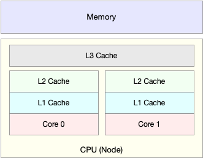
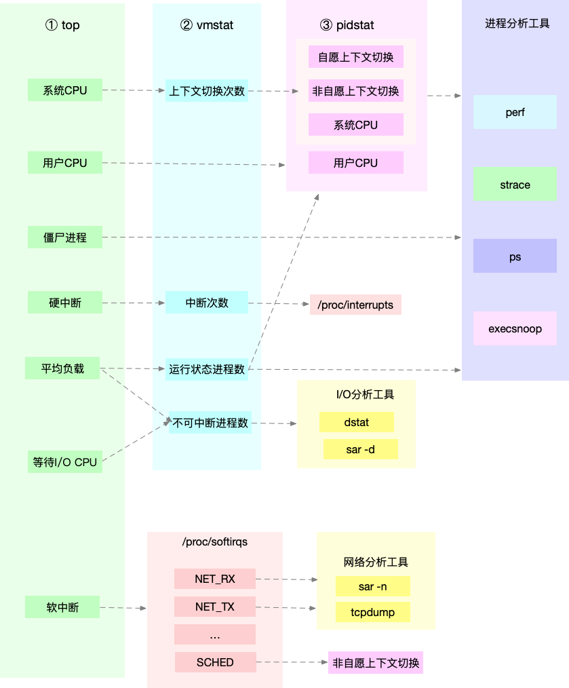
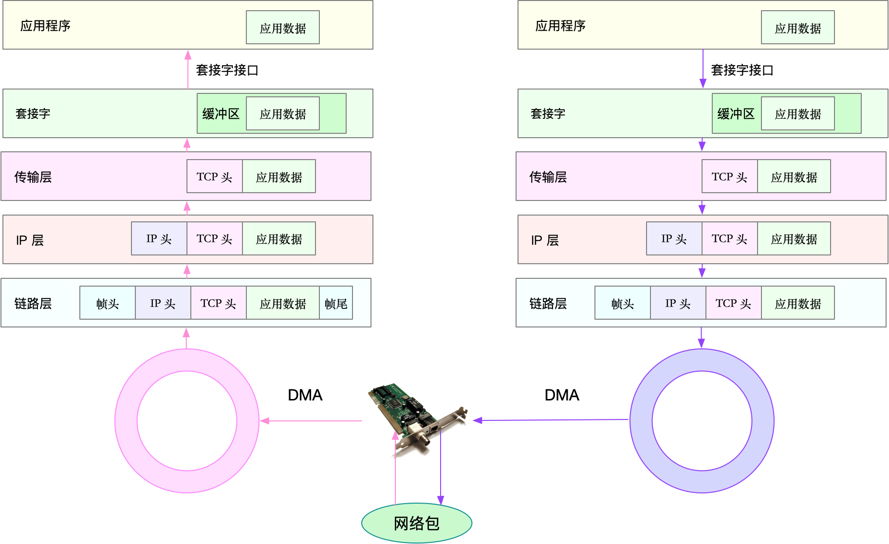
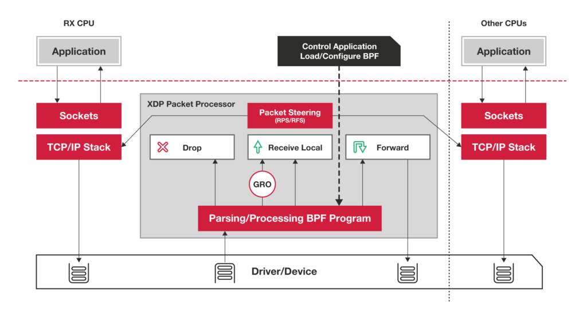
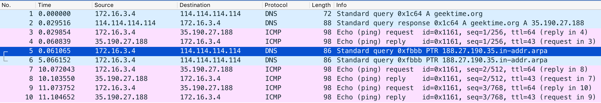
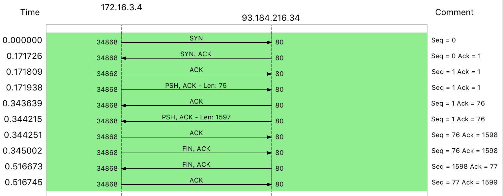

# CPU

## 02 | 基础篇：到底应该怎么理解“平均负载”
简单来说，平均负载是指单位时间内，系统处于**可运行状态和不可中断状态**的平均进程数，也就是平均活跃进程数，它和 CPU 使用率并没有直接关系。

比如，当一个进程向磁盘读写数据时，为了保证数据的一致性，在得到磁盘回复前，它是不能被其他进程或者中断打断的，这个时候的进程就处于不可中断状态。如果此时的进程被打断了，就容易出现磁盘数据与进程数据不一致的问题。

不可中断状态实际上是系统对进程和硬件设备的一种保护机制

```sh
uptime

02:34:03 up 2 days, 20:14, 1 user, load average: 0.63, 0.83, 0.88
```

在我看来，当平均负载高于 CPU 数量 70% 的时候，你就应该分析排查负载高的问题了

1. CPU 密集型进程，使用大量 CPU 会导致平均负载升高，此时这两者是一致的；
2. I/O 密集型进程，等待 I/O 也会导致平均负载升高，但 CPU 使用率不一定很高；
3. 大量等待 CPU 的进程调度也会导致平均负载升高，此时的 CPU 使用率也会比较高。
   
### 小结

平均负载提供了一个快速查看系统整体性能的手段，反映了整体的负载情况。但只看平均负载本身，我们并不能直接发现，到底是哪里出现了瓶颈。所以，在理解平均负载时，也要注意：
1. 平均负载高有可能是 CPU 密集型进程导致的；
2. 平均负载高并不一定代表 CPU 使用率高，还有可能是 I/O 更繁忙了；
3. 当发现负载高的时候，你可以使用 mpstat、pidstat 等工具，辅助分析负载的来源。

## 03 | 基础篇：经常说的 CPU 上下文切换是什么意思？（上）

根据任务的不同，CPU 的上下文切换就可以分为几个不同的场景，也就是**进程上下文切换、线程上下文切换以及中断上下文切换**。

进程既可以在用户空间运行，又可以在内核空间中运行。进程在用户空间运行时，被称为进程的用户态，而陷入内核空间的时候，被称为进程的内核态。从用户态到内核态的转变，需要通过系统调用来完成。比如，当我们查看文件内容时，就需要多次系统调用来完成：首先调用 open() 打开文件，然后调用 read() 读取文件内容，并调用 write() 将内容写到标准输出，最后再调用 close() 关闭文件。那么，系统调用的过程有没有发生 CPU 上下文的切换呢？答案自然是肯定的。

CPU 寄存器里原来用户态的指令位置，需要先保存起来。接着，为了执行内核态代码，CPU 寄存器需要更新为内核态指令的新位置。最后才是跳转到内核态运行内核任务。而系统调用结束后，CPU 寄存器需要恢复原来保存的用户态，然后再切换到用户空间，继续运行进程。所以，

*一次系统调用的过程，其实是发生了两次 CPU 上下文切换。*

### 线程上下文切换

线程与进程最大的区别在于，线程是调度的基本单位，而进程则是资源拥有的基本单位。说白了，所谓内核中的任务调度，实际上的调度对象是线程；而进程只是给线程提供了*虚拟内存、全局变量*等资源。

这么一来，线程的上下文切换其实就可以分为两种情况：

第一种， 前后两个线程属于不同进程。此时，因为资源不共享，所以切换过程就跟进程上下文切换是一样。

第二种，前后两个线程属于同一个进程。此时，因为虚拟内存是共享的，所以在切换时，虚拟内存这些资源就保持不动，只需要切换线程的私有数据、寄存器等不共享的数据。

到这里你应该也发现了，虽然同为上下文切换，但同进程内的线程切换，要比多进程间的切换消耗更少的资源，而这，也正是多线程代替多进程的一个优势。

### 中断上下文切换

**对同一个 CPU 来说，中断处理比进程拥有更高的优先级**，所以中断上下文切换并不会与进程上下文切换同时发生。同样道理，由于中断会打断正常进程的调度和执行，所以大部分中断处理程序都短小精悍，以便尽可能快的执行结束

### 小结

总结一下，不管是哪种场景导致的上下文切换，你都应该知道：CPU 上下文切换，是保证 Linux 系统正常工作的核心功能之一，一般情况下不需要我们特别关注。

但过多的上下文切换，会把 CPU 时间消耗在寄存器、内核栈以及虚拟内存等数据的保存和恢复上，从而缩短进程真正运行的时间，导致系统的整体性能大幅下降。

## 04 | 基础篇：经常说的 CPU 上下文切换是什么意思？（下）

vmstat 是一个常用的系统性能分析工具，主要用来分析系统的内存使用情况，也常用来分析 CPU 上下文切换和中断的次数。

```
vmstat 
5procs -----------memory---------- ---swap-- -----io---- -system-- ------cpu----- 
r b swpd free buff cache si so bi bo in cs us sy id wa st 
0 0 0 7005360 91564 818900 0 0 0 0 25 33 0 0 100
```

cs（context switch）是每秒上下文切换的次数。
in（interrupt）则是每秒中断的次数。
r（Running or Runnable）是就绪队列的长度，也就是正在运行和等待 CPU 的进程数。
b（Blocked）则是处于不可中断睡眠状态的进程数。


vmstat 只给出了系统总体的上下文切换情况，要想查看每个进程的详细情况，就需要使用我们前面提到过的 pidstat 了。给它加上 -w 选项，你就可以查看每个进程上下文切换的情况了.
```sh

# 每隔5秒输出1组数据
$ pidstat -w 5
Linux 4.15.0 (ubuntu) 09/23/18 _x86_64_ (2 CPU)
08:18:26 UID PID cswch/s nvcswch/s Command
08:18:31 0 1 0.20 0.00 systemd
08:18:31 0 8 5.40 0.00 rcu_sched...
```

这两个概念你一定要牢牢记住，因为它们意味着不同的性能问题：
1. 所谓**自愿上下文切换**，是指进程无法获取所需资源，导致的上下文切换。比如说， I/O、内存等系统资源不足时，就会发生自愿上下文切换。
2. 而**非自愿上下文切换**，则是指进程由于时间片已到等原因，被系统强制调度，进而发生的上下文切换。比如说，大量进程都在争抢 CPU 时，就容易发生非自愿上下文切换


1. 自愿上下文切换变多了，说明进程都在等待资源，有可能发生了 I/O 等其他问题；
2. 非自愿上下文切换变多了，说明进程都在被强制调度，也就是都在争抢 CPU，说明 CPU 的确成了瓶颈；
3. 中断次数变多了，说明 CPU 被中断处理程序占用，还需要通过查看 /proc/interrupts 文件来分析具体的中断类型。

### 小结

今天，我通过一个 sysbench 的案例，给你讲了上下文切换问题的分析思路。碰到上下文切换次数过多的问题时，我们可以借助 vmstat 、 pidstat 和 /proc/interrupts 等工具，来辅助排查性能问题的根源。

## 05 | 基础篇：某个应用的CPU使用率居然达到100%，我该怎么办？

碰到常规问题无法解释的 CPU 使用率情况时，首先要想到有可能是短时应用导致的问题，比如有可能是下面这两种情况。

1. 第一，应用里直接调用了其他二进制程序，这些程序通常运行时间比较短，通过 top 等工具也不容易发现。
2. 第二，应用本身在不停地崩溃重启，而启动过程的资源初始化，很可能会占用相当多的 CPU。
   
对于这类进程，我们可以用 pstree 或者 execsnoop 找到它们的父进程，再从父进程所在的应用入手，排查问题的根源。

## 06-07 系统中出现大量不可中断进程和僵尸进程怎么办？

```

# 间隔1秒输出10组数据

$ dstat 1 10


# 间隔 1 秒输出多组数据 (这里是 20 组)

$ pidstat -d 1 20

# -d 展示 I/O 统计数据，-p 指定进程号，间隔 1 秒输出 3 组数据

$ pidstat -d -p 4344 1 3


$ perf record -g
$ perf report
```

虽然这个案例是磁盘 I/O 导致了 iowait 升高，
不过， **iowait 高不一定代表 I/O 有性能瓶颈。当系统中只有 I/O 类型的进程在运行时，iowait 也会很高，但实际上，磁盘的读写远没有达到性能瓶颈的程度** 

因此，碰到 iowait 升高时，需要先用 dstat、pidstat 等工具，确认是不是磁盘 I/O 的问题，然后再找是哪些进程导致了 I/O。

等待 I/O 的进程一般是不可中断状态，所以用 ps 命令找到的 D 状态（即不可中断状态）的进程，多为可疑进程。但这个案例中，在 I/O 操作后，进程又变成了僵尸进程，所以不能用 strace 直接分析这个进程的系统调用。

这种情况下，我们用了 perf 工具，来分析系统的 CPU 时钟事件，最终发现是直接 I/O 导致的问题。这时，再检查源码中对应位置的问题，就很轻松了。

## 09 | 基础篇：怎么理解Linux软中断？

中断其实是一种异步的事件处理机制，可以提高系统的并发处理能力。

为了减少对正常进程运行调度的影响，中断处理程序就需要尽可能快地运行。

特别是，中断处理程序在响应中断时，还会临时关闭中断。这就会导致上一次中断处理完成之前，其他中断都不能响应，也就是说中断有可能会丢失。

Linux 将中断处理过程分成了两个阶段，也就是**上半部和下半部**：
1. 上半部用来快速处理中断，它在中断禁止模式下运行，主要处理跟硬件紧密相关的或时间敏感的工作。(硬中断)
2. 下半部用来延迟处理上半部未完成的工作，通常以内核线程的方式运行。（软中断）

1. 上半部直接处理硬件请求，也就是我们常说的硬中断，特点是快速执行；
2. 而下半部则是由内核触发，也就是我们常说的软中断，特点是延迟执行。

Linux 中的软中断包括网络收发、定时、调度、RCU 锁等各种类型，可以通过查看 /proc/softirqs 来观察软中断的运行情况。

## 10 | 案例篇：系统的软中断CPU使用率升高，我该怎么办？

```
watch -d cat /proc/softirqs

# -n DEV 表示显示网络收发的报告，间隔1秒输出一组数据
$ sar -n DEV 1

```

软中断 CPU 使用率（softirq）升高是一种很常见的性能问题。虽然软中断的类型很多，但实际生产中，我们遇到的性能瓶颈大多是网络收发类型的软中断，特别是网络接收的软中断。在碰到这类问题时，你可以借用 sar、tcpdump 等工具，做进一步分析。不要害怕网络性能，后面我会教你更多的分析方法。

## 11 | 套路篇：如何迅速分析出系统CPU的瓶颈在哪里？








CPU 优化

清楚了性能优化最基本的三个问题后，我们接下来从应用程序和系统的角度，分别来看看如何才能降低 CPU 使用率，提高 CPU 的并行处理能力。

**应用程序优化**
首先，从应用程序的角度来说，降低 CPU 使用率的最好方法当然是，排除所有不必要的工作，只保留最核心的逻辑。比如减少循环的层次、减少递归、减少动态内存分配等等。除此之外，应用程序的性能优化也包括很多种方法，我在这里列出了最常见的几种，你可以记下来。

1. 编译器优化：很多编译器都会提供优化选项，适当开启它们，在编译阶段你就可以获得编译器的帮助，来提升性能。比如， gcc 就提供了优化选项 -O2，开启后会自动对应用程序的代码进行优化。
2. 算法优化：使用复杂度更低的算法，可以显著加快处理速度。比如，在数据比较大的情况下，可以用 O(nlogn) 的排序算法（如快排、归并排序等），代替 O(n^2) 的排序算法（如冒泡、插入排序等）。
3. 异步处理：使用异步处理，可以避免程序因为等待某个资源而一直阻塞，从而提升程序的并发处理能力。比如，把轮询替换为事件通知，就可以避免轮询耗费 CPU 的问题。
4. 多线程代替多进程：前面讲过，相对于进程的上下文切换，线程的上下文切换并不切换进程地址空间，因此可以降低上下文切换的成本。
5. 善用缓存：经常访问的数据或者计算过程中的步骤，可以放到内存中缓存起来，这样在下次用时就能直接从内存中获取，加快程序的处理速度。系统优化从系统的角度来说，

**优化 CPU 的运行**，

一方面要充分利用 CPU 缓存的本地性，加速缓存访问；另一方面，就是要控制进程的 CPU 使用情况，减少进程间的相互影响。具体来说，系统层面的 CPU 优化方法也有不少，这里我同样列举了最常见的一些方法，方便你记忆和使用。
1. CPU 绑定：把进程绑定到一个或者多个 CPU 上，可以提高 CPU 缓存的命中率，减少跨 CPU 调度带来的上下文切换问题。
2. CPU 独占：跟 CPU 绑定类似，进一步将 CPU 分组，并通过 CPU 亲和性机制为其分配进程。这样，这些 CPU 就由指定的进程独占，换句话说，不允许其他进程再来使用这些 CPU。
3. 优先级调整：使用 nice 调整进程的优先级，正值调低优先级，负值调高优先级。优先级的数值含义前面我们提到过，忘了的话及时复习一下。在这里，适当降低非核心应用的优先级，增高核心应用的优先级，可以确保核心应用得到优先处理。

4. 为进程设置资源限制：使用 Linux cgroups 来设置进程的 CPU 使用上限，可以防止由于某个应用自身的问题，而耗尽系统资源。
5. NUMA（Non-Uniform Memory Access）优化：支持 NUMA 的处理器会被划分为多个 node，每个 node 都有自己的本地内存空间。NUMA 优化，其实就是让 CPU 尽可能只访问本地内存。
6. 中断负载均衡：无论是软中断还是硬中断，它们的中断处理程序都可能会耗费大量的 CPU。开启 irqbalance 服务或者配置 smp_affinity，就可以把中断处理过程自动负载均衡到多个 CPU 上。

# Memory

## 15 | 基础篇：Linux内存是怎么工作的？

Linux 内核给每个进程都提供了一个独立的虚拟地址空间，并且这个地址空间是连续的。这样，进程就可以很方便地访问内存，更确切地说是访问虚拟内存。

虚拟地址空间的内部又被分为内核空间和用户空间两部分，不同字长（也就是单个 CPU 指令可以处理数据的最大长度）的处理器，地址空间的范围也不同。比如最常见的 32 位和 64 位系统.


既然每个进程都有一个这么大的地址空间，那么所有进程的虚拟内存加起来，自然要比实际的物理内存大得多。所以，并不是所有的虚拟内存都会分配物理内存，只有那些实际使用的虚拟内存才分配物理内存，并且分配后的物理内存，是通过内存映射来管理的。**内存映射**，其实就是将虚拟内存地址映射到物理内存地址。

为了完成内存映射，内核为每个进程都维护了一张页表，记录**虚拟地址与物理地址**的映射关系，


页的大小只有 4 KB ，导致的另一个问题就是，整个页表会变得非常大。比方说，仅 32 位系统就需要 100 多万个页表项（4GB/4KB），才可以实现整个地址空间的映射。为了解决页表项过多的问题，Linux 提供了两种机制，也就是多级页表和大页（HugePage）。

如何查看内存使用情况

```s
$ free 
total used free shared buff/cache available
Mem: 8169348 263524 6875352 668 1030472 7611064
Swap: 0 0 0
```

* 第一列，total 是总内存大小；
* 第二列，used 是已使用内存的大小，包含了共享内存；
* 第三列，free 是未使用内存的大小；
* 第四列，shared 是共享内存的大小；
* 第五列，buff/cache 是缓存和缓冲区的大小；
* 最后一列，available 是新进程可用内存的大小。 available 不仅包含未使用内存，还包括了可回收的缓存，所以一般会比未使用内存更大。

```s
top

PID USER PR NI VIRT RES SHR S %CPU %MEM TIME+ COMMAND 
430 root 19 -1 122360 35588 23748 S 0.0 0.4 0:32.17 systemd-journal
```
* VIRT 是进程虚拟内存的大小，只要是进程申请过的内存，即便还没有真正分配物理内存，也会计算在内。
* RES 是常驻内存的大小，也就是进程实际使用的物理内存大小，但不包括 Swap 和共享内存。
* SHR 是共享内存的大小，比如与其他进程共同使用的共享内存、加载的动态链接库以及程序的代码段等。
* %MEM 是进程使用物理内存占系统总内存的百分比。


* 第一，虚拟内存通常并不会全部分配物理内存。从上面的输出，你可以发现每个进程的虚拟内存都比常驻内存大得多。
* 第二，共享内存 SHR 并不一定是共享的，比方说，程序的代码段、非共享的动态链接库，也都算在 SHR 里

## 16 | 基础篇：怎么理解内存中的Buffer和Cache？

1. Buffers 是对原始磁盘块的临时存储，也就是用来缓存磁盘的数据，通常不会特别大（20MB 左右）。这样，内核就可以把分散的写集中起来，统一优化磁盘的写入，比如可以把多次小的写合并成单次大的写等等。
2. Cached 是从磁盘读取文件的页缓存，也就是用来缓存从文件读取的数据。这样，下次访问这些文件数据时，就可以直接从内存中快速获取，而不需要再次访问缓慢的磁盘。
3. SReclaimable 是 Slab 的一部分。Slab 包括两部分，其中的可回收部分，用 SReclaimable 记录；而不可回收部分，用 SUnreclaim 记录。

**简单来说，Buffer 是对磁盘数据的缓存，而 Cache 是文件数据的缓存，它们既会用在读请求中，也会用在写请求中。**

从写的角度来说，不仅可以优化磁盘和文件的写入，对应用程序也有好处，应用程序可以在数据真正落盘前，就返回去做其他工作。

从读的角度来说，既可以加速读取那些需要频繁访问的数据，也降低了频繁 I/O 对磁盘的压力。

## 17 | 案例篇：如何利用系统缓存优化程序的运行效率？

**cachestat** 提供了整个操作系统缓存的读写命中情况。
**cachetop** 提供了每个进程的缓存命中情况。


```sh

sudo apt-key adv --keyserver keyserver.ubuntu.com --recv-keys 4052245BD4284CDD
echo "deb https://repo.iovisor.org/apt/xenial xenial main" | sudo tee /etc/apt/sources.list.d/iovisor.list
sudo apt-get update
sudo apt-get install -y bcc-tools libbcc-examples linux-headers-$(uname -r)


$ cachestat 1 3
   TOTAL   MISSES     HITS  DIRTIES   BUFFERS_MB  CACHED_MB
       2        0        2        1           17        279
       2        0        2        1           17        279
       2        0        2        1           17        279 


$ cachetop
11:58:50 Buffers MB: 258 / Cached MB: 347 / Sort: HITS / Order: ascending
PID      UID      CMD              HITS     MISSES   DIRTIES  READ_HIT%  WRITE_HIT%
   13029 root     python                  1        0        0     100.0%       0.0%
```

Buffers 和 Cache 可以极大提升系统的 I/O 性能。通常，我们用缓存命中率，来衡量缓存的使用效率。命中率越高，表示缓存被利用得越充分，应用程序的性能也就越好。

## 18 | 案例篇：内存泄漏了，我该如何定位和处理？

对普通进程来说，能看到的其实是内核提供的虚拟内存，这些虚拟内存还需要通过页表，由系统映射为物理内存。

当进程通过 malloc() 申请虚拟内存后，系统并不会立即为其分配物理内存，而是在首次访问时，才通过缺页异常陷入内核中分配内存。

为了协调 CPU 与磁盘间的性能差异，Linux 还会使用 Cache 和 Buffer ，分别把文件和磁盘读写的数据缓存到内存中。


栈内存由系统自动分配和管理。一旦程序运行超出了这个局部变量的作用域，栈内存就会被系统自动回收，所以不会产生内存泄漏的问题。

堆内存由应用程序自己来分配和管理。除非程序退出，这些堆内存并不会被系统自动释放，而是需要应用程序明确调用库函数 free() 来释放它们。如果应用程序没有正确释放堆内存，就会造成内存泄漏。

```sh
# install sysstat docker
sudo apt-get install -y sysstat docker.io

# Install bcc
sudo apt-key adv --keyserver keyserver.ubuntu.com --recv-keys 4052245BD4284CDD
echo "deb https://repo.iovisor.org/apt/bionic bionic main" | sudo tee /etc/apt/sources.list.d/iovisor.list
sudo apt-get update
sudo apt-get install -y bcc-tools libbcc-examples linux-headers-$(uname -r)
```

```sh

# 每隔3秒输出一组数据
$ vmstat 3
procs -----------memory---------- ---swap-- -----io---- -system-- ------cpu-----
r  b   swpd   free   buff  cache   si   so    bi    bo   in   cs us sy id wa st
procs -----------memory---------- ---swap-- -----io---- -system-- ------cpu-----
r  b   swpd   free   buff  cache   si   so    bi    bo   in   cs us sy id wa st
0  0      0 6601824  97620 1098784    0    0     0     0   62  322  0  0 100  0  0
0  0      0 6601700  97620 1098788    0    0     0     0   57  251  0  0 100  0  0
0  0      0 6601320  97620 1098788    0    0     0     3   52  306  0  0 100  0  0
0  0      0 6601452  97628 1098788    0    0     0    27   63  326  0  0 100  0  0
2  0      0 6601328  97628 1098788    0    0     0    44   52  299  0  0 100  0  0
0  0      0 6601080  97628 1098792    0    0     0     0   56  285  0  0 100  0  0 

```

未使用内存在逐渐减小，而 buffer 和 cache 基本不变，这说明，系统中使用的内存一直在升高。但这并不能说明有内存泄漏，因为应用程序运行中需要的内存也可能会增大。比如说，程序中如果用了一个动态增长的数组来缓存计算结果，占用内存自然会增长。

当然，memleak 是 bcc 软件包中的一个工具，我们一开始就装好了，执行 /usr/share/bcc/tools/memleak 就可以运行它。

```sh
# -a 表示显示每个内存分配请求的大小以及地址
# -p 指定案例应用的PID号
$ /usr/share/bcc/tools/memleak -a -p $(pidof app)
WARNING: Couldn't find .text section in /app
WARNING: BCC can't handle sym look ups for /app
    addr = 7f8f704732b0 size = 8192
    addr = 7f8f704772d0 size = 8192
    addr = 7f8f704712a0 size = 8192
    addr = 7f8f704752c0 size = 8192
    32768 bytes in 4 allocations from stack
        [unknown] [app]
        [unknown] [app]
        start_thread+0xdb [libpthread-2.27.so] 
```

## 19 - 20 | 案例篇：为什么系统的Swap变高了

接下来再看第一个可能的结果，内存回收，也就是系统释放掉可以回收的内存，比如我前面讲过的缓存和缓冲区，就属于可回收内存。它们在内存管理中，通常被叫做文件页（File-backed Page）。

大部分文件页，都可以直接回收，以后有需要时，再从磁盘重新读取就可以了。而那些被应用程序修改过，并且暂时还没写入磁盘的数据（也就是脏页），就得先写入磁盘，然后才能进行内存释放。这些脏页，一般可以通过两种方式写入磁盘。

1. 可以在应用程序中，通过系统调用 fsync ，把脏页同步到磁盘中；
2. 也可以交给系统，由内核线程 pdflush 负责这些脏页的刷新。

除了文件页外，还有没有其他的内存可以回收呢？比如，应用程序动态分配的堆内存，也就是我们在内存管理中说到的匿名页（**Anonymous Page**），是不是也可以回收呢？我想，你肯定会说，它们很可能还要再次被访问啊，当然不能直接回收了。非常正确，这些内存自然不能直接释放。

Swap 把这些不常访问的内存先写到磁盘中，然后释放这些内存，给其他更需要的进程使用。再次访问这些内存时，重新从磁盘读入内存就可以了。


kswapd0 定期扫描内存的使用情况，并根据剩余内存落在这三个阈值的空间位置，进行内存的回收操作。
1. 剩余内存小于页最小阈值，说明进程可用内存都耗尽了，只有内核才可以分配内存。
2. 剩余内存落在页最小阈值和页低阈值中间，说明内存压力比较大，剩余内存不多了。这时 kswapd0 会执行内存回收，直到剩余内存大于高阈值为止。
3. 剩余内存落在页低阈值和页高阈值中间，说明内存有一定压力，但还可以满足新内存请求。
4. 剩余内存大于页高阈值，说明剩余内存比较多，没有内存压力。

这个页低阈值，其实可以通过内核选项 /proc/sys/vm/min_free_kbytes 来间接设置。**min_free_kbytes** 设置了页最小阈值，而其他两个阈值，都是根据页最小阈值计算生成的，计算方法如下 ：

```s
pages_low = pages_min*5/4
pages_high = pages_min*3/2
```

### swappiness

其实，Linux 提供了一个 /proc/sys/vm/swappiness 选项，用来调整使用 Swap 的积极程度。

swappiness 的范围是 0-100，数值越大，越积极使用 Swap，也就是更倾向于回收匿名页；数值越小，越消极使用 Swap，也就是更倾向于回收文件页。

虽然 swappiness 的范围是 0-100，不过要注意，这并不是内存的百分比，而是调整 Swap 积极程度的权重，即使你把它设置成 0，当剩余内存 + 文件页小于页高阈值时，还是会发生 Swap。

### 开启Swap
开启 Swap 后，你可以设置 **/proc/sys/vm/min_free_kbytes** ，来调整系统定期回收内存的阈值，也可以设置 **/proc/sys/vm/swappiness** ，来调整文件页和匿名页的回收倾向。


要开启 Swap，我们首先要清楚，Linux 本身支持两种类型的 Swap，即 Swap 分区和 Swap 文件。以 Swap 文件为例，在第一个终端中运行下面的命令开启 Swap，我这里配置 Swap 文件的大小为 8GB：

```sh

# 创建Swap文件
$ fallocate -l 8G /mnt/swapfile
# 修改权限只有根用户可以访问
$ chmod 600 /mnt/swapfile
# 配置Swap文件
$ mkswap /mnt/swapfile
# 开启Swap
$ swapon /mnt/swapfile
```

```sh

# 写入空设备，实际上只有磁盘的读请求
$ dd if=/dev/sda1 of=/dev/null bs=1G count=2048


# 间隔1秒输出一组数据
# -r表示显示内存使用情况，-S表示显示Swap使用情况
$ sar -r -S 1
04:39:56    kbmemfree   kbavail kbmemused  %memused kbbuffers  kbcached  kbcommit   %commit  kbactive   kbinact   kbdirty
04:39:57      6249676   6839824   1919632     23.50    740512     67316   1691736     10.22    815156    841868         4

04:39:56    kbswpfree kbswpused  %swpused  kbswpcad   %swpcad
04:39:57      8388604         0      0.00         0      0.00

04:39:57    kbmemfree   kbavail kbmemused  %memused kbbuffers  kbcached  kbcommit   %commit  kbactive   kbinact   kbdirty
04:39:58      6184472   6807064   1984836     24.30    772768     67380   1691736     10.22    847932    874224        20

04:39:57    kbswpfree kbswpused  %swpused  kbswpcad   %swpcad
04:39:58      8388604         0      0.00         0      0.00

…


04:44:06    kbmemfree   kbavail kbmemused  %memused kbbuffers  kbcached  kbcommit   %commit  kbactive   kbinact   kbdirty
04:44:07       152780   6525716   8016528     98.13   6530440     51316   1691736     10.22    867124   6869332         0

04:44:06    kbswpfree kbswpused  %swpused  kbswpcad   %swpcad
04:44:07      8384508      4096      0.05        52      1.27
```

这里我还是推荐 proc 文件系统，用来查看进程 Swap 换出的虚拟内存大小，它保存在 /proc/pid/status 中的 VmSwap 中（推荐你执行 man proc 来查询其他字段的含义）。

```sh
# 按VmSwap使用量对进程排序，输出进程名称、进程ID以及SWAP用量
$ for file in /proc/*/status ; do awk '/VmSwap|Name|^Pid/{printf $2 " " $3}END{ print ""}' $file; done | sort -k 3 -n -r | head
dockerd 2226 10728 kB
docker-containe 2251 8516 kB
snapd 936 4020 kB
networkd-dispat 911 836 kB
polkitd 1004 44 kB
```

**关闭 Swap**

```
$ swapoff -a
```

实际上，关闭 Swap 后再重新打开，也是一种常用的 Swap 空间清理方法，比如：

```
$ swapoff -a && swapon -a 
```

通常，降低 Swap 的使用，可以提高系统的整体性能。要怎么做呢？这里，我也总结了几种常见的降低方法。
1. 禁止 Swap，现在服务器的内存足够大，所以除非有必要，禁用 Swap 就可以了。随着云计算的普及，大部分云平台中的虚拟机都默认禁止 Swap。
2. 如果实在需要用到 Swap，可以尝试降低 swappiness 的值，减少内存回收时 Swap 的使用倾向。
3. 响应延迟敏感的应用，如果它们可能在开启 Swap 的服务器中运行，你还可以用库函数 mlock() 或者 mlockall() 锁定内存，阻止它们的内存换出。

## 21 | 套路篇：如何“快准狠”找到系统内存的问题？

首先，你最容易想到的是系统内存使用情况，比如已用内存、剩余内存、共享内存、可用内存、缓存和缓冲区的用量等。

第二类很容易想到的，应该是进程内存使用情况，比如进程的虚拟内存、常驻内存、共享内存以及 Swap 内存等。


为了迅速定位内存问题，我通常会先运行几个覆盖面比较大的性能工具，比如 free、top、vmstat、pidstat 等。

1. 先用 free 和 top，查看系统整体的内存使用情况。
2. 再用 vmstat 和 pidstat，查看一段时间的趋势，从而判断出内存问题的类型。
3. 最后进行详细分析，比如内存分配分析、缓存 / 缓冲区分析、具体进程的内存使用分析等。


常见的优化思路有这么几种。
1. 最好禁止 Swap。如果必须开启 Swap，降低 swappiness 的值，减少内存回收时 Swap 的使用倾向。
2. 减少内存的动态分配。比如，可以使用内存池、大页（HugePage）等。
3. 尽量使用缓存和缓冲区来访问数据。比如，可以使用堆栈明确声明内存空间，来存储需要缓存的数据；或者用 Redis 这类的外部缓存组件，优化数据的访问。
4. 使用 cgroups 等方式限制进程的内存使用情况。这样，可以确保系统内存不会被异常进程耗尽。
5. 通过 /proc/pid/oom_adj ，调整核心应用的 oom_score。这样，可以保证即使内存紧张，核心应用也不会被 OOM 杀死。

# IO

## 23 | 基础篇：Linux 文件系统是怎么工作的？
为了方便管理，Linux 文件系统为每个文件都分配两个数据结构，**索引节点（index node）(inode)和目录项（directory entry）**。它们主要用来记录文件的元信息和目录结构。

换句话说，索引节点是每个文件的唯一标志，而目录项维护的正是文件系统的树状结构。目录项和索引节点的关系是多对一，你可以简单理解为，一个文件可以有多个别名。


目录项、索引节点、逻辑块以及超级块，构成了 Linux 文件系统的四大基本要素。不过，为了支持各种不同的文件系统，Linux 内核在用户进程和文件系统的中间，又引入了一个抽象层，也就是 **虚拟文件系统 VFS**（Virtual File System）。


在 VFS 的下方，Linux 支持各种各样的文件系统，如 Ext4、XFS、NFS 等等。按照存储位置的不同，这些文件系统可以分为三类。
1. 第一类是基于磁盘的文件系统，也就是把数据直接存储在计算机本地挂载的磁盘中。常见的 Ext4、XFS、OverlayFS 等，都是这类文件系统。
2. 第二类是基于内存的文件系统，也就是我们常说的虚拟文件系统。这类文件系统，不需要任何磁盘分配存储空间，但会占用内存。我们经常用到的 /proc 文件系统，其实就是一种最常见的虚拟文件系统。此外，/sys 文件系统也属于这一类，主要向用户空间导出层次化的内核对象。
3. 第三类是网络文件系统，也就是用来访问其他计算机数据的文件系统，比如 NFS、SMB、iSCSI 等。

对文件系统来说，最常见的一个问题就是空间不足。当然，你可能本身就知道，用 df 命令，就能查看文件系统的磁盘空间使用情况。比如：

```sh
$ df /dev/sda1 
Filesystem     1K-blocks    Used Available Use% Mounted on 
/dev/sda1       30308240 3167020  27124836  11% / 


$ df -h /dev/sda1 
Filesystem      Size  Used Avail Use% Mounted on 
/dev/sda1        29G  3.1G   26G  11% / 


$ df -h /dev/sda1 
Filesystem      Size  Used Avail Use% Mounted on 
/dev/sda1        29G  3.1G   26G  11% / 
```

索引节点的容量，（也就是 Inode 个数）是在格式化磁盘时设定好的，一般由格式化工具自动生成。**当你发现索引节点空间不足，但磁盘空间充足时，很可能就是过多小文件导致的**。

## 基础篇：Linux 磁盘I/O是怎么工作的

### 磁盘性能指标

说到磁盘性能的衡量标准，必须要提到五个常见指标，也就是我们经常用到的，**使用率、饱和度、IOPS、吞吐量以及响应时间**等。这五个指标，是衡量磁盘性能的基本指标。

* 使用率，是指磁盘处理 I/O 的时间百分比。过高的使用率（比如超过 80%），通常意味着磁盘 I/O 存在性能瓶颈。
* 饱和度，是指磁盘处理 I/O 的繁忙程度。过高的饱和度，意味着磁盘存在严重的性能瓶颈。当饱和度为 100% 时，磁盘无法接受新的 I/O 请求。
* IOPS（Input/Output Per Second），是指每秒的 I/O 请求数。
* 吞吐量，是指每秒的 I/O 请求大小。
* 响应时间，是指 I/O 请求从发出到收到响应的间隔时间

使用率只考虑有没有 I/O，而不考虑 I/O 的大小。换句话说，当使用率是 100% 的时候，磁盘依然有可能接受新的 I/O 请求。

举个例子，在数据库、大量小文件等这类随机读写比较多的场景中，IOPS 更能反映系统的整体性能；而在多媒体等顺序读写较多的场景中，吞吐量才更能反映系统的整体性能。

推荐用性能测试工具 fio ，来测试磁盘的 IOPS、吞吐量以及响应时间等核心指标。但还是那句话，因地制宜，灵活选取。在基准测试时，一定要注意根据应用程序 I/O 的特点，来具体评估指标。

iostat 是最常用的磁盘 I/O 性能观测工具，它提供了每个磁盘的使用率、IOPS、吞吐量等各种常见的性能指标，当然，这些指标实际上来自 /proc/diskstats。

```s
# -d -x表示显示所有磁盘I/O的指标
$ iostat -d -x 1 
Device            r/s     w/s     rkB/s     wkB/s   rrqm/s   wrqm/s  %rrqm  %wrqm r_await w_await aqu-sz rareq-sz wareq-sz  svctm  %util 
loop0            0.00    0.00      0.00      0.00     0.00     0.00   0.00   0.00    0.00    0.00   0.00     0.00     0.00   0.00   0.00 
loop1            0.00    0.00      0.00      0.00     0.00     0.00   0.00   0.00    0.00    0.00   0.00     0.00     0.00   0.00   0.00 
sda              0.00    0.00      0.00      0.00     0.00     0.00   0.00   0.00    0.00    0.00   0.00     0.00     0.00   0.00   0.00 
sdb              0.00    0.00      0.00      0.00     0.00     0.00   0.00   0.00    0.00    0.00   0.00     0.00     0.00   0.00   0.00 
```


这些指标中，你要注意：
* %util ，就是我们前面提到的磁盘 I/O 使用率；
* r/s+ w/s ，就是 IOPS；
* rkB/s+wkB/s ，就是吞吐量；
* r_await+w_await ，就是响应时间。


```s
$ pidstat -d 1 
13:39:51      UID       PID   kB_rd/s   kB_wr/s kB_ccwr/s iodelay  Command 
13:39:52      102       916      0.00      4.00      0.00       0  rsyslogd


$ iotop
Total DISK READ :       0.00 B/s | Total DISK WRITE :       7.85 K/s 
Actual DISK READ:       0.00 B/s | Actual DISK WRITE:       0.00 B/s 
  TID  PRIO  USER     DISK READ  DISK WRITE  SWAPIN     IO>    COMMAND 
15055 be/3 root        0.00 B/s    7.85 K/s  0.00 %  0.00 % systemd-journald 
```

你可以用 iostat 获得磁盘的 I/O 情况，也可以用 pidstat、iotop 等观察进程的 I/O 情况。不过在分析这些性能指标时，你要注意结合读写比例、I/O 类型以及 I/O 大小等，进行综合分析。

## 30 | 套路篇：如何迅速分析出系统I/O的瓶颈在哪里？


1. 第一，在文件系统的原理中，我介绍了查看文件系统容量的工具 df。它既可以查看文件系统数据的空间容量，也可以查看索引节点的容量。至于文件系统缓存，我们通过 /proc/meminfo、/proc/slabinfo 以及 slabtop 等各种来源，观察页缓存、目录项缓存、索引节点缓存以及具体文件系统的缓存情况。
2. 第二，在磁盘 I/O 的原理中，我们分别用 iostat 和 pidstat 观察了磁盘和进程的 I/O 情况。它们都是最常用的 I/O 性能分析工具。通过 iostat ，我们可以得到磁盘的 I/O 使用率、吞吐量、响应时间以及 IOPS 等性能指标；而通过 pidstat ，则可以观察到进程的 I/O 吞吐量以及块设备 I/O 的延迟等。
3. 第三，在狂打日志的案例中，我们先用 **top** 查看系统的 CPU 使用情况，发现 iowait 比较高；然后，又用 **iostat** 发现了磁盘的 I/O 使用率瓶颈，并用 **pidstat** 找出了大量 I/O 的进程；最后，通过 **strace** 和 **lsof**，我们找出了问题进程正在读写的文件，并最终锁定性能问题的来源——原来是进程在狂打日志。
4. 第四，在磁盘 I/O 延迟的单词热度案例中，我们同样先用 top、iostat ，发现磁盘有 I/O 瓶颈，并用 pidstat 找出了大量 I/O 的进程。可接下来，想要照搬上次操作的我们失败了。在随后的 strace 命令中，我们居然没看到 write 系统调用。于是，我们换了一个思路，用新工具 filetop 和 opensnoop ，从内核中跟踪系统调用，最终找出瓶颈的来源。
5. 最后，在 MySQL 和 Redis 的案例中，同样的思路，我们先用 top、iostat 以及 pidstat ，确定并找出 I/O 性能问题的瓶颈来源，它们正是 mysqld 和 redis-server。随后，我们又用 strace+lsof 找出了它们正在读写的文件。关于 MySQL 案例，根据 mysqld 正在读写的文件路径，再结合 MySQL 数据库引擎的原理，我们不仅找出了数据库和数据表的名称，还进一步发现了慢查询的问题，最终通过优化索引解决了性能瓶颈。至于 Redis 案例，根据 redis-server 读写的文件，以及正在进行网络通信的 TCP Socket，再结合 Redis 的工作原理，我们发现 Redis 持久化选项配置有问题；从 TCP Socket 通信的数据中，我们还发现了客户端的不合理行为。于是，我们修改 Redis 配置选项，并优化了客户端使用 Redis 的方式，从而减少网络通信次数，解决性能问题。

```s
# 按1切换到每个CPU的使用情况 
$ top 
top - 14:43:43 up 1 day,  1:39,  2 users,  load average: 2.48, 1.09, 0.63 
Tasks: 130 total,   2 running,  74 sleeping,   0 stopped,   0 zombie 
%Cpu0  :  0.7 us,  6.0 sy,  0.0 ni,  0.7 id, 92.7 wa,  0.0 hi,  0.0 si,  0.0 st 
%Cpu1  :  0.0 us,  0.3 sy,  0.0 ni, 92.3 id,  7.3 wa,  0.0 hi,  0.0 si,  0.0 st 
KiB Mem :  8169308 total,   747684 free,   741336 used,  6680288 buff/cache 
KiB Swap:        0 total,        0 free,        0 used.  7113124 avail Mem 

  PID USER      PR  NI    VIRT    RES    SHR S  %CPU %MEM     TIME+ COMMAND 
18940 root      20   0  656108 355740   5236 R   6.3  4.4   0:12.56 python 
1312 root      20   0  236532  24116   9648 S   0.3  0.3   9:29.80 python3 


# -d表示显示I/O性能指标，-x表示显示扩展统计（即所有I/O指标） 
$ iostat -x -d 1 
Device            r/s     w/s     rkB/s     wkB/s   rrqm/s   wrqm/s  %rrqm  %wrqm r_await w_await aqu-sz rareq-sz wareq-sz  svctm  %util 
loop0            0.00    0.00      0.00      0.00     0.00     0.00   0.00   0.00    0.00    0.00   0.00     0.00     0.00   0.00   0.00 
sdb              0.00    0.00      0.00      0.00     0.00     0.00   0.00   0.00    0.00    0.00   0.00     0.00     0.00   0.00   0.00 
sda              0.00   64.00      0.00  32768.00     0.00     0.00   0.00   0.00    0.00 7270.44 1102.18     0.00   512.00  15.50  99.20


$ pidstat -d 1 

15:08:35      UID       PID   kB_rd/s   kB_wr/s kB_ccwr/s iodelay  Command 
15:08:36        0     18940      0.00  45816.00      0.00      96  python 

15:08:36      UID       PID   kB_rd/s   kB_wr/s kB_ccwr/s iodelay  Command 
15:08:37        0       354      0.00      0.00      0.00     350  jbd2/sda1-8 
15:08:37        0     18940      0.00  46000.00      0.00      96  python 
15:08:37        0     20065      0.00      0.00      0.00    1503  kworker/u4:2 


$ strace -fp 18940 
strace: Process 18940 attached 
...
mmap(NULL, 314576896, PROT_READ|PROT_WRITE, MAP_PRIVATE|MAP_ANONYMOUS, -1, 0) = 0x7f0f7aee9000 
mmap(NULL, 314576896, PROT_READ|PROT_WRITE, MAP_PRIVATE|MAP_ANONYMOUS, -1, 0) = 0x7f0f682e8000 
write(3, "2018-12-05 15:23:01,709 - __main"..., 314572844 
) = 314572844 
munmap(0x7f0f682e8000, 314576896)       = 0 
write(3, "\n", 1)                       = 1 
munmap(0x7f0f7aee9000, 314576896)       = 0 
close(3)                                = 0 
stat("/tmp/logtest.txt.1", {st_mode=S_IFREG|0644, st_size=943718535, ...}) = 0 


$ lsof -p 18940 
COMMAND   PID USER   FD   TYPE DEVICE  SIZE/OFF    NODE NAME 
python  18940 root  cwd    DIR   0,50      4096 1549389 / 
python  18940 root  rtd    DIR   0,50      4096 1549389 / 
… 
python  18940 root    2u   CHR  136,0       0t0       3 /dev/pts/0 
python  18940 root    3w   REG    8,1 117944320     303 /tmp/logtest.txt 

我们可以给 lsof 命令加上 -i 选项，找出 TCP socket 对应的 TCP 连接信息。
```


1. 先用 iostat 发现磁盘 I/O 性能瓶颈；
2. 再借助 pidstat ，定位出导致瓶颈的进程；
3. 随后分析进程的 I/O 行为；
4. 最后，结合应用程序的原理，分析这些 I/O 的来源。

## 31 | 套路篇：磁盘 I/O 性能优化的几个思路
fio（Flexible I/O Tester）正是最常用的文件系统和磁盘 I/O 性能基准测试工具。

```s
# 随机读
fio -name=randread -direct=1 -iodepth=64 -rw=randread -ioengine=libaio -bs=4k -size=1G -numjobs=1 -runtime=1000 -group_reporting -filename=/dev/sdb

# 随机写
fio -name=randwrite -direct=1 -iodepth=64 -rw=randwrite -ioengine=libaio -bs=4k -size=1G -numjobs=1 -runtime=1000 -group_reporting -filename=/dev/sdb

# 顺序读
fio -name=read -direct=1 -iodepth=64 -rw=read -ioengine=libaio -bs=4k -size=1G -numjobs=1 -runtime=1000 -group_reporting -filename=/dev/sdb

# 顺序写
fio -name=write -direct=1 -iodepth=64 -rw=write -ioengine=libaio -bs=4k -size=1G -numjobs=1 -runtime=1000 -group_reporting -filename=/dev/sdb 
```

```s
read: (g=0): rw=read, bs=(R) 4096B-4096B, (W) 4096B-4096B, (T) 4096B-4096B, ioengine=libaio, iodepth=64
fio-3.1
Starting 1 process
Jobs: 1 (f=1): [R(1)][100.0%][r=16.7MiB/s,w=0KiB/s][r=4280,w=0 IOPS][eta 00m:00s]
read: (groupid=0, jobs=1): err= 0: pid=17966: Sun Dec 30 08:31:48 2018
   read: IOPS=4257, BW=16.6MiB/s (17.4MB/s)(1024MiB/61568msec)
    slat (usec): min=2, max=2566, avg= 4.29, stdev=21.76
    clat (usec): min=228, max=407360, avg=15024.30, stdev=20524.39
     lat (usec): min=243, max=407363, avg=15029.12, stdev=20524.26
    clat percentiles (usec):
     |  1.00th=[   498],  5.00th=[  1020], 10.00th=[  1319], 20.00th=[  1713],
     | 30.00th=[  1991], 40.00th=[  2212], 50.00th=[  2540], 60.00th=[  2933],
     | 70.00th=[  5407], 80.00th=[ 44303], 90.00th=[ 45351], 95.00th=[ 45876],
     | 99.00th=[ 46924], 99.50th=[ 46924], 99.90th=[ 48497], 99.95th=[ 49021],
     | 99.99th=[404751]
   bw (  KiB/s): min= 8208, max=18832, per=99.85%, avg=17005.35, stdev=998.94, samples=123
   iops        : min= 2052, max= 4708, avg=4251.30, stdev=249.74, samples=123
  lat (usec)   : 250=0.01%, 500=1.03%, 750=1.69%, 1000=2.07%
  lat (msec)   : 2=25.64%, 4=37.58%, 10=2.08%, 20=0.02%, 50=29.86%
  lat (msec)   : 100=0.01%, 500=0.02%
  cpu          : usr=1.02%, sys=2.97%, ctx=33312, majf=0, minf=75
  IO depths    : 1=0.1%, 2=0.1%, 4=0.1%, 8=0.1%, 16=0.1%, 32=0.1%, >=64=100.0%
     submit    : 0=0.0%, 4=100.0%, 8=0.0%, 16=0.0%, 32=0.0%, 64=0.0%, >=64=0.0%
     complete  : 0=0.0%, 4=100.0%, 8=0.0%, 16=0.0%, 32=0.0%, 64=0.1%, >=64=0.0%
     issued rwt: total=262144,0,0, short=0,0,0, dropped=0,0,0
     latency   : target=0, window=0, percentile=100.00%, depth=64

Run status group 0 (all jobs):
   READ: bw=16.6MiB/s (17.4MB/s), 16.6MiB/s-16.6MiB/s (17.4MB/s-17.4MB/s), io=1024MiB (1074MB), run=61568-61568msec

Disk stats (read/write):
  sdb: ios=261897/0, merge=0/0, ticks=3912108/0, in_queue=3474336, util=90.09% 
```


先来看刚刚提到的前三个参数。事实上，slat、clat、lat 都是指 I/O 延迟（latency）。不同之处在于：
1. slat ，是指从 I/O 提交到实际执行 I/O 的时长（Submission latency）；
2. clat ，是指从 I/O 提交到 I/O 完成的时长（Completion latency）；
3. 而 lat ，指的是从 fio 创建 I/O 到 I/O 完成的总时长。

这里需要注意的是，对同步 I/O 来说，由于 I/O 提交和 I/O 完成是一个动作，所以 slat 实际上就是 I/O 完成的时间，而 clat 是 0。而从示例可以看到，使用异步 I/O（libaio）时，lat 近似等于 slat + clat 之和。

幸运的是，fio 支持 I/O 的重放。借助前面提到过的 blktrace，再配合上 fio，就可以实现对应用程序 I/O 模式的基准测试。你需要先用 blktrace ，记录磁盘设备的 I/O 访问情况；然后使用 fio ，重放 blktrace 的记录。

```

# 使用blktrace跟踪磁盘I/O，注意指定应用程序正在操作的磁盘
$ blktrace /dev/sdb

# 查看blktrace记录的结果
# ls
sdb.blktrace.0  sdb.blktrace.1

# 将结果转化为二进制文件
$ blkparse sdb -d sdb.bin

# 使用fio重放日志
$ fio --name=replay --filename=/dev/sdb --direct=1 --read_iolog=sdb.bin 
```

**应用程序优化**

1. 第一，可以用追加写代替随机写，减少寻址开销，加快 I/O 写的速度。
2. 第二，可以借助缓存 I/O ，充分利用系统缓存，降低实际 I/O 的次数。
3. 第三，可以在应用程序内部构建自己的缓存，或者用 Redis 这类外部缓存系统。这样，一方面，能在应用程序内部，控制缓存的数据和生命周期；另一方面，也能降低其他应用程序使用缓存对自身的影响。
4. 第四，在需要频繁读写同一块磁盘空间时，可以用 mmap 代替 read/write，减少内存的拷贝次数。
5. 第五，在需要同步写的场景中，尽量将写请求合并，而不是让每个请求都同步写入磁盘，即可以用 fsync() 取代 O_SYNC。
6. 第六，在多个应用程序共享相同磁盘时，为了保证 I/O 不被某个应用完全占用，推荐你使用 cgroups 的 I/O 子系统，来限制进程 / 进程组的 IOPS 以及吞吐量。


## 答疑

首先我们来看阻塞和非阻塞 I/O。根据应用程序是否阻塞自身运行，可以把 I/O 分为阻塞 I/O 和非阻塞 I/O。

所谓阻塞 I/O，是指应用程序在执行 I/O 操作后，如果没有获得响应，就会阻塞当前线程，不能执行其他任务。

所谓非阻塞 I/O，是指应用程序在执行 I/O 操作后，不会阻塞当前的线程，可以继续执行其他的任务。

再来看同步 I/O 和异步 I/O。根据 I/O 响应的通知方式的不同，可以把文件 I/O 分为同步 I/O 和异步 I/O。

所谓同步 I/O，是指收到 I/O 请求后，系统不会立刻响应应用程序；等到处理完成，系统才会通过系统调用的方式，告诉应用程序 I/O 结果。

所谓异步 I/O，是指收到 I/O 请求后，系统会先告诉应用程序 I/O 请求已经收到，随后再去异步处理；等处理完成后，系统再通过事件通知的方式，告诉应用程序结果。

你可以看出，阻塞 / 非阻塞和同步 / 异步，其实就是两个不同角度的 I/O 划分方式。它们描述的对象也不同，阻塞 / 非阻塞针对的是 I/O 调用者（即应用程序），而同步 / 异步针对的是 I/O 执行者（即系统）。

# Network

## 33-34 | 关于 Linux 网络，你必须知道这些

### 网络模型

* 应用层，负责为应用程序提供统一的接口。
* 表示层，负责把数据转换成兼容接收系统的格式。
* 会话层，负责维护计算机之间的通信连接。
* 传输层，负责为数据加上传输表头，形成数据包。
* 网络层，负责数据的路由和转发。
* 数据链路层，负责 MAC 寻址、错误侦测和改错。
* 物理层，负责在物理网络中传输数据帧

TCP/IP 模型，把网络互联的框架分为应用层、传输层、网络层、网络接口层等四层，其中，

* 应用层，负责向用户提供一组应用程序，比如 HTTP、FTP、DNS 等。
* 传输层，负责端到端的通信，比如 TCP、UDP 等。
* 网络层，负责网络包的封装、寻址和路由，比如 IP、ICMP 等。
* 网络接口层，负责网络包在物理网络中的传输，比如 MAC 寻址、错误侦测以及通过网卡传输网络帧等。


以通过 TCP 协议通信的网络包为例，通过下面这张图，我们可以看到，应用程序数据在每个层的封装格式。


* 传输层在应用程序数据前面增加了 TCP 头；
* 网络层在 TCP 数据包前增加了 IP 头；
* 而网络接口层，又在 IP 数据包前后分别增加了帧头和帧尾。

网络接口配置的最大传输单元（MTU），就规定了最大的 IP 包大小。在我们最常用的以太网中，**MTU 默认值是 1500**（这也是 Linux 的默认值）。


* 最上层的应用程序，需要通过系统调用，来跟套接字接口进行交互；
* 套接字的下面，就是我们前面提到的传输层、网络层和网络接口层；
* 最底层，则是网卡驱动程序以及物理网卡设备。

### 网络包的接收流程

1. 当一个网络帧到达网卡后，网卡会通过 DMA 方式，把这个网络包放到收包队列中；然后通过硬中断，告诉中断处理程序已经收到了网络包。
2. 接着，网卡中断处理程序会为网络帧分配内核数据结构（sk_buff），并将其拷贝到 sk_buff 缓冲区中；然后再通过软中断，通知内核收到了新的网络帧。
3. 接下来，内核协议栈从缓冲区中取出网络帧，并通过网络协议栈，从下到上逐层处理这个网络帧。
4. 最后，应用程序就可以使用 Socket 接口，读取到新接收到的数据了。



### 网络包的发送流程

1. 首先，应用程序调用 Socket API（比如 sendmsg）发送网络包。
2. 由于这是一个系统调用，所以会陷入到内核态的套接字层中。套接字层会把数据包放到 Socket 发送缓冲区中。
3. 接下来，网络协议栈从 Socket 发送缓冲区中，取出数据包；再按照 TCP/IP 栈，从上到下逐层处理。比如，传输层和网络层，分别为其增加 TCP 头和 IP 头，执行路由查找确认下一跳的 IP，并按照 MTU 大小进行分片。
4. 分片后的网络包，再送到网络接口层，进行物理地址寻址，以找到下一跳的 MAC 地址。然后添加帧头和帧尾，放到发包队列中。这一切完成后，会有软中断通知驱动程序：发包队列中有新的网络帧需要发送。
5. 最后，驱动程序通过 DMA ，从发包队列中读出网络帧，并通过物理网卡把它发送出去。

### 性能指标
实际上，我们通常用 **带宽、吞吐量、延时、PPS（Packet Per Second）** 等指标衡量网络的性能。
1. 带宽，表示链路的最大传输速率，单位通常为 b/s （比特 / 秒）。
2. 吞吐量，表示单位时间内成功传输的数据量，单位通常为 b/s（比特 / 秒）或者 B/s（字节 / 秒）。吞吐量受带宽限制，而吞吐量 / 带宽，也就是该网络的使用率。
3. 延时，表示从网络请求发出后，一直到收到远端响应，所需要的时间延迟。在不同场景中，这一指标可能会有不同含义。比如，它可以表示，建立连接需要的时间（比如 TCP 握手延时），或一个数据包往返所需的时间（比如 RTT）。
4. PPS，是 Packet Per Second（包 / 秒）的缩写，表示以网络包为单位的传输速率。PPS 通常用来评估网络的转发能力，比如硬件交换机，通常可以达到线性转发（即 PPS 可以达到或者接近理论最大值）。而基于 Linux 服务器的转发，则容易受网络包大小的影响。

除了这些指标，网络的 **可用性（网络能否正常通信）、并发连接数（TCP 连接数量）、丢包率（丢包百分比）、重传率（重新传输的网络包比例）等** 也是常用的性能指标。


以网络接口 eth0 为例，你可以运行下面的两个命令，查看它的配置和状态：

```s
$ ifconfig eth0
eth0: flags=4163<UP,BROADCAST,RUNNING,MULTICAST> mtu 1500
      inet 10.240.0.30 netmask 255.240.0.0 broadcast 10.255.255.255
      inet6 fe80::20d:3aff:fe07:cf2a prefixlen 64 scopeid 0x20<link>
      ether 78:0d:3a:07:cf:3a txqueuelen 1000 (Ethernet)
      RX packets 40809142 bytes 9542369803 (9.5 GB)
      RX errors 0 dropped 0 overruns 0 frame 0
      TX packets 32637401 bytes 4815573306 (4.8 GB)
      TX errors 0 dropped 0 overruns 0 carrier 0 collisions 0
​
$ ip -s addr show dev eth0
2: eth0: <BROADCAST,MULTICAST,UP,LOWER_UP> mtu 1500 qdisc mq state UP group default qlen 1000
  link/ether 78:0d:3a:07:cf:3a brd ff:ff:ff:ff:ff:ff
  inet 10.240.0.30/12 brd 10.255.255.255 scope global eth0
      valid_lft forever preferred_lft forever
  inet6 fe80::20d:3aff:fe07:cf2a/64 scope link
      valid_lft forever preferred_lft forever
  RX: bytes packets errors dropped overrun mcast
   9542432350 40809397 0       0       0       193
  TX: bytes packets errors dropped carrier collsns
   4815625265 32637658 0       0       0       0
```

* 第一，网络接口的状态标志。ifconfig 输出中的 RUNNING ，或 ip 输出中的 LOWER_UP ，都表示物理网络是连通的，即网卡已经连接到了交换机或者路由器中。如果你看不到它们，通常表示网线被拔掉了。
* 第二，MTU 的大小。MTU 默认大小是 1500，根据网络架构的不同（比如是否使用了 VXLAN 等叠加网络），你可能需要调大或者调小 MTU 的数值。
* 第三，网络接口的 IP 地址、子网以及 MAC 地址。这些都是保障网络功能正常工作所必需的，你需要确保配置正确。
* 第四，网络收发的字节数、包数、错误数以及丢包情况，特别是 TX 和 RX 部分的 errors、dropped、overruns、carrier 以及 collisions 等指标不为 0 时，通常表示出现了网络 I/O 问题。其中：
    1. errors 表示发生错误的数据包数，比如校验错误、帧同步错误等；
    2. dropped 表示丢弃的数据包数，即数据包已经收到了 Ring Buffer，但因为内存不足等原因丢包；
    3. overruns 表示超限数据包数，即网络 I/O 速度过快，导致 Ring Buffer 中的数据包来不及处理（队列满）而导致的丢包；
    4. carrier 表示发生 carrirer 错误的数据包数，比如双工模式不匹配、物理电缆出现问题等；
    5. collisions 表示碰撞数据包数。

### 套接字信息

```s
# head -n 3 表示只显示前面3行
# -l 表示只显示监听套接字
# -n 表示显示数字地址和端口(而不是名字)
# -p 表示显示进程信息
$ netstat -nlp | head -n 3
Active Internet connections (only servers)
Proto Recv-Q Send-Q Local Address           Foreign Address         State       PID/Program name
tcp        0      0 127.0.0.53:53           0.0.0.0:*               LISTEN      840/systemd-resolve

# -l 表示只显示监听套接字
# -t 表示只显示 TCP 套接字
# -n 表示显示数字地址和端口(而不是名字)
# -p 表示显示进程信息
$ ss -ltnp | head -n 3
State    Recv-Q    Send-Q        Local Address:Port        Peer Address:Port
LISTEN   0         128           127.0.0.53%lo:53               0.0.0.0:*        users:(("systemd-resolve",pid=840,fd=13))
LISTEN   0         128                 0.0.0.0:22               0.0.0.0:*        users:(("sshd",pid=1459,fd=3))
```
其中，**接收队列（Recv-Q）和发送队列（Send-Q）需要你特别关注**，它们通常应该是 0。当你发现它们不是 0 时，说明有网络包的堆积发生。当然还要注意，在不同套接字状态下，它们的含义不同。

* 当套接字处于连接状态（Established）时，Recv-Q 表示套接字缓冲还没有被应用程序取走的字节数（即接收队列长度）。而 Send-Q 表示还没有被远端主机确认的字节数（即发送队列长度）。

* 当套接字处于监听状态（Listening）时，Recv-Q 表示全连接队列的长度。而 Send-Q 表示全连接队列的最大长度。


所谓全连接，是指服务器收到了客户端的 ACK，完成了 TCP 三次握手，然后就会把这个连接挪到全连接队列中。这些全连接中的套接字，还需要被 accept() 系统调用取走，服务器才可以开始真正处理客户端的请求。

与全连接队列相对应的，还有一个半连接队列。所谓半连接是指还没有完成 TCP 三次握手的连接，连接只进行了一半。服务器收到了客户端的 SYN 包后，就会把这个连接放到半连接队列中，然后再向客户端发送 SYN+ACK 包。

```s
$ netstat -s
...
Tcp:
    3244906 active connection openings
    23143 passive connection openings
    115732 failed connection attempts
    2964 connection resets received
    1 connections established
    13025010 segments received
    17606946 segments sent out
    44438 segments retransmitted
    42 bad segments received
    5315 resets sent
    InCsumErrors: 42
...

$ ss -s
Total: 186 (kernel 1446)
TCP:   4 (estab 1, closed 0, orphaned 0, synrecv 0, timewait 0/0), ports 0

Transport Total     IP        IPv6
*    1446      -         -
RAW    2         1         1
UDP    2         2         0
TCP    4         3         1
...
```

### 网络吞吐和 PPS

给 sar 增加 -n 参数就可以查看网络的统计信息，比如网络接口（DEV）、网络接口错误（EDEV）、TCP、UDP、ICMP 等等。执行下面的命令，你就可以得到网络接口统计信息：

```s

# 数字1表示每隔1秒输出一组数据
$ sar -n DEV 1
Linux 4.15.0-1035-azure (ubuntu)   01/06/19   _x86_64_  (2 CPU)

13:21:40        IFACE   rxpck/s   txpck/s    rxkB/s    txkB/s   rxcmp/s   txcmp/s  rxmcst/s   %ifutil
13:21:41         eth0     18.00     20.00      5.79      4.25      0.00      0.00      0.00      0.00
13:21:41      docker0      0.00      0.00      0.00      0.00      0.00      0.00      0.00      0.00
13:21:41           lo      0.00      0.00      0.00      0.00      0.00      0.00      0.00      0.00
```

* rxpck/s 和 txpck/s 分别是接收和发送的 PPS，单位为包 / 秒。
* rxkB/s 和 txkB/s 分别是接收和发送的吞吐量，单位是 KB/ 秒。
* rxcmp/s 和 txcmp/s 分别是接收和发送的压缩数据包数，单位是包 / 秒。
* %ifutil 是网络接口的使用率，即半双工模式下为 (rxkB/s+txkB/s)/Bandwidth，而全双工模式下为 max(rxkB/s, txkB/s)/Bandwidth。

其中，Bandwidth 可以用 ethtool 来查询

```s
$ ethtool eth0 | grep Speed
  Speed: 1000Mb/s
```

### 连通性和延时
```s
# -c3表示发送三次ICMP包后停止
$ ping -c3 114.114.114.114
PING 114.114.114.114 (114.114.114.114) 56(84) bytes of data.
64 bytes from 114.114.114.114: icmp_seq=1 ttl=54 time=244 ms
64 bytes from 114.114.114.114: icmp_seq=2 ttl=47 time=244 ms
64 bytes from 114.114.114.114: icmp_seq=3 ttl=67 time=244 ms

--- 114.114.114.114 ping statistics ---
3 packets transmitted, 3 received, 0% packet loss, time 2001ms
rtt min/avg/max/mdev = 244.023/244.070/244.105/0.034 ms
```

我们通常使用带宽、吞吐量、延时等指标，来衡量网络的性能；相应的，你可以用 **ifconfig、netstat、ss、sar、ping** 等工具，来查看这些网络的性能指标。

## 35 | 基础篇：C10K 和 C1000K 回顾
C10K 和 C1000K 的首字母 C 是 Client 的缩写。C10K 就是单机同时处理 1 万个请求（并发连接 1 万）的问题，而 C1000K 也就是单机支持处理 100 万个请求（并发连接 100 万）的问题。
### C10K
详细了解前，我先来讲两种 I/O 事件通知的方式：**水平触发和边缘触发**，它们常用在套接字接口的文件描述符中

* 水平触发：只要文件描述符可以非阻塞地执行 I/O ，就会触发通知。也就是说，应用程序可以随时检查文件描述符的状态，然后再根据状态，进行 I/O 操作。
* 边缘触发：只有在文件描述符的状态发生改变（也就是 I/O 请求达到）时，才发送一次通知。这时候，应用程序需要尽可能多地执行 I/O，直到无法继续读写，才可以停止。如果 I/O 没执行完，或者因为某种原因没来得及处理，那么这次通知也就丢失了。

#### 第一种，使用非阻塞 I/O 和水平触发通知，比如使用 select 或者 poll。

这种方式的最大优点，是对应用程序比较友好，它的 API 非常简单。

但是，应用软件使用 select 和 poll 时，需要对这些文件描述符列表进行轮询，这样，请求数多的时候就会比较耗时。并且，select 和 poll 还有一些其他的限制。

应用程序每次调用 select 和 poll 时，还需要把文件描述符的集合，从用户空间传入内核空间，由内核修改后，再传出到用户空间中。这一来一回的内核空间与用户空间切换，也增加了处理成本。

#### 第二种，使用非阻塞 I/O 和边缘触发通知，比如 epoll。

1. epoll 使用红黑树，在内核中管理文件描述符的集合，这样，就不需要应用程序在每次操作时都传入、传出这个集合。
2. epoll 使用事件驱动的机制，只关注有 I/O 事件发生的文件描述符，不需要轮询扫描整个集合。

不过要注意，epoll 是在 Linux 2.6 中才新增的功能（2.4 虽然也有，但功能不完善）。由于边缘触发只在文件描述符可读或可写事件发生时才通知，那么应用程序就需要尽可能多地执行 I/O，并要处理更多的异常事件。

#### 第三种，使用异步 I/O（Asynchronous I/O，简称为 AIO）

### 工作模型优化

* 第一种，主进程 + 多个 worker 子进程，这也是最常用的一种模型。
这种方法的一个通用工作模式就是：主进程执行 bind() + listen() 后，创建多个子进程；然后，在每个子进程中，都通过 accept() 或 epoll_wait() ，来处理相同的套接字。

比如，最常用的反向代理服务器 Nginx 就是这么工作的。


这里要注意，accept() 和 epoll_wait() 调用，还存在一个惊群的问题。换句话说，当网络 I/O 事件发生时，多个进程被同时唤醒，但实际上只有一个进程来响应这个事件，其他被唤醒的进程都会重新休眠。

为了避免惊群问题， Nginx 在每个 worker 进程中，都增加一个了全局锁（accept_mutex）。这些 worker 进程需要首先竞争到锁，只有竞争到锁的进程，才会加入到 epoll 中，这样就确保只有一个 worker 子进程被唤醒。

主线程负责套接字初始化和子线程状态的管理，而子线程则负责实际的请求处理。由于线程的调度和切换成本比较低，实际上你可以进一步把 epoll_wait() 都放到主线程中，保证每次事件都只唤醒主线程，而子线程只需要负责后续的请求处理。

* 第二种，监听到相同端口的多进程模型。

在这种方式下，所有的进程都监听相同的接口，并且开启 SO_REUSEPORT 选项，由内核负责将请求负载均衡到这些监听进程中去。这一过程如下图所示。


由于内核确保了只有一个进程被唤醒，就不会出现惊群问题了。


不过要注意，想要使用 SO_REUSEPORT 选项，需要用 Linux 3.9 以上的版本才可以。

### C1000K

其实还是基于 C10K 的这些理论，epoll 配合线程池，再加上 CPU、内存和网络接口的性能和容量提升。大部分情况下，C100K 很自然就可以达到。

那么，再进一步，C1000K 是不是也可以很容易就实现呢？这其实没有那么简单了。

大量请求带来的中断处理，也会带来非常高的处理成本。这样，就需要多队列网卡、中断负载均衡、CPU 绑定、RPS/RFS（软中断负载均衡到多个 CPU 核上），以及将网络包的处理卸载（Offload）到网络设备（如 TSO/GSO、LRO/GRO、VXLAN OFFLOAD）等各种硬件和软件的优化。

C1000K 的解决方法，本质上还是构建在 epoll 的非阻塞 I/O 模型上。只不过，除了 I/O 模型之外，还需要从应用程序到 Linux 内核、再到 CPU、内存和网络等各个层次的深度优化，特别是需要借助硬件，来卸载那些原来通过软件处理的大量功能。

### C10M

实际上，在 C1000K 问题中，各种软件、硬件的优化很可能都已经做到头了。

究其根本，还是 Linux 内核协议栈做了太多太繁重的工作。从网卡中断带来的硬中断处理程序开始，到软中断中的各层网络协议处理，最后再到应用程序，这个路径实在是太长了，就会导致网络包的处理优化，到了一定程度后，就无法更进一步了。

要解决这个问题, 这里有两种常见的机制，DPDK 和 XDP




### Summary

C10K 问题的根源，一方面在于系统有限的资源；另一方面，也是更重要的因素，是同步阻塞的 I/O 模型以及轮询的套接字接口，限制了网络事件的处理效率。Linux 2.6 中引入的 epoll ，完美解决了 C10K 的问题，现在的高性能网络方案都基于 epoll。

从 C10K 到 C100K ，可能只需要增加系统的物理资源就可以满足；但从 C100K 到 C1000K ，就不仅仅是增加物理资源就能解决的问题了。这时，就需要多方面的优化工作了，从硬件的中断处理和网络功能卸载、到网络协议栈的文件描述符数量、连接状态跟踪、缓存队列等内核的优化，再到应用程序的工作模型优化，都是考虑的重点。

## 36 | 套路篇：怎么评估系统的网络性能？

### 性能指标

1. 首先，带宽，表示链路的最大传输速率，单位是 b/s（比特 / 秒）。在你为服务器选购网卡时，带宽就是最核心的参考指标。常用的带宽有 1000M、10G、40G、100G 等。
2. 第二，吞吐量，表示没有丢包时的最大数据传输速率，单位通常为 b/s （比特 / 秒）或者 B/s（字节 / 秒）。吞吐量受带宽的限制，吞吐量 / 带宽也就是该网络链路的使用率。
3. 第三，延时，表示从网络请求发出后，一直到收到远端响应，所需要的时间延迟。这个指标在不同场景中可能会有不同的含义。它可以表示建立连接需要的时间（比如 TCP 握手延时），或者一个数据包往返所需时间（比如 RTT）。
4. 最后，PPS，是 Packet Per Second（包 / 秒）的缩写，表示以网络包为单位的传输速率。PPS 通常用来评估网络的转发能力，而基于 Linux 服务器的转发，很容易受到网络包大小的影响（交换机通常不会受到太大影响，即交换机可以线性转发）。

### 各协议层的性能测试

#### 转发性能

```s
$ modprobe pktgen
$ ps -ef | grep pktgen | grep -v grep
root     26384     2  0 06:17 ?        00:00:00 [kpktgend_0]
root     26385     2  0 06:17 ?        00:00:00 [kpktgend_1]
$ ls /proc/net/pktgen/
kpktgend_0  kpktgend_1  pgctrl


# 定义一个工具函数，方便后面配置各种测试选项
function pgset() {
    local result
    echo $1 > $PGDEV

    result=`cat $PGDEV | fgrep "Result: OK:"`
    if [ "$result" = "" ]; then
         cat $PGDEV | fgrep Result:
    fi
}

# 为0号线程绑定eth0网卡
PGDEV=/proc/net/pktgen/kpktgend_0
pgset "rem_device_all"   # 清空网卡绑定
pgset "add_device eth0"  # 添加eth0网卡

# 配置eth0网卡的测试选项
PGDEV=/proc/net/pktgen/eth0
pgset "count 1000000"    # 总发包数量
pgset "delay 5000"       # 不同包之间的发送延迟(单位纳秒)
pgset "clone_skb 0"      # SKB包复制
pgset "pkt_size 64"      # 网络包大小
pgset "dst 192.168.0.30" # 目的IP
pgset "dst_mac 11:11:11:11:11:11"  # 目的MAC

# 启动测试
PGDEV=/proc/net/pktgen/pgctrl
pgset "start"


$ cat /proc/net/pktgen/eth0
Params: count 1000000  min_pkt_size: 64  max_pkt_size: 64
     frags: 0  delay: 0  clone_skb: 0  ifname: eth0
     flows: 0 flowlen: 0
...
Current:
     pkts-sofar: 1000000  errors: 0
     started: 1534853256071us  stopped: 1534861576098us idle: 70673us
...
Result: OK: 8320027(c8249354+d70673) usec, 1000000 (64byte,0frags)
  120191pps 61Mb/sec (61537792bps) errors: 0


```

你可以看到，测试报告主要分为三个部分：
1. 第一部分的 Params 是测试选项；
2. 第二部分的 Current 是测试进度，其中， packts so far（pkts-sofar）表示已经发送了 100 万个包，也就表明测试已完成。
3. 第三部分的 Result 是测试结果，包含测试所用时间、网络包数量和分片、PPS、吞吐量以及错误数。
根据上面的结果，我们发现，PPS 为 12 万，吞吐量为 61 Mb/s，没有发生错误。那么，12 万的 PPS 好不好呢？

即使是千兆交换机的 PPS，也可以达到 **150 万 PPS**，比我们测试得到的 12 万大多了。所以，看到这个数值你并不用担心，现在的多核服务器和万兆网卡已经很普遍了，稍做优化就可以达到数百万的 PPS。

### TCP/UDP 性能

iperf 和 netperf 都是最常用的网络性能测试工具，测试 TCP 和 UDP 的吞吐量。它们都以客户端和服务器通信的方式，测试一段时间内的平均吞吐量。

```s
# -s表示启动服务端，-i表示汇报间隔，-p表示监听端口
$ iperf3 -s -i 1 -p 10000


# -c表示启动客户端，192.168.0.30为目标服务器的IP
# -b表示目标带宽(单位是bits/s)
# -t表示测试时间
# -P表示并发数，-p表示目标服务器监听端口
$ iperf3 -c 192.168.0.30 -b 1G -t 15 -P 2 -p 10000


[ ID] Interval           Transfer     Bandwidth
...
[SUM]   0.00-15.04  sec  0.00 Bytes  0.00 bits/sec                  sender
[SUM]   0.00-15.04  sec  1.51 GBytes   860 Mbits/sec                  receiver
```

### HTTP 性能

要测试 HTTP 的性能，也有大量的工具可以使用，比如 ab、webbench 等，都是常用的 HTTP 压力测试工具。其中，ab 是 Apache 自带的 HTTP 压测工具，主要测试 HTTP 服务的每秒请求数、请求延迟、吞吐量以及请求延迟的分布情况等。

```s
# -c表示并发请求数为1000，-n表示总的请求数为10000
$ ab -c 1000 -n 10000 http://192.168.0.30/
...
Server Software:        nginx/1.15.8
Server Hostname:        192.168.0.30
Server Port:            80

...

Requests per second:    1078.54 [#/sec] (mean)
Time per request:       927.183 [ms] (mean)
Time per request:       0.927 [ms] (mean, across all concurrent requests)
Transfer rate:          890.00 [Kbytes/sec] received

Connection Times (ms)
              min  mean[+/-sd] median   max
Connect:        0   27 152.1      1    1038
Processing:     9  207 843.0     22    9242
Waiting:        8  207 843.0     22    9242
Total:         15  233 857.7     23    9268

Percentage of the requests served within a certain time (ms)
  50%     23
  66%     24
  75%     24
  80%     26
  90%    274
  95%   1195
  98%   2335
  99%   4663
 100%   9268 (longest request)
 ```

 * Requests per second 为 1074；
 * 每个请求的延迟（Time per request）分为两行，第一行的 927 ms 表示平均延迟，包括了线程运行的调度时间和网络请求响应时间，而下一行的 0.927ms ，则表示实际请求的响应时间；
 * Transfer rate 表示吞吐量（BPS）为 890 KB/s。

 像 Jmeter 或者 LoadRunner（商业产品），则针对复杂场景提供了脚本录制、回放、GUI 等更丰富的功能，使用起来也更加方便。

 ## 37 | 案例篇：DNS 解析时快时慢，我该怎么办？

 比如，我的系统配置的就是 114.114.114.114 这个域名服务器。你可以执行下面的命令，来查询你的系统配置：

 ```s

$ cat /etc/resolv.conf
nameserver 114.114.114.114
 ```

 * A 记录，用来把域名转换成 IP 地址；
 * CNAME 记录，用来创建别名；
 * 而 NS 记录，则表示该域名对应的域名服务器地址。

 还是以极客时间的网站 time.geekbang.org 为例，执行下面的 nslookup 命令，就可以查询到这个域名的 A 记录，可以看到，它的 IP 地址是 39.106.233.176：

 ```s
$ nslookup time.geekbang.org
# 域名服务器及端口信息
Server:    114.114.114.114
Address:  114.114.114.114#53

# 非权威查询结果
Non-authoritative answer:
Name:  time.geekbang.org
Address: 39.106.233.17
 ```

 ```s
# +trace表示开启跟踪查询
# +nodnssec表示禁止DNS安全扩展
$ dig +trace +nodnssec time.geekbang.org

; <<>> DiG 9.11.3-1ubuntu1.3-Ubuntu <<>> +trace +nodnssec time.geekbang.org
;; global options: +cmd
.      322086  IN  NS  m.root-servers.net.
.      322086  IN  NS  a.root-servers.net.
.      322086  IN  NS  i.root-servers.net.
.      322086  IN  NS  d.root-servers.net.
.      322086  IN  NS  g.root-servers.net.
.      322086  IN  NS  l.root-servers.net.
.      322086  IN  NS  c.root-servers.net.
.      322086  IN  NS  b.root-servers.net.
.      322086  IN  NS  h.root-servers.net.
.      322086  IN  NS  e.root-servers.net.
.      322086  IN  NS  k.root-servers.net.
.      322086  IN  NS  j.root-servers.net.
.      322086  IN  NS  f.root-servers.net.
;; Received 239 bytes from 114.114.114.114#53(114.114.114.114) in 1340 ms

org.      172800  IN  NS  a0.org.afilias-nst.info.
org.      172800  IN  NS  a2.org.afilias-nst.info.
org.      172800  IN  NS  b0.org.afilias-nst.org.
org.      172800  IN  NS  b2.org.afilias-nst.org.
org.      172800  IN  NS  c0.org.afilias-nst.info.
org.      172800  IN  NS  d0.org.afilias-nst.org.
;; Received 448 bytes from 198.97.190.53#53(h.root-servers.net) in 708 ms

geekbang.org.    86400  IN  NS  dns9.hichina.com.
geekbang.org.    86400  IN  NS  dns10.hichina.com.
;; Received 96 bytes from 199.19.54.1#53(b0.org.afilias-nst.org) in 1833 ms

time.geekbang.org.  600  IN  A  39.106.233.176
;; Received 62 bytes from 140.205.41.16#53(dns10.hichina.com) in 4 ms
 ```

 1. 第一部分，是从 114.114.114.114 查到的一些根域名服务器（.）的 NS 记录。
 2. 第二部分，是从 NS 记录结果中选一个（h.root-servers.net），并查询顶级域名 org. 的 NS 记录。
 3. 第三部分，是从 org. 的 NS 记录中选择一个（b0.org.afilias-nst.org），并查询二级域名 geekbang.org. 的 NS 服务器。
 4. 最后一部分，就是从 geekbang.org. 的 NS 服务器（dns10.hichina.com）查询最终主机 time.geekbang.org. 的 A 记录。

 

 * 对 DNS 解析的结果进行缓存。缓存是最有效的方法，但要注意，一旦缓存过期，还是要去 DNS 服务器重新获取新记录。不过，这对大部分应用程序来说都是可接受的。
 * 对 DNS 解析的结果进行预取。这是浏览器等 Web 应用中最常用的方法，也就是说，不等用户点击页面上的超链接，浏览器就会在后台自动解析域名，并把结果缓存起来。
 * 使用 HTTPDNS 取代常规的 DNS 解析。这是很多移动应用会选择的方法，特别是如今域名劫持普遍存在，使用 HTTP 协议绕过链路中的 DNS 服务器，就可以避免域名劫持的问题。
 * 基于 DNS 的全局负载均衡（GSLB）。这不仅为服务提供了负载均衡和高可用的功能，还可以根据用户的位置，返回距离最近的 IP 地址。

 ## 38 | 案例篇：怎么使用 tcpdump 和 Wireshark 分析网络流量？

 tcpdump 和 Wireshark 就是最常用的网络抓包和分析工具，更是分析网络性能必不可少的利器。
 * tcpdump 仅支持命令行格式使用，常用在服务器中抓取和分析网络包。
 * Wireshark 除了可以抓包外，还提供了强大的图形界面和汇总分析工具，在分析复杂的网络情景时，尤为简单和实用。

 ```s
$ tcpdump -nn udp port 53 or host 35.190.27.188


tcpdump: verbose output suppressed, use -v or -vv for full protocol decode
listening on eth0, link-type EN10MB (Ethernet), capture size 262144 bytes
14:02:31.100564 IP 172.16.3.4.56669 > 114.114.114.114.53: 36909+ A? geektime.org. (30)
14:02:31.507699 IP 114.114.114.114.53 > 172.16.3.4.56669: 36909 1/0/0 A 35.190.27.188 (46)
14:02:31.508164 IP 172.16.3.4 > 35.190.27.188: ICMP echo request, id 4356, seq 1, length 64
14:02:31.539667 IP 35.190.27.188 > 172.16.3.4: ICMP echo reply, id 4356, seq 1, length 64
14:02:31.539995 IP 172.16.3.4.60254 > 114.114.114.114.53: 49932+ PTR? 188.27.190.35.in-addr.arpa. (44)
14:02:36.545104 IP 172.16.3.4.60254 > 114.114.114.114.53: 49932+ PTR? 188.27.190.35.in-addr.arpa. (44)
14:02:41.551284 IP 172.16.3.4 > 35.190.27.188: ICMP echo request, id 4356, seq 2, length 64
14:02:41.582363 IP 35.190.27.188 > 172.16.3.4: ICMP echo reply, id 4356, seq 2, length 64
14:02:42.552506 IP 172.16.3.4 > 35.190.27.188: ICMP echo request, id 4356, seq 3, length 64
14:02:42.583646 IP 35.190.27.188 > 172.16.3.4: ICMP echo reply, id 4356, seq 3, length 64
```

* -nn ，表示不解析抓包中的域名（即不反向解析）、协议以及端口号。
* udp port 53 ，表示只显示 UDP 协议的端口号（包括源端口和目的端口）为 53 的包。host 35.190.27.188 ，表示只显示 IP 地址（包括源地址和目的地址）为 35.190.27.188 的包。
* 这两个过滤条件中间的“ or ”，表示或的关系，也就是说，只要满足上面两个条件中的任一个，就可以展示出来。

 

 

 最后，再次强调 tcpdump 的输出格式，我在前面已经介绍了它的基本格式：

 
时间戳 协议 源地址.源端口 > 目的地址.目的端口 网络包详细信息

### Wireshark

```s
$ tcpdump -nn udp port 53 or host 35.190.27.188 -w ping.pcap
```




```s
$ dig +short example.com
93.184.216.34
$ tcpdump -nn host 93.184.216.34 -w web.pcap
```

HTTP


由于 HTTP 基于 TCP ，所以你最先看到的三个包，分别是 TCP 三次握手的包。接下来，中间的才是 HTTP 请求和响应包，而最后的三个包，则是 TCP 连接断开时的三次挥手包。

从菜单栏中，点击 Statistics -> Flow Graph，然后，在弹出的界面中的 Flow type 选择 TCP Flows，你可以更清晰的看到，整个过程中 TCP 流的执行过程：



这其实跟各种教程上讲到的，TCP 三次握手和四次挥手很类似，作为对比， 你通常看到的 TCP 三次握手和四次挥手的流程，基本是这样的：


其实，之所以有三个包，是因为服务器端收到客户端的 FIN 后，服务器端同时也要关闭连接，这样就可以把 ACK 和 FIN 合并到一起发送，节省了一个包，变成了“三次挥手”。

https://wiki.wireshark.org/TCP%204-times%20close

## 39 | 案例篇：怎么缓解 DDoS 攻击带来的性能下降问题？

```s
# 运行Nginx服务并对外开放80端口
# --network=host表示使用主机网络（这是为了方便后面排查问题）
$ docker run -itd --name=nginx --network=host nginx


# -w表示只输出HTTP状态码及总时间，-o表示将响应重定向到/dev/null
$ curl -s -w 'Http code: %{http_code}\nTotal time:%{time_total}s\n' -o /dev/null http://192.168.0.30/
...
Http code: 200
Total time:0.002s


# -S参数表示设置TCP协议的SYN（同步序列号），-p表示目的端口为80
# -i u10表示每隔10微秒发送一个网络帧
$ hping3 -S -p 80 -i u10 192.168.0.30
```

```s
$ sar -n DEV 1
08:55:49        IFACE   rxpck/s   txpck/s    rxkB/s    txkB/s   rxcmp/s   txcmp/s  rxmcst/s   %ifutil
08:55:50      docker0      0.00      0.00      0.00      0.00      0.00      0.00      0.00      0.00
08:55:50         eth0  22274.00    629.00   1174.64     37.78      0.00      0.00      0.00      0.02
08:55:50           lo      0.00      0.00      0.00      0.00      0.00      0.00      0.00      0.00


# -i eth0 只抓取eth0网卡，-n不解析协议名和主机名
# tcp port 80表示只抓取tcp协议并且端口号为80的网络帧
$ tcpdump -i eth0 -n tcp port 80
09:15:48.287047 IP 192.168.0.2.27095 > 192.168.0.30: Flags [S], seq 1288268370, win 512, length 0
09:15:48.287050 IP 192.168.0.2.27131 > 192.168.0.30: Flags [S], seq 2084255254, win 512, length 0
09:15:48.287052 IP 192.168.0.2.27116 > 192.168.0.30: Flags [S], seq 677393791, win 512, length 0
09:15:48.287055 IP 192.168.0.2.27141 > 192.168.0.30: Flags [S], seq 1276451587, win 512, length 0
09:15:48.287068 IP 192.168.0.2.27154 > 192.168.0.30: Flags [S], seq 1851495339, win 512, length 0
...
```

这个输出中，Flags [S] 表示这是一个 SYN 包。大量的 SYN 包表明，这是一个 SYN Flood 攻击。

```s
# -n表示不解析名字，-p表示显示连接所属进程
$ netstat -n -p | grep SYN_REC
tcp        0      0 192.168.0.30:80          192.168.0.2:12503      SYN_RECV    -
tcp        0      0 192.168.0.30:80          192.168.0.2:13502      SYN_RECV    -
tcp        0      0 192.168.0.30:80          192.168.0.2:15256      SYN_RECV    -
tcp        0      0 192.168.0.30:80          192.168.0.2:18117      SYN_RECV    -
...
```

找出源 IP 后，要解决 SYN 攻击的问题，只要丢掉相关的包就可以。这时，iptables 可以帮你完成这个任务。你可以在终端一中，执行下面的 iptables 命令：
```s
$ iptables -I INPUT -s 192.168.0.2 -p tcp -j REJECT
```

我们还有很多其他方法，实现类似的目标。比如，你可以用以下两种方法，来限制 syn 包的速率：

```s
# 限制syn并发数为每秒1次
$ iptables -A INPUT -p tcp --syn -m limit --limit 1/s -j ACCEPT

# 限制单个IP在60秒新建立的连接数为10
$ iptables -I INPUT -p tcp --dport 80 --syn -m recent --name SYN_FLOOD --update --seconds 60 --hitcount 10 -j REJECT


$ sysctl net.ipv4.tcp_max_syn_backlog
net.ipv4.tcp_max_syn_backlog = 256


$ sysctl -w net.ipv4.tcp_synack_retries=1
net.ipv4.tcp_synack_retries = 1

#因而，开启 SYN Cookies 后，就不需要维护半开连接状态了，进而也就没有了半连接数的限制。
$ sysctl -w net.ipv4.tcp_syncookies=1
net.ipv4.tcp_syncookies = 1


$ cat /etc/sysctl.conf
net.ipv4.tcp_syncookies = 1
net.ipv4.tcp_synack_retries = 1
net.ipv4.tcp_max_syn_backlog = 1024
```

当 DDoS 报文到达服务器后，Linux 提供的机制只能缓解，而无法彻底解决。即使像是 SYN Flood 这样的小包攻击，其巨大的 PPS ，也会导致 Linux 内核消耗大量资源，进而导致其他网络报文的处理缓慢。虽然你可以调整内核参数，缓解 DDoS 带来的性能问题，却也会像案例这样，无法彻底解决它。

对于流量型的 DDoS 来说，当服务器的带宽被耗尽后，在服务器内部处理就无能为力了。这时，只能在服务器外部的网络设备中，设法识别并阻断流量（当然前提是网络设备要能扛住流量攻击）。比如，购置专业的入侵检测和防御设备，配置流量清洗设备阻断恶意流量等。

## 40 | 案例篇：网络请求延迟变大了，我该怎么办？

很多网络服务会把 ICMP 禁止掉，这也就导致我们无法用 ping ，来测试网络服务的可用性和往返延时。这时，你可以用 traceroute 或 hping3 的 TCP 和 UDP 模式，来获取网络延迟。

```s
# -c表示发送3次请求，-S表示设置TCP SYN，-p表示端口号为80
$ hping3 -c 3 -S -p 80 baidu.com
HPING baidu.com (eth0 123.125.115.110): S set, 40 headers + 0 data bytes
len=46 ip=123.125.115.110 ttl=51 id=47908 sport=80 flags=SA seq=0 win=8192 rtt=20.9 ms
len=46 ip=123.125.115.110 ttl=51 id=6788  sport=80 flags=SA seq=1 win=8192 rtt=20.9 ms
len=46 ip=123.125.115.110 ttl=51 id=37699 sport=80 flags=SA seq=2 win=8192 rtt=20.9 ms

--- baidu.com hping statistic ---
3 packets transmitted, 3 packets received, 0% packet loss
round-trip min/avg/max = 20.9/20.9/20.9 ms


# --tcp表示使用TCP协议，-p表示端口号，-n表示不对结果中的IP地址执行反向域名解析
$ traceroute --tcp -p 80 -n baidu.com
traceroute to baidu.com (123.125.115.110), 30 hops max, 60 byte packets
 1  * * *
 2  * * *
 3  * * *
 4  * * *
 5  * * *
 6  * * *
 7  * * *
 8  * * *
 9  * * *
10  * * *
11  * * *
12  * * *
13  * * *
14  123.125.115.110  20.684 ms *  20.798 ms
```

这里我解释一下延迟确认。这是针对 TCP ACK 的一种优化机制，也就是说，不用每次请求都发送一个 ACK，而是先等一会儿（比如 40ms），看看有没有“顺风车”。如果这段时间内，正好有其他包需要发送，那就捎带着 ACK 一起发送过去。当然，如果一直等不到其他包，那就超时后单独发送 ACK。


TCP_QUICKACK (since Linux 2.4.4)
              Enable  quickack mode if set or disable quickack mode if cleared.  In quickack mode, acks are sent imme‐
              diately, rather than delayed if needed in accordance to normal TCP operation.  This flag is  not  perma‐
              nent,  it only enables a switch to or from quickack mode.  Subsequent operation of the TCP protocol will
              once again enter/leave quickack mode depending on internal  protocol  processing  and  factors  such  as
              delayed ack timeouts occurring and data transfer.  This option should not be used in code intended to be
              portable.

Nagle 算法，是 TCP 协议中用于减少小包发送数量的一种优化算法，目的是为了提高实际带宽的利用率。

显然，Nagle 算法本身的想法还是挺好的，但是知道 Linux 默认的延迟确认机制后，你应该就不这么想了。因为它们一起使用时，网络延迟会明显。如下图所示：


查询 tcp 的文档，你就会知道，只有设置了 **TCP_NODELAY** 后，Nagle 算法才会禁用。所以，我们只需要查看 Nginx 的 tcp_nodelay 选项就可以了。


所以，在发现网络延迟增大后，你可以用 traceroute、hping3、tcpdump、Wireshark、strace 等多种工具，来定位网络中的潜在问题。比如，

* 使用 hping3 以及 wrk 等工具，确认单次请求和并发请求情况的网络延迟是否正常。
* 使用 traceroute，确认路由是否正确，并查看路由中每一跳网关的延迟。
* 使用 tcpdump 和 Wireshark，确认网络包的收发是否正常。
* 使用 strace 等，观察应用程序对网络套接字的调用情况是否正常。

### 41 | 案例篇：如何优化 NAT 性能？（上）

网络地址端口转换 NAPT（Network Address and Port Translation），即把内网 IP 映射到公网 IP 的不同端口上，让多个内网 IP 可以共享同一个公网 IP 地址。

NAPT 是目前最流行的 NAT 类型，我们在 Linux 中配置的 NAT 也是这种类型。而根据转换方式的不同，我们又可以把 NAPT 分为三类。
1. 第一类是源地址转换 SNAT，即目的地址不变，只替换源 IP 或源端口。SNAT 主要用于，多个内网 IP 共享同一个公网 IP ，来访问外网资源的场景。
2. 第二类是目的地址转换 DNAT，即源 IP 保持不变，只替换目的 IP 或者目的端口。DNAT 主要通过公网 IP 的不同端口号，来访问内网的多种服务，同时会隐藏后端服务器的真实 IP 地址。
3. 第三类是双向地址转换，即同时使用 SNAT 和 DNAT。当接收到网络包时，执行 DNAT，把目的 IP 转换为内网 IP；而在发送网络包时，执行 SNAT，把源 IP 替换为外部 IP。

