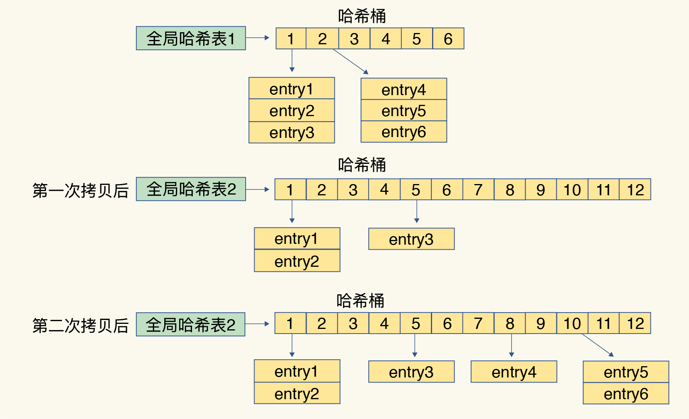
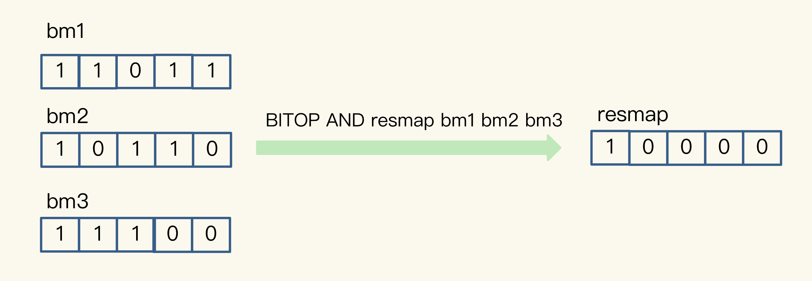
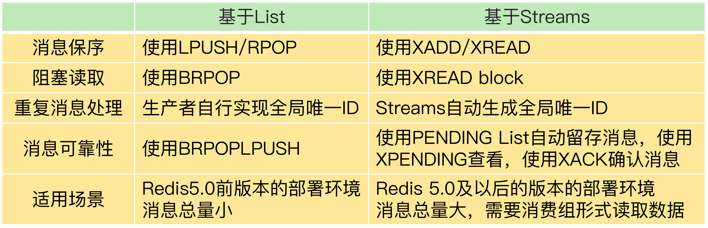
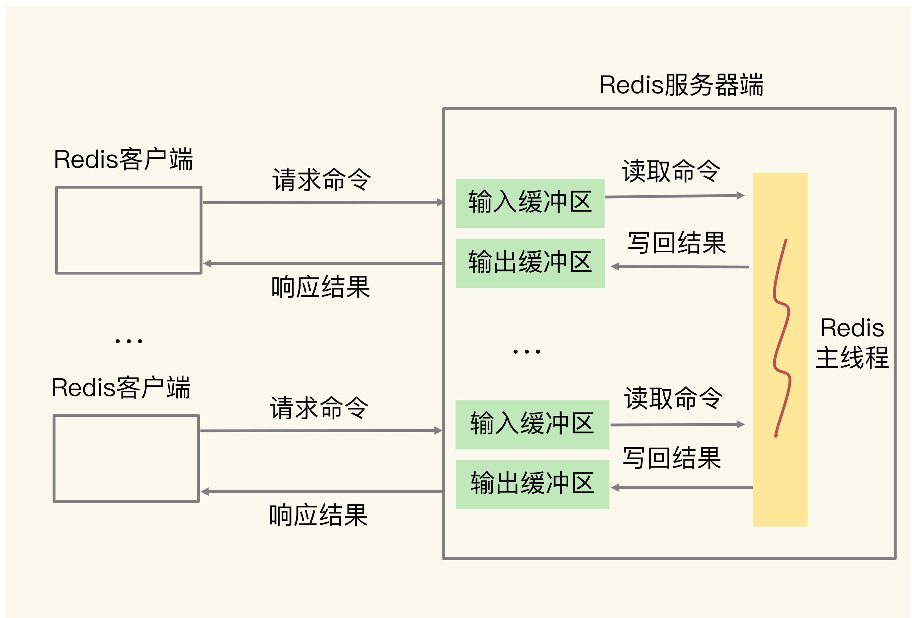
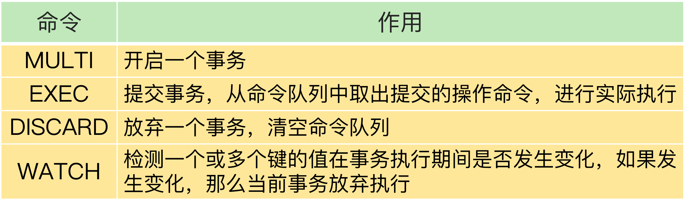

# Redis


## 开篇


* 高性能主线，包括线程模型、数据结构、持久化、网络框架；
* 高可靠主线，包括主从复制、哨兵机制；
* 高可扩展主线，包括数据分片、负载均衡。

## 01 | 基本架构：一个键值数据库包含什么？


SimpleKV 缺少的还包括：丰富的数据类型、数据压缩、过期机制、数据淘汰策略、主从复制、集群化、高可用等功能，另外还可以增加统计模块、通知模块、调试模块、元数据查询等辅助功能。

## 02 | 数据结构：快速的Redis有哪些慢操作？

底层数据结构一共有 6 种，分别是简单动态字符串、双向链表、压缩列表、哈希表、跳表和整数数组。


### 键和值用什么结构组织？

哈希桶中的元素保存的并不是值本身，而是指向具体值的指针


Redis 采用了渐进式 rehash。

简单来说就是在第二步拷贝数据时，Redis 仍然正常处理客户端请求，每处理一个请求时，从哈希表 1 中的第一个索引位置开始，顺带着将这个索引位置上的所有 entries 拷贝到哈希表 2 中；等处理下一个请求时，再顺带拷贝哈希表 1 中的下一个索引位置的 entries。如下图所示：




整数数组和压缩列表在查找时间复杂度方面并没有很大的优势，那为什么 Redis 还会把它们作为底层数据结构呢？

1、内存利用率，数组和压缩列表都是非常紧凑的数据结构，它比链表占用的内存要更少。Redis是内存数据库，大量数据存到内存中，此时需要做尽可能的优化，提高内存的利用率。

2、数组对CPU高速缓存支持更友好，所以Redis在设计时，集合数据元素较少情况下，默认采用内存紧凑排列的方式存储，同时利用CPU高速缓存不会降低访问速度。当数据元素超过设定阈值后，避免查询时间复杂度太高，转为哈希和跳表数据结构存储，保证查询效率。


## 03 | 高性能IO模型：为什么单线程Redis能那么快？

Redis 是单线程，主要是指 Redis 的网络 IO 和键值对读写是由一个线程来完成的，这也是 Redis 对外提供键值存储服务的主要流程。但 Redis 的其他功能，比如持久化、异步删除、集群数据同步等，其实是由额外的线程执行的。

### Redis 为什么用单线程？

多线程编程模式面临的共享资源的并发访问控制问题.

### 单线程 Redis 为什么那么快？

Redis 的大部分操作在内存上完成，再加上它采用了高效的数据结构，例如哈希表和跳表，这是它实现高性能的一个重要原因。另一方面，就是 Redis 采用了多路复用机制，使其在网络 IO 操作中能并发处理大量的客户端请求，实现高吞吐率。

Linux 中的 IO 多路复用机制是指一个线程处理多个 IO 流，就是我们经常听到的 select/epoll 机制。简单来说，在 Redis 只运行单线程的情况下，该机制允许内核中，同时存在多个监听套接字和已连接套接字。内核会一直监听这些套接字上的连接请求或数据请求。一旦有请求到达，就会交给 Redis 线程处理，这就实现了一个 Redis 线程处理多个 IO 流的效果。


图中的多个 FD 就是刚才所说的多个套接字。Redis 网络框架调用 epoll 机制，让内核监听这些套接字。此时，Redis 线程不会阻塞在某一个特定的监听或已连接套接字上，也就是说，不会阻塞在某一个特定的客户端请求处理上。

还有哪些潜在的性能瓶颈吗？

1. 任意一个请求在server中一旦发生耗时，都会影响整个server的性能，也就是说后面的请求都要等前面这个耗时请求处理完成，自己才能被处理到。耗时的操作包括以下几种：

    * 操作bigkey：写入一个bigkey在分配内存时需要消耗更多的时间，同样，删除bigkey释放内存同样会产生耗时；
    * 使用复杂度过高的命令：例如SORT/SUNION/ZUNIONSTORE，或者O(N)命令，但是N很大，例如lrange key 0 -1一次查询全量数据；
    *  大量key集中过期：Redis的过期机制也是在主线程中执行的，大量key集中过期会导致处理一个请求时，耗时都在删除过期key，耗时变长；
    *  淘汰策略：淘汰策略也是在主线程执行的，当内存超过Redis内存上限后，每次写入都需要淘汰一些key，也会造成耗时变长；
    * AOF刷盘开启always机制：每次写入都需要把这个操作刷到磁盘，写磁盘的速度远比写内存慢，会拖慢Redis的性能；
   * 主从全量同步生成RDB：虽然采用fork子进程生成数据快照，但fork这一瞬间也是会阻塞整个线程的，实例越大，阻塞时间越久；


2. 并发量非常大时，单线程读写客户端IO数据存在性能瓶颈，虽然采用IO多路复用机制，但是读写客户端数据依旧是同步IO，只能单线程依次读取客户端的数据，无法利用到CPU多核。

针对问题1，一方面需要业务人员去规避，一方面Redis在4.0推出了lazy-free机制，把bigkey释放内存的耗时操作放在了异步线程中执行，降低对主线程的影响。

针对问题2，Redis在6.0推出了多线程，可以在高并发场景下利用CPU多核多线程读写客户端数据，进一步提升server性能，当然，**只是针对客户端的读写是并行的，每个命令的真正操作依旧是单线程的**。


Redis 6.0 版本为什么又引入了多线程？

Redis 的瓶颈不在 CPU ，而在内存和网络，内存不够可以增加内存或通过数据结构等进行优化
但 Redis 的网络 IO 的读写占用了发部分 CPU 的时间，如果可以把网络处理改成多线程的方式，性能会有很大提升
所以总结下 Redis 6.0 版本引入多线程有两个原因
1.充分利用服务器的多核资源
2.多线程分摊 Redis 同步 IO 读写负荷

执行命令还是由单线程顺序执行，只是处理网络数据读写采用了多线程，而且 IO 线程要么同时读 Socket ，要么同时写 Socket ，不会同时读写

## 04 | AOF日志：宕机了，Redis如何避免数据丢失？

### AOF 日志是如何实现的？

AOF 日志正好相反，它是写后日志，“写后”的意思是 Redis 是先执行命令，把数据写入内存，然后才记录日志。

传统数据库的日志，例如 redo log（重做日志），记录的是修改后的数据，而 AOF 里记录的是 Redis 收到的每一条命令，这些命令是以文本形式保存的。


但是，为了避免额外的检查开销，Redis 在向 AOF 里面记录日志的时候，并不会先去对这些命令进行语法检查。所以，如果先记日志再执行命令的话，日志中就有可能记录了错误的命令，Redis 在使用日志恢复数据时，就可能会出错。而写后日志这种方式，就是先让系统执行命令，只有命令能执行成功，才会被记录到日志中，否则，系统就会直接向客户端报错。所以，Redis 使用写后日志这一方式的一大好处是，可以避免出现记录错误命令的情况。


1. 首先，如果刚执行完一个命令，还没有来得及记日志就宕机了，那么这个命令和相应的数据就有丢失的风险。
2. AOF 虽然避免了对当前命令的阻塞，但可能会给下一个操作带来阻塞风险。这是因为，AOF 日志也是在主线程中执行的，如果在把日志文件写入磁盘时，磁盘写压力大，就会导致写盘很慢，进而导致后续的操作也无法执行了。

1. Always，同步写回：每个写命令执行完，立马同步地将日志写回磁盘；
2. Everysec，每秒写回：每个写命令执行完，只是先把日志写到 AOF 文件的内存缓冲区，每隔一秒把缓冲区中的内容写入磁盘；
3. No，操作系统控制的写回：每个写命令执行完，只是先把日志写到 AOF 文件的内存缓冲区，由操作系统决定何时将缓冲区内容写回磁盘。


### 日志文件太大了怎么办？

当一个键值对被多条写命令反复修改时，AOF 文件会记录相应的多条命令。但是，在重写的时候，是根据这个键值对当前的最新状态，为它生成对应的写入命令。

和 AOF 日志由主线程写回不同，重写过程是由后台子进程 bgrewriteaof 来完成的，这也是为了避免阻塞主线程，导致数据库性能下降。

**一个拷贝，两处日志”。**

“一个拷贝”就是指，每次执行重写时，主线程 fork 出后台的 bgrewriteaof 子进程。此时，fork 会把主线程的内存拷贝一份给 bgrewriteaof 子进程，这里面就包含了数据库的最新数据。然后，bgrewriteaof 子进程就可以在不影响主线程的情况下，逐一把拷贝的数据写成操作，记入重写日志。

fork子进程时，子进程是会拷贝父进程的页表，即虚实映射关系，而不会拷贝物理内存。子进程复制了父进程页表，也能共享访问父进程的内存数据了。

fork子进程需要拷贝进程必要的数据结构，其中有一项就是拷贝内存页表，这个拷贝过程会消耗大量CPU资源，拷贝完成之前整个进程是会阻塞的，阻塞时间取决于整个实例的内存大小，实例越大，内存页表越大，fork阻塞时间越久。

第一处日志就是指正在使用的 AOF 日志，Redis 会把这个操作写到它的缓冲区。这样一来，即使宕机了，这个 AOF 日志的操作仍然是齐全的，可以用于恢复。

而第二处日志，就是指新的 AOF 重写日志。这个操作也会被写到重写日志的缓冲区。这样，重写日志也不会丢失最新的操作。等到拷贝数据的所有操作记录重写完成后，重写日志记录的这些最新操作也会写入新的 AOF 文件，以保证数据库最新状态的记录。此时，我们就可以用新的 AOF 文件替代旧文件了。


每次 AOF 重写时，Redis 会先执行一个内存拷贝，用于重写；然后，使用两个日志保证在重写过程中，新写入的数据不会丢失。而且，因为 Redis 采用额外的线程进行数据重写，所以，这个过程并不会阻塞主线程。

## 05 | 内存快照：宕机后，Redis如何实现快速恢复？

Redis 提供了两个命令来生成 RDB 文件，分别是 save 和 bgsave。

bgsave 子进程会把这个副本数据写入 RDB 文件，而在这个过程中，主线程仍然可以直接修改原来的数据。

这既保证了快照的完整性，也允许主线程同时对数据进行修改，避免了对正常业务的影响。

但是，如果频繁地执行全量快照，也会带来两方面的开销。

1. 一方面，频繁将全量数据写入磁盘，会给磁盘带来很大压力
2. fork 这个创建过程本身会阻塞主线程，而且主线程的内存越大，阻塞时间越长


Redis 4.0 中提出了一个混合使用 AOF 日志和内存快照的方法。

这样一来，快照不用很频繁地执行，这就避免了频繁 fork 对主线程的影响。而且，AOF 日志也只用记录两次快照间的操作，也就是说，不需要记录所有操作了，因此，就不会出现文件过大的情况了，也可以避免重写开销。


另外，可以再延伸一下，老师的问题没有提到Redis进程是否绑定了CPU，如果绑定了CPU，那么子进程会继承父进程的CPU亲和性属性，子进程必然会与父进程争夺同一个CPU资源，整个Redis Server的性能必然会受到影响！所以如果Redis需要开启定时RDB和AOF重写，进程一定不要绑定CPU。


## 06 | 数据同步：主从库如何实现数据一致？


### 主从库间网络断了怎么办？

当主从库断连后，主库会把断连期间收到的写操作命令，写入 repl_backlog_buffer 这个缓冲区。

repl_backlog_buffer 是一个环形缓冲区，主库会记录自己写到的位置，从库则会记录自己已经读到的位置。


主从库的连接恢复之后，从库首先会给主库发送 psync 命令，并把自己当前的 slave_repl_offset 发给主库，主库会判断自己的 master_repl_offset 和 slave_repl_offset 之间的差距。


只要有从库存在，这个repl_backlog_buffer就会存在。主库的所有写命令除了传播给从库之外，都会在这个repl_backlog_buffer中记录一份，缓存起来，只有预先缓存了这些命令，当从库断连后，从库重新发送psync $master_runid $offset，主库才能通过$offset在repl_backlog_buffer中找到从库断开的位置，只发送$offset之后的增量数据给从库即可。


## 07 | 哨兵机制：主库挂了，如何不间断服务？

### 哨兵机制的基本流程


### 主观下线和客观下线

哨兵机制也是类似的，它通常会采用多实例组成的集群模式进行部署，这也被称为哨兵集群。引入多个哨兵实例一起来判断，就可以避免单个哨兵因为自身网络状况不好，而误判主库下线的情况。同时，多个哨兵的网络同时不稳定的概率较小，由它们一起做决策，误判率也能降低。

客观下线”的标准就是，当有 N 个哨兵实例时，最好要有 N/2 + 1 个实例判断主库为“主观下线”，才能最终判定主库为“客观下线”

### 如何选定新主库？

给剩余的从库打分了。我们可以分别按照三个规则依次进行三轮打分，这三个规则分别是从库优先级、从库复制进度以及从库 ID 号。只要在某一轮中，有从库得分最高，那么它就是主库了。

第一轮：优先级最高的从库得分高。
用户可以通过 slave-priority 配置项，给不同的从库设置不同优先级。

第二轮：和旧主库同步程度最接近的从库得分高。
我们想要找的从库，它的 slave_repl_offset 需要最接近 master_repl_offset。

第三轮：ID 号小的从库得分高。

### 课后
哨兵提升一个从库为新主库后，哨兵会把新主库的地址写入自己实例的pubsub（switch-master）中。客户端需要订阅这个pubsub，当这个pubsub有数据时，客户端就能感知到主库发生变更，同时可以拿到最新的主库地址，然后把写请求写到这个新主库即可，这种机制属于哨兵主动通知客户端。

客户端需要访问主从库时，不能直接写死主从库的地址了，而是需要从哨兵集群中获取最新的地址（sentinel get-master-addr-by-name命令），这样当实例异常时，哨兵切换后或者客户端断开重连，都可以从哨兵集群中拿到最新的实例地址。

一般Redis的SDK都提供了通过哨兵拿到实例地址，再访问实例的方式，我们直接使用即可，不需要自己实现这些逻辑。

哨兵集群判断出主库“主观下线”后，会选出一个“哨兵领导者”，之后整个过程由它来完成主从切换。

简单来说就是每个哨兵设置一个随机超时时间，超时后每个哨兵会请求其他哨兵为自己投票，其他哨兵节点对收到的第一个请求进行投票确认，一轮投票下来后，首先达到多数选票的哨兵节点成为“哨兵领导者”，如果没有达到多数选票的哨兵节点，那么会重新选举，直到能够成功选出“哨兵领导者”。


## 08 | 哨兵集群：哨兵挂了，主从库还能切换吗？

在配置哨兵的信息时，我们只需要用到下面的这个配置项，设置主库的 IP 和端口，并没有配置其他哨兵的连接信息。

```
sentinel monitor <master-name> <ip> <redis-port> <quorum> 
```
### 基于 pub/sub 机制的哨兵集群组成

只有订阅了同一个频道的应用，才能通过发布的消息进行信息交换。在主从集群中，主库上有一个名为“__sentinel__:hello”的频道，不同哨兵就是通过它来相互发现，实现互相通信的。


哨兵是如何知道从库的 IP 地址和端口的呢？


### 基于 pub/sub 机制的客户端事件通知

让客户端从哨兵这里订阅消息


你可以执行如下命令，来订阅“所有实例进入客观下线状态的事件”：

```sh
SUBSCRIBE +odown
```

当哨兵把新主库选择出来后，客户端就会看到下面的 switch-master 事件。这个事件表示主库已经切换了，新主库的 IP 地址和端口信息已经有了。

### 由哪个哨兵执行主从切换？

一个哨兵获得了仲裁所需的赞成票数后，就可以标记主库为“客观下线”。这个所需的赞成票数是通过哨兵配置文件中的 quorum 配置项设定的。例如，现在有 5 个哨兵，quorum 配置的是 3，那么，一个哨兵需要 3 张赞成票，就可以标记主库为“客观下线”了。这 3 张赞成票包括哨兵自己的一张赞成票和另外两个哨兵的赞成票。

在投票过程中，任何一个想成为 Leader 的哨兵，要满足两个条件：第一，拿到半数以上的赞成票；第二，拿到的票数同时还需要大于等于哨兵配置文件中的 quorum 值。


如果 S3 没有拿到 2 票 Y，那么这轮投票就不会产生 Leader。哨兵集群会等待一段时间（也就是哨兵故障转移超时时间的 2 倍），再重新选举。这是因为，哨兵集群能够进行成功投票，很大程度上依赖于选举命令的正常网络传播。如果网络压力较大或有短时堵塞，就可能导致没有一个哨兵能拿到半数以上的赞成票。所以，等到网络拥塞好转之后，再进行投票选举，成功的概率就会增加。

要保证所有哨兵实例的配置是一致的，尤其是主观下线的判断值 down-after-milliseconds.

## 09 | 切片集群：数据增多了，是该加内存还是加实例？

在使用 RDB 进行持久化时，Redis 会 fork 子进程来完成，fork 操作的用时和 Redis 的数据量是正相关的，而 fork 在执行时会阻塞主线程。数据量越大，fork 操作造成的主线程阻塞的时间越长。所以，在使用 RDB 对 25GB 的数据进行持久化时，数据量较大，后台运行的子进程在 fork 创建时阻塞了主线程，于是就导致 Redis 响应变慢了。


### 数据切片和实例的对应分布关系

Redis Cluster 方案采用哈希槽（Hash Slot，接下来我会直接称之为 Slot），来处理数据和实例之间的映射关系。在 Redis Cluster 方案中，一个切片集群共有 16384 个哈希槽，这些哈希槽类似于数据分区.首先根据键值对的 key，按照CRC16 算法计算一个 16 bit 的值；然后，再用这个 16bit 值对 16384 取模.

我们在部署 Redis Cluster 方案时，可以使用 cluster create 命令创建集群.我们也可以使用 cluster meet 命令手动建立实例间的连接，形成集群，再使用 cluster addslots 命令.

在手动分配哈希槽时，需要把 16384 个槽都分配完，否则 Redis 集群无法正常工作。

### 客户端如何定位数据？

Redis Cluster 方案提供了一种重定向机制，所谓的“重定向”，就是指，客户端给一个实例发送数据读写操作时，这个实例上并没有相应的数据，客户端要再给一个新实例发送操作命令。

```
GET hello:key
(error) MOVED 13320 172.16.19.5:6379
```
客户端就会再次向实例 3 发送请求，同时还会更新本地缓存，把 Slot 2 与实例的对应关系更新过来。


和 MOVED 命令不同，ASK 命令并不会更新客户端缓存的哈希槽分配信息。


Redis Cluster的数据迁移是同步的，迁移一个key会同时阻塞源节点和目标节点，迁移过程中会有性能问题。而Codis提供了异步迁移数据的方案，迁移速度更快，对性能影响最小，当然，实现方案也比较复杂。


## 11 | “万金油”的String，为什么不好用了？

这节课，我们打破了对 String 的认知误区，以前，我们认为 String 是“万金油”，什么场合都适用，但是，在保存的键值对本身占用的内存空间不大时（例如这节课里提到的的图片 ID 和图片存储对象 ID），String 类型的元数据开销就占据主导了，这里面包括了 RedisObject 结构、SDS 结构、dictEntry 结构的内存开销。

针对这种情况，我们可以使用压缩列表保存数据。当然，使用 Hash 这种集合类型保存单值键值对的数据时，我们需要将单值数据拆分成两部分，分别作为 Hash 集合的键和值，就像刚才案例中用二级编码来表示图片 ID，希望你能把这个方法用到自己的场景中。

最后，我还想再给你提供一个小方法：如果你想知道键值对采用不同类型保存时的内存开销，可以在这个网址里输入你的键值对长度和使用的数据类型，这样就能知道实际消耗的内存大小了。建议你把这个小工具用起来，它可以帮助你充分地节省内存。

当使用ziplist存储时，我们尽量存储int数据，ziplist在设计时每个entry都进行了优化. 使用Hash和Sorted Set存储时，虽然节省了内存空间，但是设置过期变得困难（无法控制每个元素的过期，只能整个key设置过期，或者业务层单独维护每个元素过期删除的逻辑，但比较复杂）。而使用String虽然占用内存多，但是每个key都可以单独设置过期时间，还可以设置maxmemory和淘汰策略，以这种方式控制整个实例的内存上限。

当哈希对象可以同时满足以下两个条件时， 哈希对象使用 ziplist 编码：

1. 哈希对象保存的所有键值对的键和值的字符串长度都小于 64 字节；
2. 哈希对象保存的键值对数量小于 512 个；

## 12 | 有一亿个keys要统计，应该用哪种集合？

### 聚合统计

Set 的差集、并集和交集的计算复杂度较高，在数据量较大的情况下，如果直接执行这些计算，会导致 Redis 实例阻塞。所以，我给你分享一个小建议：你可以从主从集群中选择一个从库，让它专门负责聚合计算，或者是把数据读取到客户端，在客户端来完成聚合统计

### 排序统计

在面对需要展示最新列表、排行榜等场景时，如果数据更新频繁或者需要分页显示，建议你优先考虑使用 Sorted Set。

### 二值状态统计

Bitmap 本身是用 String 类型作为底层数据结构实现的一种统计二值状态的数据类型。

在统计 1 亿个用户连续 10 天的签到情况时，你可以把每天的日期作为 key，每个 key 对应一个 1 亿位的 Bitmap，每一个 bit 对应一个用户当天的签到情况。



接下来，我们对 10 个 Bitmap 做“与”操作，得到的结果也是一个 Bitmap。在这个 Bitmap 中，只有 10 天都签到的用户对应的 bit 位上的值才会是 1。最后，我们可以用 BITCOUNT 统计下 Bitmap 中的 1 的个数，这就是连续签到 10 天的用户总数了。

### 基数统计

HyperLogLog 是一种用于统计基数的数据集合类型，它的最大优势就在于，当集合元素数量非常多时，它计算基数所需的空间总是固定的，而且还很小。

在统计 UV 时，你可以用 PFADD 命令（用于向 HyperLogLog 中添加新元素）把访问页面的每个用户都添加到 HyperLogLog 中。


PFADD page1:uv user1 user2 user3 user4 user5

接下来，就可以用 PFCOUNT 命令直接获得 page1 的 UV 值了，这个命令的作用就是返回 HyperLogLog 的统计结果。

PFCOUNT page1:uv

还可以使用pfcount page1:uv page2:uv page3:uv或pfmerge page_union:uv page1:uv page2:uv page3:uv得出3个页面的UV总和。

### Summary


## 13 | GEO是什么？还可以定义新的数据类型吗？

### 面向 LBS 应用的 GEO 数据类型

GeoHash 的编码方法

对于一个地理位置信息来说，它的经度范围是[-180,180]。GeoHash 编码会把一个经度值编码成一个 N 位的二进制值，我们来对经度范围[-180,180]做 N 次的二分区操作，其中 N 可以自定义。

按照这种方法，做完 5 次分区后，我们把经度值 116.37 定位在[112.5, 123.75]这个区间，并且得到了经度值的 5 位编码值，即 11010。这个编码过程如下表所示：


对纬度的编码方式，和对经度的一样，只是纬度的范围是[-90，90]，下面这张表显示了对纬度值 39.86 的编码过程。


我们刚刚计算的经纬度（116.37，39.86）的各自编码值是 11010 和 10111


用了 GeoHash 编码后，原来无法用一个权重分数表示的一组经纬度（116.37，39.86）就可以用 1110011101 这一个值来表示，就可以保存为 Sorted Set 的权重分数了。

所以，我们使用 Sorted Set 范围查询得到的相近编码值，在实际的地理空间上，也是相邻的方格，这就可以实现 LBS 应用“搜索附近的人或物”的功能了。


为了避免查询不准确问题，我们可以同时查询给定经纬度所在的方格周围的 4 个或 8 个方格。


### 如何操作 GEO 类型？

1. GEOADD 命令：用于把一组经纬度信息和相对应的一个 ID 记录到 GEO 类型集合中；
2. GEORADIUS 命令：会根据输入的经纬度位置，查找以这个经纬度为中心的一定范围内的其他元素。当然，我们可以自己定义这个范围。

### 课后

而Redis提供的PubSub，可以支持多个消费者进行消费，生产者发布一条消息，多个消费者同时订阅消费。但是它的缺点是，如果任意一个消费者挂了，等恢复过来后，在这期间的生产者的数据就丢失了。PubSub只把数据发给在线的消费者，消费者一旦下线，就会丢弃数据。另一个缺点是，PubSub中的数据不支持数据持久化，当Redis宕机恢复后，其他类型的数据都可以从RDB和AOF中恢复回来，但PubSub不行，它就是简单的基于内存的多播机制。

之后Redis 5.0推出了Stream数据结构，它借鉴了Kafka的设计思想，弥补了List和PubSub的不足。Stream类型数据可以持久化、支持ack机制、支持多个消费者、支持回溯消费，基本上实现了队列中间件大部分功能，比List和PubSub更可靠。

## 14 | 如何在Redis中保存时间序列数据？

这里就涉及到了 Redis 用来实现简单的事务的 MULTI 和 EXEC 命令。当多个命令及其参数本身无误时，MULTI 和 EXEC 命令可以保证执行这些命令时的原子性。

MULTI 命令：表示一系列原子性操作的开始。收到这个命令后，Redis 就知道，接下来再收到的命令需要放到一个内部队列中，后续一起执行，保证原子性。

EXEC 命令：表示一系列原子性操作的结束。一旦 Redis 收到了这个命令，就表示所有要保证原子性的命令操作都已经发送完成了。此时，Redis 开始执行刚才放到内部队列中的所有命令操作。

在使用MULTI和EXEC命令时，建议客户端使用pipeline，当使用pipeline时，客户端会把命令一次性批量发送给服务端，然后让服务端执行，这样可以减少客户端和服务端的来回网络IO次数，提升访问性能。


基于 RedisTimeSeries 模块保存时间序列数据

1. 用 TS.CREATE 命令创建时间序列数据集合；
2. 用 TS.ADD 命令插入数据；
3. 用 TS.GET 命令读取最新数据；
4. 用 TS.MGET 命令按标签过滤查询数据集合；
5. 用 TS.RANGE 支持聚合计算的范围查询。

## 15 | 消息队列的考验：Redis有哪些解决方案？

消息队列在存取消息时，必须要满足三个需求，分别是消息保序、处理重复的消息和保证消息可靠性。

1. 需求一：消息保序
2. 需求二：重复消息处理
3. 需求三：消息可靠性保证

### 基于 Streams 的消息队列解决方案

Streams 是 Redis 专门为消息队列设计的数据类型，它提供了丰富的消息队列操作命令。
1. XADD：插入消息，保证有序，可以自动生成全局唯一 ID；
2. XREAD：用于读取消息，可以按 ID 读取数据；
3. XREADGROUP：按消费组形式读取消息；
4. XPENDING 和 XACK：XPENDING 命令可以用来查询每个消费组内所有消费者已读取但尚未确认的消息，而 XACK 命令用于向消息队列确认消息处理已完成。


Streams 本身可以使用 XGROUP 创建消费组，创建消费组之后，Streams 可以使用 XREADGROUP 命令让消费组内的消费者读取消息，

如果消费者没有成功处理消息，它就不会给 Streams 发送 XACK 命令，消息仍然会留存。此时，消费者可以在重启后，用 XPENDING 命令查看已读取、但尚未确认处理完成的消息。

Streams 是 Redis 5.0 专门针对消息队列场景设计的数据类型，如果你的 Redis 是 5.0 及 5.0 以后的版本，就可以考虑把 Streams 用作消息队列了。

Kafka、RabbitMQ 部署时，涉及额外的组件，例如 Kafka 的运行就需要再部署 ZooKeeper。相比 Redis 来说，Kafka 和 RabbitMQ 一般被认为是重量级的消息队列。




如果对于丢数据不敏感的业务，例如发短信、发通知的场景，可以采用Redis作队列。如果是金融相关的业务场景，例如交易、支付这类，建议还是使用专业的队列中间件。

## 16 | 异步机制：如何避免单线程模型的阻塞？

### Redis 实例有哪些阻塞点？

1. 客户端：网络 IO，键值对增删改查操作，数据库操作；
   1. Redis 中涉及集合的操作复杂度通常为 O(N), 集合全量查询和聚合操作
   2. bigkey 删除操作就是 Redis 的第二个阻塞点
   3. Redis 的第三个阻塞点：清空数据库
2. 磁盘：生成 RDB 快照，记录 AOF 日志，AOF 日志重写；
   1. 第四个阻塞点了：AOF 日志同步写
3. 主从节点：主库生成、传输 RDB 文件，从库接收 RDB 文件、清空数据库、加载 RDB 文件；
   1. 加载 RDB 文件就成为了 Redis 的第五个阻塞点
4. 切片集群实例：向其他实例传输哈希槽信息，数据迁移。


键值对删除：当你的集合类型中有大量元素（例如有百万级别或千万级别元素）需要删除时，我建议你使用 UNLINK 命令。**但是String（不管内存占用多大）、List（少量元素）、Set（int编码存储）、Hash/ZSet（ziplist编码存储）这些情况下的key在释放内存时，依旧在主线程中操作**。可见，即使开启了lazy-free，String类型的bigkey，在删除时依旧有阻塞主线程的风险。所以，即便Redis提供了lazy-free，我建议还是尽量不要在Redis中存储bigkey。

清空数据库：可以在 FLUSHDB 和 FLUSHALL 命令后加上 ASYNC 选项，这样就可以让后台子线程异步地清空数据库，如下所示：

集合全量查询和聚合操作：可以使用 SCAN 命令，分批读取数据，再在客户端进行聚合计算；

从库加载 RDB 文件：把主库的数据量大小控制在 2~4GB 左右，以保证 RDB 文件能以较快的速度加载。

## 17 | 为什么CPU结构也会影响Redis的性能？


如果应用程序先在一个 Socket 上运行，并且把数据保存到了内存，然后被调度到另一个 Socket 上运行，此时，应用程序再进行内存访问时，就需要访问之前 Socket 上连接的内存，和访问 Socket 直接连接的内存相比，远端内存访问会增加应用程序的延迟。在多 CPU 架构下，一个应用程序访问所在 Socket 的本地内存和访问远端内存的延迟并不一致，所以，我们也把这个架构称为非统一内存访问架构（Non-Uniform Memory Access，NUMA 架构）。

### CPU 多核对 Redis 性能的影响

我们要避免 Redis 总是在不同 CPU 核上来回调度执行。于是，我们尝试着把 Redis 实例和 CPU 核绑定了，让一个 Redis 实例固定运行在一个 CPU 核上。我们可以使用 taskset 命令把一个程序绑定在一个核上运行。

我们执行下面的命令，就把 Redis 实例绑在了 0 号核上，其中，“-c”选项用于设置要绑定的核编号。

```
taskset -c 0 ./redis-server
```

在实际应用 Redis 时，我经常看到一种做法，为了提升 Redis 的网络性能，把操作系统的网络中断处理程序和 CPU 核绑定。这个做法可以避免网络中断处理程序在不同核上来回调度执行，的确能有效提升 Redis 的网络处理性能。

如果网络中断处理程序和 Redis 实例各自所绑的 CPU 核不在同一个 CPU Socket 上，那么，Redis 实例读取网络数据时，就需要跨 CPU Socket 访问内存，这个过程会花费较多时间。


我建议你把 Redis 实例和网络中断处理程序绑在同一个 CPU Socket 下的不同核上，这样可以提升 Redis 的运行性能。

### 绑核的风险和解决方案

Redis 除了主线程以外，还有用于 RDB 生成和 AOF 重写的子进程（可以回顾看下第 4 讲和第 5 讲）。此外，我们还在第 16 讲学习了 Redis 的后台线程。

方案一：一个 Redis 实例对应绑一个物理核在给 Redis 实例绑核时，我们不要把一个实例和一个逻辑核绑定，而要和一个物理核绑定，也就是说，把一个物理核的 2 个逻辑核都用上。

```
taskset -c 0,12 ./redis-server
```
就把 Redis 实例绑定到了逻辑核 0 和 12 上，而这两个核正好都属于物理核 1

## 18 | 波动的响应延迟：如何应对变慢的Redis？（上）

### Redis 自身操作特性的影响

1. 用其他高效命令代替。比如说，如果你需要返回一个 SET 中的所有成员时，不要使用 SMEMBERS 命令，而是要使用 SSCAN 多次迭代返回，避免一次返回大量数据，造成线程阻塞。
2. 当你需要执行排序、交集、并集操作时，可以在客户端完成，而不要用 SORT、SUNION、SINTER 这些命令，以免拖慢 Redis 实例。


因为 KEYS 命令需要遍历存储的键值对，所以操作延时高。如果你不了解它的实现而使用了它，就会导致 Redis 性能变慢。所以，KEYS 命令一般不被建议用于生产环境中。

排查过期 key 的时间设置，并根据实际使用需求，设置不同的过期时间。

## 19 | 波动的响应延迟：如何应对变慢的Redis？（下）

### 操作系统：swap

当出现百 MB，甚至 GB 级别的 swap 大小时，就表明，此时，Redis 实例的内存压力很大，很有可能会变慢。所以，swap 的大小是排查 Redis 性能变慢是否由 swap 引起的重要指标。

### 操作系统：内存大页

关闭内存大页，就行了。

```
cat /sys/kernel/mm/transparent_hugepage/enabled


echo never /sys/kernel/mm/transparent_hugepage/enabled
```


关于如何分析、排查、解决Redis变慢问题，我总结的checklist如下：

1、使用复杂度过高的命令（例如SORT/SUION/ZUNIONSTORE/KEYS），或一次查询全量数据（例如LRANGE key 0 N，但N很大）

分析：a) 查看slowlog是否存在这些命令 b) Redis进程CPU使用率是否飙升（聚合运算命令导致）

解决：a) 不使用复杂度过高的命令，或用其他方式代替实现（放在客户端做） b) 数据尽量分批查询（LRANGE key 0 N，建议N<=100，查询全量数据建议使用HSCAN/SSCAN/ZSCAN）

2、操作bigkey

分析：a) slowlog出现很多SET/DELETE变慢命令（bigkey分配内存和释放内存变慢） b) 使用redis-cli -h $host -p $port --bigkeys扫描出很多bigkey

解决：a) 优化业务，避免存储bigkey b) Redis 4.0+可开启lazy-free机制

3、大量key集中过期

分析：a) 业务使用EXPIREAT/PEXPIREAT命令 b) Redis info中的expired_keys指标短期突增

解决：a) 优化业务，过期增加随机时间，把时间打散，减轻删除过期key的压力 b) 运维层面，监控expired_keys指标，有短期突增及时报警排查

4、Redis内存达到maxmemory

分析：a) 实例内存达到maxmemory，且写入量大，淘汰key压力变大 b) Redis info中的evicted_keys指标短期突增

解决：a) 业务层面，根据情况调整淘汰策略（随机比LRU快） b) 运维层面，监控evicted_keys指标，有短期突增及时报警 c) 集群扩容，多个实例减轻淘汰key的压力

5、大量短连接请求

分析：Redis处理大量短连接请求，TCP三次握手和四次挥手也会增加耗时

解决：使用长连接操作Redis

6、生成RDB和AOF重写fork耗时严重

分析：a) Redis变慢只发生在生成RDB和AOF重写期间 b) 实例占用内存越大，fork拷贝内存页表越久 c) Redis info中latest_fork_usec耗时变长

解决：a) 实例尽量小 b) Redis尽量部署在物理机上 c) 优化备份策略（例如低峰期备份） d) 合理配置repl-backlog和slave client-output-buffer-limit，避免主从全量同步 e) 视情况考虑关闭AOF f) 监控latest_fork_usec耗时是否变长

7、AOF使用awalys机制

分析：磁盘IO负载变高

解决：a) 使用everysec机制 b) 丢失数据不敏感的业务不开启AOF

8、使用Swap

分析：a) 所有请求全部开始变慢 b) slowlog大量慢日志 c) 查看Redis进程是否使用到了Swap

解决：a) 增加机器内存 b) 集群扩容 c) Swap使用时监控报警

9、进程绑定CPU不合理

分析：a) Redis进程只绑定一个CPU逻辑核 b) NUMA架构下，网络中断处理程序和Redis进程没有绑定在同一个Socket下

解决：a) Redis进程绑定多个CPU逻辑核 b) 网络中断处理程序和Redis进程绑定在同一个Socket下

10、开启透明大页机制

分析：生成RDB和AOF重写期间，主线程处理写请求耗时变长（拷贝内存副本耗时变长）

解决：关闭透明大页机制

11、网卡负载过高

分析：a) TCP/IP层延迟变大，丢包重传变多 b) 是否存在流量过大的实例占满带宽

解决：a) 机器网络资源监控，负载过高及时报警 b) 提前规划部署策略，访问量大的实例隔离部署

总之，Redis的性能与CPU、内存、网络、磁盘都息息相关，任何一处发生问题，都会影响到Redis的性能。

主要涉及到的包括业务使用层面和运维层面：业务人员需要了解Redis基本的运行原理，使用合理的命令、规避bigke问题和集中过期问题。运维层面需要DBA提前规划好部署策略，预留足够的资源，同时做好监控，这样当发生问题时，能够及时发现并尽快处理。


## 20 | 删除数据后，为什么内存占用率还是很高？

### 如何判断是否有内存碎片？

```

INFO memory
# Memory
used_memory:1073741736
used_memory_human:1024.00M
used_memory_rss:1997159792
used_memory_rss_human:1.86G
…
mem_fragmentation_ratio:1.86
```

这里有一个 mem_fragmentation_ratio 的指标，它表示的就是 Redis 当前的内存碎片率。那么，这个碎片率是怎么计算的呢？其实，就是上面的命令中的两个指标 used_memory_rss 和 used_memory 相除的结果。

used_memory_rss 是操作系统实际分配给 Redis 的物理内存空间，里面就包含了碎片；而 used_memory 是 Redis 为了保存数据实际申请使用的空间。

mem_fragmentation_ratio 大于 1 但小于 1.5。这种情况是合理的。

mem_fragmentation_ratio小于1，说明used_memory_rss小于了used_memory，这意味着操作系统分配给Redis进程的物理内存，要小于Redis实际存储数据的内存，也就是说Redis没有足够的物理内存可以使用了，这会导致Redis一部分内存数据会被换到Swap中，之后当Redis访问Swap中的数据时，延迟会变大，性能下降。

### 如何清理内存碎片？

1. 重启 Redis 实例
2. 从 4.0-RC3 版本以后，Redis 自身提供了一种内存碎片自动清理的方法

active-defrag-ignore-bytes 100mb：表示内存碎片的字节数达到 100MB 时，开始清理；

active-defrag-threshold-lower 10：表示内存碎片空间占操作系统分配给 Redis 的总空间比例达到 10% 时，开始清理。

## 21 | 缓冲区：一个可能引发“惨案”的地方



### 如何应对输入缓冲区溢出？

1. 写入了 bigkey，比如一下子写入了多个百万级别的集合类型数据；
2. 服务器端处理请求的速度过慢，例如，Redis 主线程出现了间歇性阻塞，无法及时处理正常发送的请求，导致客户端发送的请求在缓冲区越积越多。


```

CLIENT LIST
id=5 addr=127.0.0.1:50487 fd=9 name= age=4 idle=0 flags=N db=0 sub=0 psub=0 multi=-1 qbuf=26 qbuf-free=32742 obl=0 oll=0 omem=0 events=r cmd=client
```

qbuf，表示输入缓冲区已经使用的大小

qbuf-free，表示输入缓冲区尚未使用的大小。


Redis 并没有提供参数让我们调节客户端输入缓冲区的大小。如果要避免输入缓冲区溢出，那我们就只能从数据命令的发送和处理速度入手，也就是前面提到的避免客户端写入 bigkey，以及避免 Redis 主线程阻塞。

### 如何应对输出缓冲区溢出？

我们看下输出缓冲区大小设置的问题。和输入缓冲区不同，我们可以通过client-output-buffer-limit 配置项，来设置缓冲区的大小。

通常可以在 Redis 配置文件中进行这样的设置

```
client-output-buffer-limit normal 0 0 0
```

其中，normal 表示当前设置的是普通客户端，第 1 个 0 设置的是缓冲区大小限制，第 2 个 0 和第 3 个 0 分别表示缓冲区持续写入量限制和持续写入时间限制。

对于普通客户端来说，它每发送完一个请求，会等到请求结果返回后，再发送下一个请求，这种发送方式称为阻塞式发送。在这种情况下，如果不是读取体量特别大的 bigkey，服务器端的输出缓冲区一般不会被阻塞的。

对于订阅客户端来说，一旦订阅的 Redis 频道有消息了，服务器端都会通过输出缓冲区把消息发给客户端。所以，订阅客户端和服务器间的消息发送方式，不属于阻塞式发送。不过，如果频道消息较多的话，也会占用较多的输出缓冲区空间。

```
client-output-buffer-limit pubsub 8mb 2mb 60
```

pubsub 参数表示当前是对订阅客户端进行设置；8mb 表示输出缓冲区的大小上限为 8MB，一旦实际占用的缓冲区大小要超过 8MB，服务器端就会直接关闭客户端的连接；2mb 和 60 表示，如果连续 60 秒内对输出缓冲区的写入量超过 2MB 的话，服务器端也会关闭客户端连接。

### 主从集群中的缓冲区


一方面，我们可以控制主节点保存的数据量大小。按通常的使用经验，我们会把主节点的数据量控制在 2~4GB，这样可以让全量同步执行得更快些，避免复制缓冲区累积过多命令。

另一方面，我们可以使用 client-output-buffer-limit 配置项，来设置合理的复制缓冲区大小。设置的依据，就是主节点的数据量大小、主节点的写负载压力和主节点本身的内存大小。

```
config set client-output-buffer-limit slave 512mb 128mb 60
```

slave 参数表明该配置项是针对复制缓冲区的。512mb 代表将缓冲区大小的上限设置为 512MB；128mb 和 60 代表的设置是，如果连续 60 秒内的写入量超过 128MB 的话，也会触发缓冲区溢出。

假设一条写命令数据是 1KB，那么，复制缓冲区可以累积 512K 条（512MB/1KB = 512K）写命令。同时，主节点在全量复制期间，可以承受的写命令速率上限是 2000 条 /s（128MB/1KB/60 约等于 2000）。


主节点在把接收到的写命令同步给从节点时，同时会把这些写命令写入复制积压缓冲区。一旦从节点发生网络闪断，再次和主节点恢复连接后，从节点就会从复制积压缓冲区中，读取断连期间主节点接收到的写命令，进而进行增量同步.


主库上的从库输出缓冲区（slave client-output-buffer）是不计算在Redis使用的总内存中的，也就是说主从同步延迟，数据积压在主库上的从库输出缓冲区中，这个缓冲区内存占用变大，不会超过maxmemory导致淘汰数据。只有普通客户端和订阅客户端的输出缓冲区内存增长，超过maxmemory时，才会淘汰数据。


## 22 问答

### 可以使用 Redis 日志（慢查询日志）和 latency monitor 来排查执行较慢的命令操作，那么，我们该如何使用慢查询日志和 latency monitor 呢？


slowlog-log-slower-than：这个参数表示，慢查询日志对执行时间大于多少微秒的命令进行记录。

slowlog-max-len：这个参数表示，慢查询日志最多能记录多少条命令记录。

```

SLOWLOG GET 1
1) 1) (integer) 33           //每条日志的唯一ID编号
   2) (integer) 1600990583   //命令执行时的时间戳
   3) (integer) 20906        //命令执行的时长，单位是微秒
   4) 1) "keys"               //具体的执行命令和参数
      2) "abc*"
   5) "127.0.0.1:54793"      //客户端的IP和端口号
   6) ""                     //客户端的名称，此处为空
```

可以看到，KEYS "abc*"这条命令的执行时间是 20906 微秒，大约 20 毫秒，的确是一条执行较慢的命令操作。如果我们想查看更多的慢日志，只要把 SLOWLOG GET 后面的数字参数改为想查看的日志条数，就可以了。

我们可以把 latency monitor 监控的命令执行时长阈值设为 1000 微秒

```
config set latency-monitor-threshold 1000
```

设置好了 latency monitor 的参数后，我们可以使用 latency latest 命令，查看最新和最大的超过阈值的延迟情况，如下所示：
```
latency latest
1) 1) "command"
   2) (integer) 1600991500    //命令执行的时间戳
   3) (integer) 2500           //最近的超过阈值的延迟
   4) (integer) 10100          //最大的超过阈值的延迟
```

### 问题 2：如何排查 Redis 的 bigkey？

```

./redis-cli  --bigkeys

-------- summary -------
Sampled 32 keys in the keyspace!
Total key length in bytes is 184 (avg len 5.75)

//统计每种数据类型中元素个数最多的bigkey
Biggest   list found 'product1' has 8 items
Biggest   hash found 'dtemp' has 5 fields
Biggest string found 'page2' has 28 bytes
Biggest stream found 'mqstream' has 4 entries
Biggest    set found 'userid' has 5 members
Biggest   zset found 'device:temperature' has 6 members

//统计每种数据类型的总键值个数，占所有键值个数的比例，以及平均大小
4 lists with 15 items (12.50% of keys, avg size 3.75)
5 hashs with 14 fields (15.62% of keys, avg size 2.80)
10 strings with 68 bytes (31.25% of keys, avg size 6.80)
1 streams with 4 entries (03.12% of keys, avg size 4.00)
7 sets with 19 members (21.88% of keys, avg size 2.71)
5 zsets with 17 members (15.62% of keys, avg size 3.40)
```

不过，在使用–bigkeys 选项时，有一个地方需要注意一下。这个工具是通过扫描数据库来查找 bigkey 的，所以，在执行的过程中，会对 Redis 实例的性能产生影响。如果你在使用主从集群，我建议你在从节点上执行该命令。

可以使用 -i 参数控制扫描间隔，避免长时间扫描降低 Redis 实例的性能。例如，我们执行如下命令时，redis-cli 会每扫描 100 次暂停 100 毫秒（0.1 秒）。

```
./redis-cli  --bigkeys -i 0.1
```

## 23 | 旁路缓存：Redis是如何工作的？

### Redis 作为旁路缓存的使用操作

### 只读缓存


### 读写缓存


Cache Aside策略：就是文章所讲的只读缓存模式。读操作命中缓存直接返回，否则从后端数据库加载到缓存再返回。写操作直接更新数据库，然后删除缓存。这种策略的优点是一切以后端数据库为准，可以保证缓存和数据库的一致性。缺点是写操作会让缓存失效，再次读取时需要从数据库中加载。这种策略是我们在开发软件时最常用的，在使用Memcached或Redis时一般都采用这种方案。

Read/Write Throught策略：应用层读写只需要操作缓存，不需要关心后端数据库。应用层在操作缓存时，缓存层会自动从数据库中加载或写回到数据库中，这种策略的优点是，对于应用层的使用非常友好，只需要操作缓存即可，缺点是需要缓存层支持和后端数据库的联动。

Write Back策略：类似于文章所讲的读写缓存模式+异步写回策略。写操作只写缓存，比较简单。而读操作如果命中缓存则直接返回，否则需要从数据库中加载到缓存中，在加载之前，如果缓存已满，则先把需要淘汰的缓存数据写回到后端数据库中，再把对应的数据放入到缓存中。这种策略的优点是，写操作飞快（只写缓存），缺点是如果数据还未来得及写入后端数据库，系统发生异常会导致缓存和数据库的不一致。这种策略经常使用在操作系统Page Cache中，或者应对大量写操作的数据库引擎中。

只读缓存是牺牲了一定的性能，优先保证数据库和缓存的一致性，它更适合对于一致性要求比较要高的业务场景。而如果对于数据库和缓存一致性要求不高，或者不存在并发修改同一个值的情况，那么使用读写缓存就比较合适，它可以保证更好的访问性能。

## 24 | 替换策略：缓存满了怎么办？

我会建议把缓存容量设置为总数据量的 15% 到 30%，兼顾访问性能和内存空间开销。


### Redis 缓存有哪些淘汰策略？

在设置了过期时间的数据中进行淘汰，包括 volatile-random、volatile-ttl、volatile-lru、volatile-lfu（Redis 4.0 后新增）四种。

在所有数据范围内进行淘汰，包括 allkeys-lru、allkeys-random、allkeys-lfu（Redis 4.0 后新增）三种。


在 Redis 中，LRU 算法被做了简化，以减轻数据淘汰对缓存性能的影响。具体来说，Redis 默认会记录每个数据的最近一次访问的时间戳（由键值对数据结构 RedisObject 中的 lru 字段记录）。然后，Redis 在决定淘汰的数据时，第一次会随机选出 N 个数据，把它们作为一个候选集合。接下来，Redis 会比较这 N 个数据的 lru 字段，把 lru 字段值最小的数据从缓存中淘汰出去。

Redis 提供了一个配置参数 maxmemory-samples，这个参数就是 Redis 选出的数据个数 N。

```
CONFIG SET maxmemory-samples 100
```

**优先使用 allkeys-lru 策略**。这样，可以充分利用 LRU 这一经典缓存算法的优势，把最近最常访问的数据留在缓存中

如果业务应用中的数据访问频率相差不大，没有明显的冷热数据区分，建议使用 allkeys-random 策略，

如果你的业务中有置顶的需求，比如置顶新闻、置顶视频，那么，可以使用 volatile-lru 策略，同时不给这些置顶数据设置过期时间。这样一来，这些需要置顶的数据一直不会被删除


## 25 | 缓存异常（上）：如何解决缓存和数据库的数据不一致问题？

具体来说，可以把要删除的缓存值或者是要更新的数据库值暂存到消息队列中（例如使用 Kafka 消息队列）。当应用没有能够成功地删除缓存值或者是更新数据库值时，可以从消息队列中重新读取这些值，然后再次进行删除或更新。


使用读写缓存同时操作数据库和缓存时，因为其中一个操作失败导致不一致的问题，同样可以通过消息队列重试来解决。而在并发的场景下，读+写并发对业务没有影响或者影响较小，而写+写并发时需要配合分布式锁的使用，才能保证缓存和数据库的一致性。优点是，缓存中一直会有数据，如果更新操作后会立即再次访问，可以直接命中缓存，能够降低读请求对于数据库的压力

## 26 | 缓存异常（下）：如何解决缓存雪崩、击穿、穿透难题？

### 缓存雪崩

缓存雪崩是指大量的应用请求无法在 Redis 缓存中进行处理，紧接着，应用将大量请求发送到数据库层，导致数据库层的压力激增。


第一个原因是：缓存中有大量数据同时过期

你可以在用 EXPIRE 命令给每个数据设置过期时间时，给这些数据的过期时间增加一个较小的随机数

除了微调过期时间，我们还可以通过服务降级，来应对缓存雪崩。

在业务系统中**实现服务熔断**或**请求限流机制**。

通过主从节点的方式构建 Redis 缓存高可靠集群。如果 Redis 缓存的主节点故障宕机了，从节点还可以切换成为主节点，继续提供缓存服务，避免了由于缓存实例宕机而导致的缓存雪崩问题。

### 缓存击穿

缓存击穿是指，针对某个访问非常频繁的热点数据的请求，无法在缓存中进行处理，紧接着，访问该数据的大量请求，一下子都发送到了后端数据库.

对于访问特别频繁的热点数据，我们就不设置过期时间了。

### 缓存穿透

缓存穿透是指要访问的数据既不在 Redis 缓存中，也不在数据库中，导致请求在访问缓存时，发生缓存缺失，再去访问数据库时，发现数据库中也没有要访问的数据

第一种方案是，缓存空值或缺省值。

第二种方案是，使用布隆过滤器快速判断数据是否存在，避免从数据库中查询数据是否存在，减轻数据库压力。

最后一种方案是，在请求入口的前端进行请求检测。缓存穿透的一个原因是有大量的恶意请求访问不存在的数据，所以，一个有效的应对方案是在请求入口前端，对业务系统接收到的请求进行合法性检测

Redis实现的布隆过滤器bigkey问题：Redis布隆过滤器是使用String类型实现的，存储的方式是一个bigkey，建议使用时单独部署一个实例，专门存放布隆过滤器的数据，不要和业务数据混用，否则在集群环境下，数据迁移时会导致Redis阻塞问题。

## 27 | 缓存被污染了，该怎么办？

因为只看数据的访问时间，使用 LRU 策略在处理扫描式单次查询操作时，无法解决缓存污染

### LFU 缓存策略的优化

Redis 在实现 LFU 策略的时候，只是把原来 24bit 大小的 lru 字段，又进一步拆分成了两部分。ldt 值：
1. lru 字段的前 16bit，表示数据的访问时间戳；
2. counter 值：lru 字段的后 8bit，表示数据的访问次数。

用计数器当前的值乘以配置项 lfu_log_factor 再加 1，再取其倒数，得到一个 p 值；然后，把这个 p 值和一个取值范围在（0，1）间的随机数 r 值比大小，只有 p 值大于 r 值时，计数器才加 1。

记录了当 lfu_log_factor 取不同值时，在不同的实际访问次数情况下，计数器的值是如何变化的。


LFU 策略使用衰减因子配置项 lfu_decay_time 来控制访问次数的衰减。


实际应用的负载具有较好的时间局部性，所以 LRU 策略的应用会更加广泛。但是，在扫描式查询的应用场景中，LFU 策略就可以很好地应对缓存污染问题了，建议你优先使用。

## 28 | Pika: 如何基于SSD实现大容量Redis？

## 29 | 无锁的原子操作：Redis如何应对并发访问？

### Redis 的两种原子操作方法

1. 把多个操作在 Redis 中实现成一个操作，也就是单命令操作
2. 把多个操作写到一个 Lua 脚本中，以原子性方式执行单个 Lua 脚本

Redis 提供了 INCR/DECR 命令，把这三个操作转变为一个原子操作了。INCR/DECR 命令可以对数据进行增值 / 减值操作，而且它们本身就是单个命令操作，Redis 在执行它们时，本身就具有互斥性。

1、lua 脚本尽量只编写通用的逻辑代码，避免直接写死变量。变量通过外部调用方传递进来，这样 lua 脚本的可复用度更高。

2、建议先使用SCRIPT LOAD命令把 lua 脚本加载到 Redis 中，然后得到一个脚本唯一摘要值，再通过EVALSHA命令 + 脚本摘要值来执行脚本，这样可以避免每次发送脚本内容到 Redis，减少网络开销。

```lua
//获取ip对应的访问次数
current = GET(ip)
//如果超过访问次数超过20次，则报错
IF current != NULL AND current > 20 THEN
    ERROR "exceed 20 accesses per second"
ELSE
    //如果访问次数不足20次，增加一次访问计数
    value = INCR(ip)
    //如果是第一次访问，将键值对的过期时间设置为60s后
    IF value == 1 THEN
        EXPIRE(ip,60)
    END
    //执行其他操作
    DO THINGS
END
```

## 30 | 如何使用Redis实现分布式锁？

### 基于单个 Redis 节点实现分布式锁

首先是 SETNX 命令，它用于设置键值对的值。给锁变量设置一个过期时间.我们需要能区分来自不同客户端的锁操作，可以让每个客户端给锁变量设置一个唯一值，这里的唯一值就可以用来标识当前操作的客户端。

```
SET key value [EX seconds | PX milliseconds]  [NX]


// 加锁, unique_value作为客户端唯一性的标识
SET lock_key unique_value NX PX 10000
```
```lua
//释放锁 比较unique_value是否相等，避免误释放
if redis.call("get",KEYS[1]) == ARGV[1] then
    return redis.call("del",KEYS[1])
else
    return 0
end
```

对于释放锁操作来说，我们可以在执行完业务逻辑后，使用 DEL 命令删除锁变量。不过，你不用担心锁变量被删除后，其他客户端无法请求加锁了。因为 SETNX 命令在执行时，如果要设置的键值对（也就是锁变量）不存在，SETNX 命令会先创建键值对，然后设置它的值。所以，释放锁之后，再有客户端请求加锁时，SETNX 命令会创建保存锁变量的键值对，并设置锁变量的值，完成加锁。


### 基于多个 Redis 节点实现高可靠的分布式锁

Redlock.

1. 第一步是，客户端获取当前时间。
2. 第二步是，客户端按顺序依次向 N 个 Redis 实例执行加锁操作。
3. 第三步是，一旦客户端完成了和所有 Redis 实例的加锁操作，客户端就要计算整个加锁过程的总耗时。
   1. 客户端只有在满足下面的这两个条件时，才能认为是加锁成功。
   2. 条件一：客户端从超过半数（大于等于 N/2+1）的 Redis 实例上成功获取到了锁；
   3. 条件二：客户端获取锁的总耗时没有超过锁的有效时间。
4. Redlock 释放锁时，要对所有节点释放（即使某个节点加锁失败了），因为加锁时可能发生服务端加锁成功，由于网络问题，给客户端回复网络包失败的情况，所以需要把所有节点可能存的锁都释放掉

使用 Redlock 时要避免机器时钟发生跳跃

http://zhangtielei.com/posts/blog-redlock-reasoning.html
加锁过程中客户端发生了阻塞、机器时钟发生跳跃.

## 31 | 事务机制：Redis能实现ACID属性吗？

### Redis 如何实现事务？

```
#开启事务
127.0.0.1:6379> MULTI
OK
#将a:stock减1，
127.0.0.1:6379> DECR a:stock
QUEUED
#将b:stock减1
127.0.0.1:6379> DECR b:stock
QUEUED
#实际执行事务
127.0.0.1:6379> EXEC
1) (integer) 4
2) (integer) 9
```

WATCH 机制的作用是，在事务执行前，监控一个或多个键的值变化情况，当事务调用 EXEC 命令执行时，WATCH 机制会先检查监控的键是否被其它客户端修改了




在使用事务时，建议配合 Pipeline 使用。


