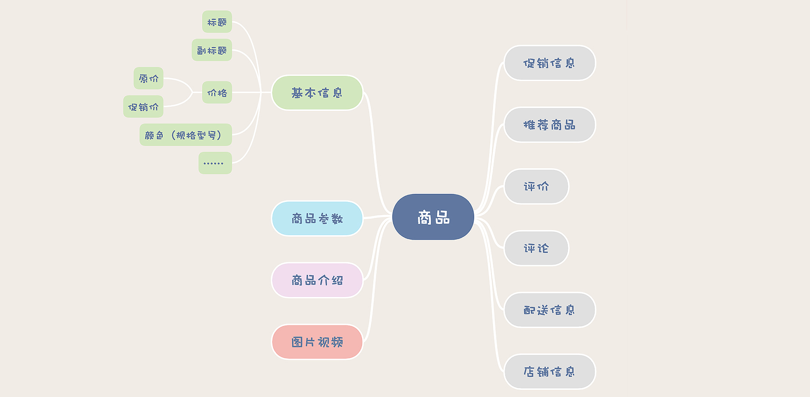

# 01 | 创建和更新订单时，如何保证数据准确无误？

## 如何避免重复下单？

我们可以利用数据库的这种“主键唯一约束”特性，在插入数据的时候带上主键，来解决创建订单服务的幂等性问题。具体的做法是这样的，我们给订单系统增加一个“生成订单号”的服务，这个服务没有参数，返回值就是一个新的、全局唯一的订单号。

这个订单号也是我们订单表的主键，这样，无论是用户手抖，还是各种情况导致的重试，这些重复请求中带的都是同一个订单号。

因为有重试就可能有ABA，ABA 问题怎么解决？这里给你提供一个比较通用的解决方法。给你的订单主表增加一列，列名可以叫 version，也即是“版本号”的意思。每次查询订单的时候，版本号需要随着订单数据返回给页面。页面在更新数据的请求中，需要把这个版本号作为更新请求的参数，再带回给订单更新服务。

# 02 | 流量大、数据多的商品详情页系统该如何设计？



## 商品基本信息该如何存储？

建议你在数据库中建一张表来保存商品的基本信息，然后，还需要在数据库前面，加一个缓存，帮助数据抵挡绝大部分的读请求。这个缓存，你可以使用 Redis，也可以用 Memcached，

设计商品基本信息表的时候，有一点需要提醒你的是，一定要记得保留商品数据的每一个历史版本。


## 使用 MongoDB 保存商品参数

对于商品参数信息，数据量大、数据结构不统一，这些 MongoDB 都可以很好的满足。我们也不需要事务和多表联查，MongoDB 简直就是为了保存商品参数量身定制的一样。

大多数场景下mongo写性能更好一些，ES更容易维护，功能也更丰富，但也有一些缺陷，比如深分页的问题，SQL支持还不是特别完善。

我理解mongo中字段只是个文本，没啥元数据维护，但是ES中每个字段默认要分词要索引，ES master要维护元数据，我在哪看到过ES默认单个索引字段不能超过1000,电商场景字段何止1000,所以这种场景个人认为ES不合适，mongo很合适

## 使用对象存储保存图片和视频

国内的很多云厂商的对象存储对图片和视频，都做了非常多的针对性优化。最有用的是，缩放图片和视频转码，你只要把图片和视频丢到对象存储中，就可以随时获得任意尺寸大小的图片，视频也会自动转码成各种格式和码率的版本，适配各种 App 和场景。我只能说，谁用谁知道，真香！


## 将商品介绍静态化

商详页静态化之后，不仅仅是可以节省服务器资源，还可以利用 CDN 加速，把商详页放到离用户最近的 CDN 服务器上，让商详页访问更快。

至于商品价格、促销信息等这些需要频繁变动的信息，不能静态化到页面中，可以在前端页面使用 AJAX 请求商品系统动态获取。


数据量最大的图片、视频和商品介绍都是从离用户最近的 CDN 服务商获取的，速度快，节约带宽。真正打到商品系统的请求，就是价格这些需要动态获取的商品信息，一般做一次 Redis 查询就可以了，基本不会有流量打到 MySQL 中。这样一个商品系统的存储的架构，把大部分请求都转移到了又便宜速度又快的 CDN 服务器上，可以用很少量的服务器和带宽资源，抗住大量的并发请求。


# 03 | 复杂而又重要的购物车系统，应该如何设计？

在我们这个场景中，使用 Cookie 和 LocalStorage 最关键的区别是，客户端和服务端的每次交互，都会自动带着 Cookie 数据往返，这样服务端可以读写客户端 Cookie 中的数据，而 LocalStorage 里的数据，只能由客户端来访问。

```sql
{
    "cart": [
        {
            "SKUID": 8888,
            "timestamp": 1578721136,
            "count": 1,
            "selected": true
        },
        {
            "SKUID": 6666,
            "timestamp": 1578721138,
            "count": 2,
            "selected": false
        }
    ]
}
```


也可以选择更快的 Redis 来保存购物车数据，以用户 ID 作为 Key，用一个 Redis 的 HASH 作为 Value 来保存购物车中的商品。

考虑到需求总是不断变化，还是更推荐你使用 MySQL 来存储购物车数据。如果追求性能或者高并发，也可以选择使用 Redis。
