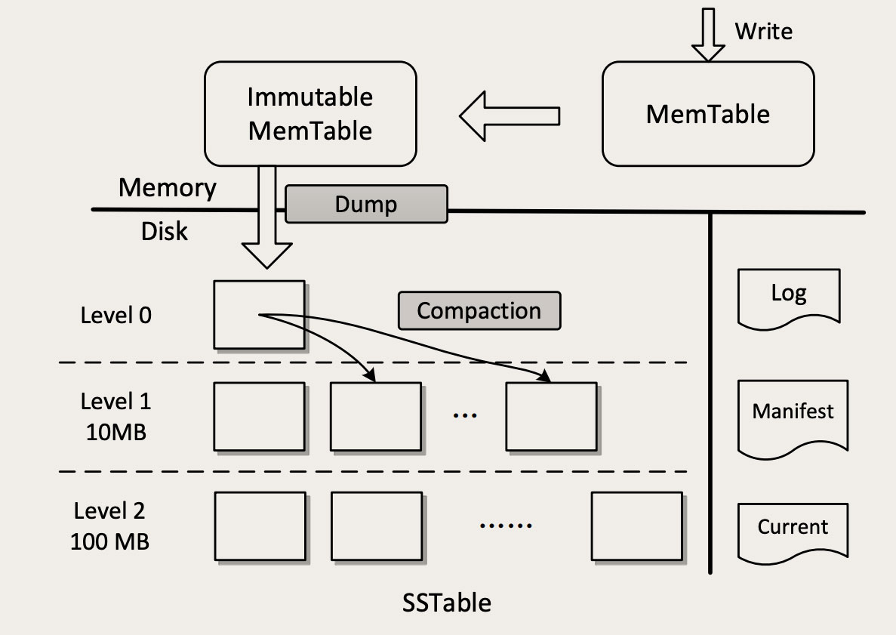

# 01 | 创建和更新订单时，如何保证数据准确无误？

## 如何避免重复下单？

我们可以利用数据库的这种“主键唯一约束”特性，在插入数据的时候带上主键，来解决创建订单服务的幂等性问题。具体的做法是这样的，我们给订单系统增加一个“生成订单号”的服务，这个服务没有参数，返回值就是一个新的、全局唯一的订单号。

这个订单号也是我们订单表的主键，这样，无论是用户手抖，还是各种情况导致的重试，这些重复请求中带的都是同一个订单号。

因为有重试就可能有ABA，ABA 问题怎么解决？这里给你提供一个比较通用的解决方法。给你的订单主表增加一列，列名可以叫 version，也即是“版本号”的意思。每次查询订单的时候，版本号需要随着订单数据返回给页面。页面在更新数据的请求中，需要把这个版本号作为更新请求的参数，再带回给订单更新服务。

# 02 | 流量大、数据多的商品详情页系统该如何设计？


## 商品基本信息该如何存储？

建议你在数据库中建一张表来保存商品的基本信息，然后，还需要在数据库前面，加一个缓存，帮助数据抵挡绝大部分的读请求。这个缓存，你可以使用 Redis，也可以用 Memcached，

设计商品基本信息表的时候，有一点需要提醒你的是，一定要记得保留商品数据的每一个历史版本。


## 使用 MongoDB 保存商品参数

对于商品参数信息，数据量大、数据结构不统一，这些 MongoDB 都可以很好的满足。我们也不需要事务和多表联查，MongoDB 简直就是为了保存商品参数量身定制的一样。

大多数场景下mongo写性能更好一些，ES更容易维护，功能也更丰富，但也有一些缺陷，比如深分页的问题，SQL支持还不是特别完善。

我理解mongo中字段只是个文本，没啥元数据维护，但是ES中每个字段默认要分词要索引，ES master要维护元数据，我在哪看到过ES默认单个索引字段不能超过1000,电商场景字段何止1000,所以这种场景个人认为ES不合适，mongo很合适

## 使用对象存储保存图片和视频

国内的很多云厂商的对象存储对图片和视频，都做了非常多的针对性优化。最有用的是，缩放图片和视频转码，你只要把图片和视频丢到对象存储中，就可以随时获得任意尺寸大小的图片，视频也会自动转码成各种格式和码率的版本，适配各种 App 和场景。我只能说，谁用谁知道，真香！


## 将商品介绍静态化

商详页静态化之后，不仅仅是可以节省服务器资源，还可以利用 CDN 加速，把商详页放到离用户最近的 CDN 服务器上，让商详页访问更快。

至于商品价格、促销信息等这些需要频繁变动的信息，不能静态化到页面中，可以在前端页面使用 AJAX 请求商品系统动态获取。


数据量最大的图片、视频和商品介绍都是从离用户最近的 CDN 服务商获取的，速度快，节约带宽。真正打到商品系统的请求，就是价格这些需要动态获取的商品信息，一般做一次 Redis 查询就可以了，基本不会有流量打到 MySQL 中。这样一个商品系统的存储的架构，把大部分请求都转移到了又便宜速度又快的 CDN 服务器上，可以用很少量的服务器和带宽资源，抗住大量的并发请求。


# 03 | 复杂而又重要的购物车系统，应该如何设计？

在我们这个场景中，使用 Cookie 和 LocalStorage 最关键的区别是，客户端和服务端的每次交互，都会自动带着 Cookie 数据往返，这样服务端可以读写客户端 Cookie 中的数据，而 LocalStorage 里的数据，只能由客户端来访问。

```sql
{
    "cart": [
        {
            "SKUID": 8888,
            "timestamp": 1578721136,
            "count": 1,
            "selected": true
        },
        {
            "SKUID": 6666,
            "timestamp": 1578721138,
            "count": 2,
            "selected": false
        }
    ]
}
```


也可以选择更快的 Redis 来保存购物车数据，以用户 ID 作为 Key，用一个 Redis 的 HASH 作为 Value 来保存购物车中的商品。

考虑到需求总是不断变化，还是更推荐你使用 MySQL 来存储购物车数据。如果追求性能或者高并发，也可以选择使用 Redis。


# 04 | 事务：账户余额总是对不上账，怎么办？


它的本质问题是，**冗余数据的一致性问题**。

1. 流水记录只能新增，一旦记录成功不允许修改和删除。即使是由于正当原因需要取消一笔已经完成的交易，也不应该去删除交易流水。正确的做法是再记录一笔“取消交易”的流水。
2. 流水号必须是递增的，我们需要用流水号来确定交易的先后顺序。


# 05 | 分布式事务：如何保证多个系统间的数据是一致的？

## 2PC：订单与优惠券的数据一致性问题


如果准备阶段成功，进入提交阶段，这个时候就“只有华山一条路”，整个分布式事务只能成功，不能失败。如果发生网络传输失败的情况，需要反复重试，直到提交成功为止。

所以，只有在需要强一致、并且并发量不大的场景下，才考虑使用 2PC。


3PC相比于2PC做了两个改进，一是事务执行器也增加了超时机制，避免我们课程中提到的因为协调者宕机，导致执行器长时间卡死的问题，另外，3PC在2PC之前增加一个询问阶段，这个阶段事务执行器可以去尝试锁定资源（但不等待），这样避免像2PC那样直接去锁定资源，而资源不可用的情况下，一直等待资源而卡住事务的情况。

TCC可以理解为业务层面的2PC（也有观点主张TCC和2PC是完全不同的，我个人建议没必要在这些概念上较真，理解并正确使用才是关键），TCC同样分为Try和Confirm/Cancel 两个阶段，在Try阶段锁定资源，但不执行任何更新操作，Confirm阶段来执行所有更新操作并提交，如果失败进入Cancel阶段。Cancel阶段就是收拾烂摊子，把Confirm阶段做的数据更新都改回去，把Try阶段锁定的资源都释放。相比于2PC，TCC可以不依赖于本地事务，但是Cancel阶段的业务逻辑比较难实现。


## 本地消息表：订单与购物车的数据一致性问题

本地消息表的实现思路是这样的，订单服务在收到下单请求后，正常使用订单库的事务去更新订单的数据，并且，在执行这个数据库事务过程中，在本地记录一条消息。这个消息就是一个日志，内容就是“清空购物车”这个操作。因为这个日志是记录在本地的，这里面没有分布式的问题，那这就是一个普通的单机事务，那我们就可以让订单库的事务，来保证记录本地消息和订单库的一致性。完成这一步之后，就可以给客户端返回成功响应了。


库存系统锁定库存这个操作，虽然可以接受数据最终一致，但是，锁定库存这个操作是有一个前提的，这个前提是：库存中得有货。这种情况就不适合使用本地消息表，不然就会出现用户下单成功后，系统的异步任务去锁定库存的时候，因为缺货导致锁定失败。这种情况要使用orchestrate来协调。


# 06 | 如何用Elasticsearch构建商品搜索系统？


我们来回顾一下使用 ES 构建商品搜索服务的这个过程：首先安装 ES 并启动服务，然后创建一个 INDEX，定义 MAPPING，写入数据后，执行查询并返回查询结果，其实，这个过程和我们使用数据库时，先建表、插入数据然后查询的过程，就是一样的。所以，你就把 ES 当做一个支持全文搜索的数据库来使用就行了。

但是，倒排索引相比于一般数据库采用的 B 树索引，它的写入和更新性能都比较差，因此倒排索引也只是适合全文搜索，不适合更新频繁的交易类数据。


# 07｜MySQL HA：如何将“删库跑路”的损失降到最低？


MySQL 自带了 Binlog，就是一种实时的增量备份。Binlog 里面记录的就是 MySQL 数据的变更的操作日志，开启 Binlog 之后，我们对 MySQL 中的每次更新数据操作，都会被记录到 Binlog 中。

Binlog 是可以回放的，回放 Binlog，就相当于把之前对数据库所有数据更新操作按照顺序重新执行了一遍，回放完成之后数据自然就恢复了。这就是 Binlog 增量备份的基本原理。


```mysql
$mysqlbinlog --start-datetime "2020-02-20 00:00:00" --stop-datetime "2020-02-20 15:09:00" /usr/local/var/mysql/binlog.000001 | mysql -uroot

mysql> select * from  account_balance;
+---------+---------+---------------------+--------+
| user_id | balance | timestamp           | log_id |
+---------+---------+---------------------+--------+
|       0 |     200 | 2020-02-20 15:08:12 |      0 |
+---------+---------+---------------------+--------+
```

## 配置 MySQL HA 实现高可用

MySQL 也支持同步复制，开启同步复制时，MySQL 主库会等待数据成功复制到从库之后，再给客户端返回响应。

为此你需要付出的代价是，你要至少用三台数据库服务器，并且这三台服务器提供的服务性能，还不如一台服务器高。


# 08 | 一个几乎每个系统必踩的坑儿：访问数据库超时


系统能自动恢复，基本可以排除后台服务被大量请求打死的可能性。

第一，在编写 SQL 的时候，一定要小心谨慎地仔细评估。

第二，能不能利用缓存减少数据库查询次数？在使用缓存的时候，还需要特别注意的就是缓存命中率，要尽量避免请求命中不了缓存，穿透到数据库上。


# 09 | 怎么能避免写出慢SQL？


我的经验数据，一般一台 MySQL 服务器，平均每秒钟执行的 SQL 数量在几百左右，就已经是非常繁忙了，即使看起来 CPU 利用率和磁盘繁忙程度没那么高，你也需要考虑给数据库“减负”了。

遍历行数达到千万量级和以上的，我只能告诉你，这种查询就不应该出现在你的系统中。当然我们这里说的都是在线交易系统，离线分析类系统另说。

使用索引避免全表扫描

分析 SQL 执行计划


# 10 | 走进黑盒：SQL是如何在数据库中执行的？


如何对执行计划进行优化，不同的数据库有不同的优化方法，这一块儿也是不同数据库性能有差距的主要原因之一。优化的总体思路是，在执行计划中，尽早地减少必须处理的数据量。也就是说，尽量在执行计划的最内层减少需要处理的数据量。


# 11 | MySQL如何应对高并发（一）：使用缓存保护MySQL


Cache Aside 模式和上面的 Read/Write Through 模式非常像，它们处理读请求的逻辑是完全一样的，唯一的一个小差别就是，Cache Aside 模式在更新数据的时候，并不去尝试更新缓存，而是去删除缓存。


如果系统不能采用灰度发布的方式，那就需要在系统启动的时候对缓存进行预热。所谓的缓存预热就是在系统初始化阶段，接收外部请求之前，先把最经常访问的数据填充到缓存里面，这样大量请求打过来的时候，就不会出现大量的缓存穿透了。

所以，如果说构建缓存数据需要的查询时间太长，或者并发量特别大的时候，Cache Aside 或者是 Read/Write Through 这两种缓存模式都可能出现大量缓存穿透。


Cache Aside 在高并发场景下也会出现数据不一致。
读操作A，没有命中缓存，就会到数据库中取数据v1。
此时来了一个写操作B，将v2写入数据库，让缓存失效；
读操作A在把v1放入缓存，这样就会造成脏数据。因为缓存中是v1，数据库中是v2.


这种概率比较小 因为大多数读都会比写快


# 12 | MySQL如何应对高并发（二）：读写分离


## 读写分离是提升 MySQL 并发的首选方案


分离应用程序的读写请求方法有下面这三种：

1. 纯手工方式：修改应用程序的 DAO 层代码，定义读写两个数据源，指定每一个数据库请求的数据源。
2. 组件方式：也可以使用像 Sharding-JDBC 这种集成在应用中的第三方组件来实现，这些组件集成在你的应用程序内，代理应用程序的所有数据库请求，自动把请求路由到对应数据库实例上。
3. 代理方式：在应用程序和数据库实例之间部署一组数据库代理实例，比如说 Atlas 或者 MaxScale。对应用程序来说，数据库代理把自己伪装成一个单节点的 MySQL 实例，应用程序的所有数据库请求被发送给代理，代理分离读写请求，然后转发给对应的数据库实例。这三种方式，我最推荐的是第二种，使用读写分离组。

如果你配置了多个从库，推荐你使用“HAProxy+Keepalived”这对儿经典的组合，来给所有的从节点做一个高可用负载均衡方案，既可以避免某个从节点宕机导致业务可用率降低，也方便你后续随时扩容从库的实例数量。因为 HAProxy 可以做 L4 层代理，也就是说它转发的是 TCP 请求，所以用“HAProxy+Keepalived”代理 MySQL 请求，在部署和配置上也没什么特殊的地方，正常配置和部署就可以了。HAproxy keepalived是和mysql部署在同一台机器上。


你可以把“更新购物车、重新计算总价”这两个步骤合并成一个微服务，然后放在一个数据库事务中去，**同一个事务中的查询操作也会被路由到主库**，这样来规避主从不一致的问题。

主备延迟怎么解决呢？
1、开启半同步方案
2、尽量在主库里面减少大事务、使用不均匀的话开启写后考虑主库读
3、有能力的话 分库分表
4、增加从库性能
5、如果实在无法追平 从新做从库吧


# 13 | MySQL主从数据库同步是如何实现的？


MySQL 主库在收到客户端提交事务的请求之后，会先写入 Binlog，然后再提交事务，更新存储引擎中的数据，事务提交完成后，给客户端返回操作成功的响应。同时，从库会有一个专门的复制线程，从主库接收 Binlog，然后把 Binlog 写到一个中继日志里面，再给主库返回复制成功的响应。


MySQL 从 5.7 版本开始，增加一种半同步复制（Semisynchronous Replication）的方式。异步复制是，事务线程完全不等复制响应；同步复制是，事务线程要等待所有的复制响应；半同步复制介于二者之间，事务线程不用等着所有的复制成功响应，只要一部分复制响应回来之后，就可以给客户端返回了。


一般情况下，配成默认值 1 也就够了，这样性能损失最小，可用性也很高，只要还有一个从库活着，就不影响主库读写。丢数据的风险也不大，只有在恰好主库和那个有最新数据的从库一起坏掉的情况下，才有可能丢数据。


## 复制状态机：所有分布式存储都是这么复制数据的


无论是复制还是备份恢复，依赖的都是全量备份和 Binlog，全量备份相当于备份那一时刻的一个数据快照，Binlog 则记录了每次数据更新的变化，也就是操作日志。


# 14 | 订单数据越来越多，数据库越来越慢该怎么办？

**解决海量数据导致存储系统慢的问题，思想非常简单，就是一个“拆”字，把一大坨数据拆分成 N 个小坨，学名叫“分片（Shard）”。**

```mysql
select max(id) from orders
where timestamp < SUBDATE(CURDATE(),INTERVAL 3 month);

delete from orders
where id <= ?
order by id limit 1000;
```

这样每次删除的时候，由于条件变成了主键比较，我们知道在 MySQL 的 InnoDB 存储引擎中，表数据结构就是按照主键组织的一颗 B+ 树，而 B+ 树本身就是有序的，所以不仅查找非常快，也不需要再进行额外的排序操作了。当然这样做的前提条件是订单 ID 必须和订单时间正相关才行，大多数订单 ID 的生成规则都可以满足这个条件，所以问题不大。

虽然逻辑上每个表是一颗 B+ 树，但是物理上，每条记录都是存放在磁盘文件中的，这些记录通过一些位置指针来组织成一颗 B+ 树。当 MySQL 删除一条记录的时候，只能是找到记录所在的文件中位置，然后把文件的这块区域标记为空闲，然后再修改 B+ 树中相关的一些指针，完成删除。其实那条被删除的记录还是躺在那个文件的那个位置，所以并不会释放磁盘空间。

重建表的过程中，索引也会重建，这样表数据和索引数据都会更紧凑，不仅占用磁盘空间更小，查询效率也会有提升。那对于频繁插入删除大量数据的这种表，如果能接受锁表，定期执行 OPTIMIZE TABLE 是非常有必要的。

在迁移历史数据过程中，如果可以停服，最快的方式是重建一张新的订单表，然后把三个月内的订单数据复制到新订单表中，再通过修改表名让新的订单表生效。


# 15 | MySQL存储海量数据的最后一招：分库分表


解决查询慢，只要减少每次查询的数据总量就可以了，也就是说，分表就可以解决问题。

解决高并发的问题是需要分库的。

**数据量大，就分表；并发高，就分库。**

范围分片容易产生热点问题，但对查询更友好，适合适合并发量不大的场景；哈希分片比较容易把数据和查询均匀地分布到所有分片中；查表法更灵活，但性能稍差。

# 16 | 用Redis构建缓存集群的最佳实践有哪些？

Redis Cluster 相比于单个节点的 Redis，能保存更多的数据，支持更多的并发，并且可以做到高可用，在单个节点故障的情况下，继续提供服务。

Redis Cluster 是非常适合构建中小规模 Redis 集群。

Redis Cluster 采用了一种去中心化的流言 (Gossip) 协议来传播集群配置的变化。

如何用 Redis 构建超大规模集群？

一种是基于代理的方式，在客户端和 Redis 节点之间，还需要增加一层代理服务。

像开源的 Redis 集群方案twemproxy和Codis，都是这种架构的。


虽然说，这个元数据服务仍然是一个单点，但是它的数据量不大，访问量也不大，相对就比较容易实现。我们可以用 ZooKeeper、etcd 甚至 MySQL 都能满足要求。这个方案应该是最适合超大规模 Redis 集群的方案了，在性能、弹性、高可用几方面表现都非常好，缺点是整个架构比较复杂，客户端不能通用，需要开发定制化的 Redis 客户端，只有规模足够大的企业才负担得起。


相比于代理方案，使用定制客户端的方案性能更好，很多大厂采用的都是类似的架构。

dcaced0a9ce9842ef688c9626accdcda.jpg


# 17 | 大厂都是怎么做MySQL to Redis同步的?

对于像订单服务这类核心的业务，一个可行的方法是，我们启动一个更新订单缓存的服务，接收订单变更的 MQ 消息，然后更新 Redis 中缓存的订单数据。

### 使用 Binlog 实时更新 Redis 缓存

有很多开源的项目就提供了订阅和解析 MySQL Binlog 的功能，下面我们以比较常用的开源项目Canal为例，来演示一下如何实时接收 Binlog 更新 Redis 缓存。

https://github.com/liyue2008/canal-to-redis-example

无论是用 MQ 还是 Canal 来异步更新缓存，对整个更新服务的数据可靠性和实时性要求都比较高，数据丢失或者更新慢了，都会造成 Redis 中的数据与 MySQL 中数据不同步。在把这套方案应用到生产环境中去的时候，需要考虑一旦出现不同步问题时的降级或补偿方案。

1.canal 把消息发到 kafka 中，应用程序监听 topic
2.应用程序收到消息后，根据 id 重新读 mysql
3.增加定时任务来对比数据库和 ES ，redis 中的数据
https://mp.weixin.qq.com/s/DPBgXftVE_cigSzzpA484w


# 18 | 分布式存储：你知道对象存储是如何保存图片文件的吗？


随着云计算的普及，很多新生代的存储系统，都是原生的分布式系统，它们一开始设计的目标之一就是分布式存储集群，比如说Elasticsearch、Ceph和国内很多大厂推出的新一代数据库，大多都可以做到：

- 近乎无限的存储容量；
- 超高的读写性能；数据高可靠：
- 节点磁盘损毁不会丢数据；
- 实现服务高可用：节点宕机不会影响集群对外提供服务。


在对象存储中，每一个大文件都会被拆成多个大小相等的块儿（Block），一般都会再把块儿聚合一下，放到块儿的容器里面。这里的“容器”就是存放一组块儿的逻辑单元。容器这个名词，没有统一的叫法，比如在ceph中称为 Data Placement，你理解这个含义就行。容器内的块儿数大多是固定的，所以容器的大小也是固定的。

当我们请求一个 Key 的时候，网关首先去元数据中查找这个 Key 的元数据。然后根据元数据中记录的对象长度，计算出对象有多少块儿。接下来的过程就可以分块儿并行处理了。对于每个块儿，还需要再去元数据中，找到它被放在哪个容器中。


# 19 | 跨系统实时同步数据，分布式事务是唯一的解决方案吗？


使用 Binlog 和 MQ 构建实时数据同步系统

Canal 和 MQ 这两个环节，由于没什么业务逻辑，性能都非常好。所以，一般容易成为性能瓶颈的就是消费 MQ 的同步程序，因为这些同步程序里面一般都会有一些业务逻辑，而且如果下游的数据库写性能跟不上，表象也是这个同步程序处理性能上不来，消息积压在 MQ 里面。

首先根据下游同步程序的消费能力，计算出需要多少并发；然后设置 MQ 中主题的分区（队列）数量和并发数一致。因为 MQ 是可以保证同一分区内，消息是不会乱序的，所以我们需要把具有因果关系的 Binlog 都放到相同的分区中去，就可以保证同步数据的因果一致性。对应到订单库就是，相同订单号的 Binlog 必须发到同一个分区上。

Canal 自带的分区策略就支持按照指定的 Key，把 Binlog 哈希到下游的 MQ 中去，具体的配置可以看一下Canal 接入 MQ 的文档。


### 如何保证数据同步的实时性

一般容易成为性能瓶颈的就是消费 MQ 的同步程序，因为这些同步程序里面一般都会有一些业务逻辑，而且如果下游的数据库写性能跟不上，表象也是这个同步程序处理性能上不来，消息积压在 MQ 里面。

为了确保数据一致性，Binlog 的顺序很重要，是绝对不能乱序的。

根据下游同步程序的消费能力，计算出需要多少并发；然后设置 MQ 中主题的分区（队列）数量和并发数一致。因为 MQ 是可以保证同一分区内，消息是不会乱序的，所以我们需要把具有因果关系的 Binlog 都放到相同的分区中去，就可以保证同步数据的因果一致性。对应到订单库就是，相同订单号的 Binlog 必须发到同一个分区上。

Canal 自带的分区策略就支持按照指定的 Key，把 Binlog 哈希到下游的 MQ 中去，具体的配置可以看一下Canal 接入 MQ 的文档。


# 21 | 类似“点击流”这样的海量数据应该如何存储？


## 使用 Kafka 存储海量原始数据

Kafka 提供“无限”的消息堆积能力，具有超高的吞吐量，可以满足我们保存原始数据的大部分要求。写入点击流数据的时候，每个原始数据采集服务作为一个生产者，把数据发给 Kafka 就可以了。下游的计算任务，可以作为消费者订阅消息，也可以按照时间或者位点来读取数据。并且，Kafka 作为事实标准，和大部分大数据生态圈的开源软件都有非常好的兼容性和集成度，像 Flink、Spark 等大多计算平台都提供了直接接入 Kafka 的组件。


即使它支持扩容分片数量，也没办法像其他分布式存储系统那样，重新分配数据，把已有分片上的数据迁移一部分到新的分片上。


Kafka 性能高的原因
1.采用批处理的方式提升吞吐量
2.利用了磁盘文件顺序读写性能高的特点在设计存储
3.利用了操作系统的 PageCache 做缓存，减少 IO
4.采用零拷贝技术加速消费流程


## 第二种方案是，使用 HDFS 来存储。

对于保存海量的原始数据这个特定的场景来说，HDFS 的吞吐量是远不如 Kafka 的。

但 HDFS 也有它的优势，第一个优势就是，它能提供真正无限的存储容量，如果存储空间不够了，水平扩容就可以解决。另外一个优势是，HDFS 能提供比 Kafka 更强的数据查询能力。


还有一类是时序数据库（Time Series Databases），比较活跃的项目有InfluxDB和OpenTSDB等。这些时序数据库，不仅有非常好的读写性能，还提供很方便的查询和聚合数据的能力。但是，它们不是什么数据都可以存的，它们专注于类似监控数据这样，有时间特征并且数据内容都是数值的数据。如果你有存储海量监控数据的需求，可以关注一下这些项目。


# 22 | 面对海量数据，如何才能查得更快?

如果数据量级已经超过 MySQL 极限，可以选择一些列式数据库，比如：HBase、Cassandra、ClickHouse，这些产品对海量数据，都有非常好的查询性能，在正确使用的前提下，10GB 量级的数据查询基本上可以做到秒级返回。高性能的代价是功能上的缩水，这些数据库对数据的组织方式都有一些限制，查询方式上也没有 MySQL 那么灵活。大多都需要你非常了解这些产品的脾气秉性，按照预定的姿势使用，才能达到预期的性能。


另外一个值得考虑的选择是 Elasticsearch（ES），ES 对数据组织方式和查询方式的限制，没有其他列式数据库那么死板。也就是说，ES 的查询能力和灵活性是要强于上述这些列式数据库的。在这个级别的几个选手中，我个人强烈建议你优先考虑 ES。但是 ES 有一个缺点，就是你需要给它准备大内存的服务器，硬件成本有点儿高。


数据量级超过 TB 级的时候，对这么大量级的数据做统计分析，无论使用什么存储系统，都快不到哪儿去。这个时候的性能瓶颈已经是磁盘 IO 和网络带宽了。这种情况下，实时的查询和分析肯定做不了。解决的办法都是，定期把数据聚合和计算好，然后把结果保存起来，在需要时对结果再进行二次查询。这么大量级的数据，一般都选择保存在 HDFS 中，配合 Map-Reduce、Spark、Hive 等等这些大数据生态圈产品做数据聚合和计算。

最近很火的 RocksDB、LevelDB，它们的存储结构 LSM-Tree，其实就是日志和跳表的组合，

我们需要根据每一种需求，去专门选择合适的存储系统，定义适合的数据结构，各自解决各自的问题。而不是用一种数据结构，一个数据库去解决所有的问题。

关系型数据库，列式数据库和一些大数据存储系统。对于 TB 量级以下的数据，如果可以接受相对比较贵的硬件成本，ES 是一个不错的选择。


# 23 | MySQL经常遇到的高可用、分片问题，NewSQL是如何解决的？

完整地支持 SQL 和 ACID，提供和 Old SQL 隔离级别相当的事务能力；高性能、高可靠、高可用，支持水平扩容。

Google 的 Cloud Spanner、国产的 OceanBase 以及开源的CockroachDB都属于 New SQL 数据库。


CockroachDB 是开源的 New SQL 数据库。它的存储引擎是一个分布式 KV 存储集群，执行器则大量借鉴了 PostgreSQL 的一些设计和实现，是一个集很多现有数据库和分布式存储系统技术于一身，这样的一个数据库产品。

这里简单说一下Raft协议，Raft是一个分布式一致性协议，在很多分布式系统中，都使用它来保证数据强一致性。它利用复制状态机来解决多个副本数据一致的问题，保证日志复制到半数以上节点才给客户端返回成功。并且，引入了主从心跳机制，当主节点故障时，其它节点能主动发起选举，选出新的主节点。通过复制状态机、心跳和选举机制，来保证集群数据的高可用、高可靠和强一致。


# 24 | RocksDB：不丢数据的高性能KV存储


Flink 的 State 就是一个 KV 的存储，它使用的也是 RocksDB。还有包括 MongoDB、Cassandra 等等很多的数据库，都在开发基于 RocksDB 的存储引擎。


RocksDB 它是一个持久化的 KV 存储，它需要保证每条数据都要安全地写到磁盘上，这也是很多数据库产品的基本要求。这么一比，我们就看出来 RocksDB 的优势了，我们知道，磁盘的读写性能和内存读写性能差着一两个数量级，读写磁盘的 RocksDB，能和读写内存的 Redis 做到相近的性能，这就是 RocksDB 的价值所在了。


LSM-Tree 的全称是：The Log-Structured Merge-Tree，是一种非常复杂的复合数据结构，它包含了 WAL（Write Ahead Log）、跳表（SkipList）和一个分层的有序表（SSTable，Sorted String Table）。




当 LSM-Tree 收到一个写请求，比如说：PUT foo bar，把 Key foo 的值设置为 bar。首先，这条操作命令会被写入到磁盘的 WAL 日志中（图中右侧的 Log），这是一个顺序写磁盘的操作，性能很好。**Level 0 是无序的，所以一般Level只保存很少的几个文件。Level 0的查找顺序就是按照文件的创建顺序倒序查找，也就是从最新的向最旧的查找**

然后数据会被写入到内存中的 MemTable 中，这个 MemTable 就是一个按照 Key 组织的跳表（SkipList），跳表和平衡树有着类似的查找性能，但实现起来更简单一些。写 MemTable 是个内存操作，速度也非常快。数据写入到 MemTable 之后，就可以返回写入成功了。这里面有一点需要注意的是，LSM-Tree 在处理写入的过程中，直接就往 MemTable 里写，并不去查找这个 Key 是不是已经存在了。

MemTable 太大了读写性能都会下降。所以，MemTable 有一个固定的上限大小，一般是 32M。MemTable 写满之后，就被转换成 Immutable MemTable，然后再创建一个空的 MemTable 继续写。这个 Immutable MemTable，也就是只读的 MemTable，它和 MemTable 的数据结构完全一样，唯一的区别就是不允许再写入了。

Immutable MemTable 也不能在内存中无限地占地方，会有一个后台线程，不停地把 Immutable MemTable 复制到磁盘文件中，然后释放内存空间。每个 Immutable MemTable 对应一个磁盘文件，MemTable 的数据结构跳表本身就是一个有序表，写入的文件也是一个按照 Key 排序的结构，这些文件就是 SSTable。把 MemTable 写入 SSTable 这个写操作，因为它是把整块内存写入到整个文件中，这同样是一个顺序写操作。

SSTable 被分为很多层，越往上层，文件越少，越往底层，文件越多。每一层的容量都有一个固定的上限，一般来说，下一层的容量是上一层的 10 倍。当某一层写满了，就会触发后台线程往下一层合并，数据合并到下一层之后，本层的 SSTable 文件就可以删除掉了。合并的过程也是排序的过程，除了 Level 0（第 0 层，也就是 MemTable 直接 dump 出来的磁盘文件所在的那一层。）以外，每一层内的文件都是有序的，文件内的 KV 也是有序的，这样就比较便于查找了。

然后我们再来说 LSM-Tree 如何查找数据。查找的过程也是分层查找，先去内存中的 MemTable 和 Immutable MemTable 中找，然后再按照顺序依次在磁盘的每一层 SSTable 文件中去找，只要找到了就直接返回。这样的查找方式其实是很低效的，有可能需要多次查找内存和多个文件才能找到一个 Key，但实际的效果也没那么差，因为这样一个分层的结构，它会天然形成一个非常有利于查找的情况：越是被经常读写的热数据，它在这个分层结构中就越靠上，对这样的 Key 查找就越快。在内存中缓存 SSTable 文件的 Key，用布隆过滤器避免无谓的查找等来加速查找过程。这样综合优化下来，可以获得相对还不错的查找性能。

通过分析 LSM-Tree 的数据结构可以看出来，这种数据结构还是偏向于写入性能的优化，更适合在线交易类场景，因为在这类场景下，需要频繁写入数据。

标记删除，有墓碑的概念，被删除的条目，如果在memtable里，可以直接通过墓碑标记为删除，如果不在memtable里就插入一条新的删除记录