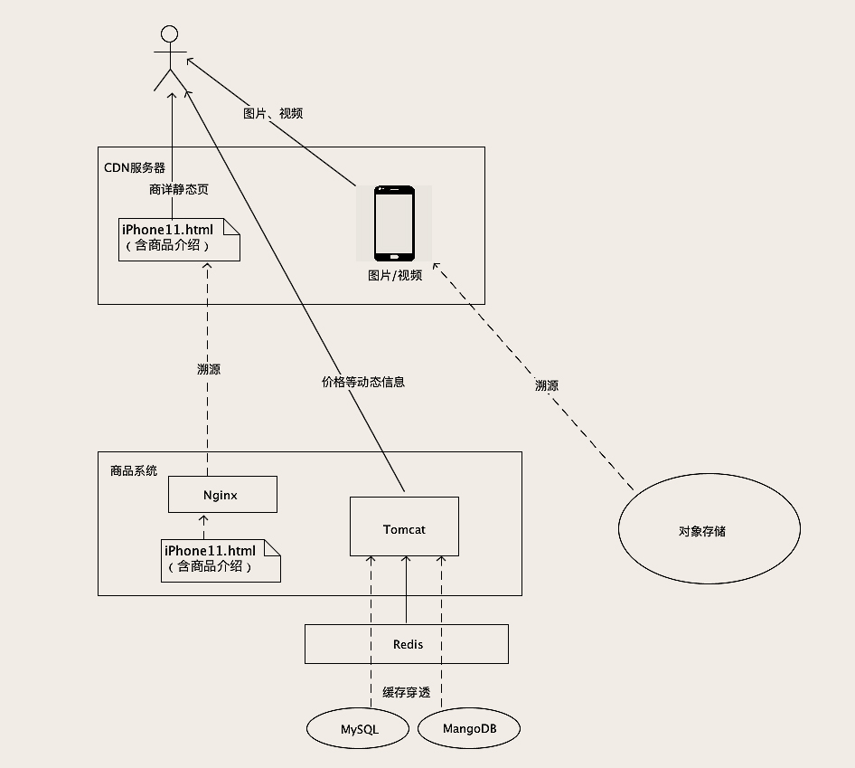

# 01 | 创建和更新订单时，如何保证数据准确无误？

## 如何避免重复下单？

我们可以利用数据库的这种“主键唯一约束”特性，在插入数据的时候带上主键，来解决创建订单服务的幂等性问题。具体的做法是这样的，我们给订单系统增加一个“生成订单号”的服务，这个服务没有参数，返回值就是一个新的、全局唯一的订单号。

这个订单号也是我们订单表的主键，这样，无论是用户手抖，还是各种情况导致的重试，这些重复请求中带的都是同一个订单号。

因为有重试就可能有ABA，ABA 问题怎么解决？这里给你提供一个比较通用的解决方法。给你的订单主表增加一列，列名可以叫 version，也即是“版本号”的意思。每次查询订单的时候，版本号需要随着订单数据返回给页面。页面在更新数据的请求中，需要把这个版本号作为更新请求的参数，再带回给订单更新服务。

# 02 | 流量大、数据多的商品详情页系统该如何设计？


## 商品基本信息该如何存储？

建议你在数据库中建一张表来保存商品的基本信息，然后，还需要在数据库前面，加一个缓存，帮助数据抵挡绝大部分的读请求。这个缓存，你可以使用 Redis，也可以用 Memcached，

设计商品基本信息表的时候，有一点需要提醒你的是，一定要记得保留商品数据的每一个历史版本。


## 使用 MongoDB 保存商品参数

对于商品参数信息，数据量大、数据结构不统一，这些 MongoDB 都可以很好的满足。我们也不需要事务和多表联查，MongoDB 简直就是为了保存商品参数量身定制的一样。

大多数场景下mongo写性能更好一些，ES更容易维护，功能也更丰富，但也有一些缺陷，比如深分页的问题，SQL支持还不是特别完善。

我理解mongo中字段只是个文本，没啥元数据维护，但是ES中每个字段默认要分词要索引，ES master要维护元数据，我在哪看到过ES默认单个索引字段不能超过1000,电商场景字段何止1000,所以这种场景个人认为ES不合适，mongo很合适

## 使用对象存储保存图片和视频

国内的很多云厂商的对象存储对图片和视频，都做了非常多的针对性优化。最有用的是，缩放图片和视频转码，你只要把图片和视频丢到对象存储中，就可以随时获得任意尺寸大小的图片，视频也会自动转码成各种格式和码率的版本，适配各种 App 和场景。我只能说，谁用谁知道，真香！


## 将商品介绍静态化

商详页静态化之后，不仅仅是可以节省服务器资源，还可以利用 CDN 加速，把商详页放到离用户最近的 CDN 服务器上，让商详页访问更快。

至于商品价格、促销信息等这些需要频繁变动的信息，不能静态化到页面中，可以在前端页面使用 AJAX 请求商品系统动态获取。




数据量最大的图片、视频和商品介绍都是从离用户最近的 CDN 服务商获取的，速度快，节约带宽。真正打到商品系统的请求，就是价格这些需要动态获取的商品信息，一般做一次 Redis 查询就可以了，基本不会有流量打到 MySQL 中。这样一个商品系统的存储的架构，把大部分请求都转移到了又便宜速度又快的 CDN 服务器上，可以用很少量的服务器和带宽资源，抗住大量的并发请求。


# 03 | 复杂而又重要的购物车系统，应该如何设计？

在我们这个场景中，使用 Cookie 和 LocalStorage 最关键的区别是，客户端和服务端的每次交互，都会自动带着 Cookie 数据往返，这样服务端可以读写客户端 Cookie 中的数据，而 LocalStorage 里的数据，只能由客户端来访问。

```sql
{
    "cart": [
        {
            "SKUID": 8888,
            "timestamp": 1578721136,
            "count": 1,
            "selected": true
        },
        {
            "SKUID": 6666,
            "timestamp": 1578721138,
            "count": 2,
            "selected": false
        }
    ]
}
```


也可以选择更快的 Redis 来保存购物车数据，以用户 ID 作为 Key，用一个 Redis 的 HASH 作为 Value 来保存购物车中的商品。

考虑到需求总是不断变化，还是更推荐你使用 MySQL 来存储购物车数据。如果追求性能或者高并发，也可以选择使用 Redis。


# 04 | 事务：账户余额总是对不上账，怎么办？


它的本质问题是，**冗余数据的一致性问题**。

1. 流水记录只能新增，一旦记录成功不允许修改和删除。即使是由于正当原因需要取消一笔已经完成的交易，也不应该去删除交易流水。正确的做法是再记录一笔“取消交易”的流水。
2. 流水号必须是递增的，我们需要用流水号来确定交易的先后顺序。


# 05 | 分布式事务：如何保证多个系统间的数据是一致的？

## 2PC：订单与优惠券的数据一致性问题


如果准备阶段成功，进入提交阶段，这个时候就“只有华山一条路”，整个分布式事务只能成功，不能失败。如果发生网络传输失败的情况，需要反复重试，直到提交成功为止。

所以，只有在需要强一致、并且并发量不大的场景下，才考虑使用 2PC。


3PC相比于2PC做了两个改进，一是事务执行器也增加了超时机制，避免我们课程中提到的因为协调者宕机，导致执行器长时间卡死的问题，另外，3PC在2PC之前增加一个询问阶段，这个阶段事务执行器可以去尝试锁定资源（但不等待），这样避免像2PC那样直接去锁定资源，而资源不可用的情况下，一直等待资源而卡住事务的情况。

TCC可以理解为业务层面的2PC（也有观点主张TCC和2PC是完全不同的，我个人建议没必要在这些概念上较真，理解并正确使用才是关键），TCC同样分为Try和Confirm/Cancel 两个阶段，在Try阶段锁定资源，但不执行任何更新操作，Confirm阶段来执行所有更新操作并提交，如果失败进入Cancel阶段。Cancel阶段就是收拾烂摊子，把Confirm阶段做的数据更新都改回去，把Try阶段锁定的资源都释放。相比于2PC，TCC可以不依赖于本地事务，但是Cancel阶段的业务逻辑比较难实现。


## 本地消息表：订单与购物车的数据一致性问题

本地消息表的实现思路是这样的，订单服务在收到下单请求后，正常使用订单库的事务去更新订单的数据，并且，在执行这个数据库事务过程中，在本地记录一条消息。这个消息就是一个日志，内容就是“清空购物车”这个操作。因为这个日志是记录在本地的，这里面没有分布式的问题，那这就是一个普通的单机事务，那我们就可以让订单库的事务，来保证记录本地消息和订单库的一致性。完成这一步之后，就可以给客户端返回成功响应了。


库存系统锁定库存这个操作，虽然可以接受数据最终一致，但是，锁定库存这个操作是有一个前提的，这个前提是：库存中得有货。这种情况就不适合使用本地消息表，不然就会出现用户下单成功后，系统的异步任务去锁定库存的时候，因为缺货导致锁定失败。这种情况要使用orchestrate来协调。


# 06 | 如何用Elasticsearch构建商品搜索系统？


我们来回顾一下使用 ES 构建商品搜索服务的这个过程：首先安装 ES 并启动服务，然后创建一个 INDEX，定义 MAPPING，写入数据后，执行查询并返回查询结果，其实，这个过程和我们使用数据库时，先建表、插入数据然后查询的过程，就是一样的。所以，你就把 ES 当做一个支持全文搜索的数据库来使用就行了。

但是，倒排索引相比于一般数据库采用的 B 树索引，它的写入和更新性能都比较差，因此倒排索引也只是适合全文搜索，不适合更新频繁的交易类数据。


# 07｜MySQL HA：如何将“删库跑路”的损失降到最低？


MySQL 自带了 Binlog，就是一种实时的增量备份。Binlog 里面记录的就是 MySQL 数据的变更的操作日志，开启 Binlog 之后，我们对 MySQL 中的每次更新数据操作，都会被记录到 Binlog 中。

Binlog 是可以回放的，回放 Binlog，就相当于把之前对数据库所有数据更新操作按照顺序重新执行了一遍，回放完成之后数据自然就恢复了。这就是 Binlog 增量备份的基本原理。


```mysql
$mysqlbinlog --start-datetime "2020-02-20 00:00:00" --stop-datetime "2020-02-20 15:09:00" /usr/local/var/mysql/binlog.000001 | mysql -uroot

mysql> select * from  account_balance;
+---------+---------+---------------------+--------+
| user_id | balance | timestamp           | log_id |
+---------+---------+---------------------+--------+
|       0 |     200 | 2020-02-20 15:08:12 |      0 |
+---------+---------+---------------------+--------+
```

## 配置 MySQL HA 实现高可用

MySQL 也支持同步复制，开启同步复制时，MySQL 主库会等待数据成功复制到从库之后，再给客户端返回响应。

为此你需要付出的代价是，你要至少用三台数据库服务器，并且这三台服务器提供的服务性能，还不如一台服务器高。


# 08 | 一个几乎每个系统必踩的坑儿：访问数据库超时


系统能自动恢复，基本可以排除后台服务被大量请求打死的可能性。

第一，在编写 SQL 的时候，一定要小心谨慎地仔细评估。

第二，能不能利用缓存减少数据库查询次数？在使用缓存的时候，还需要特别注意的就是缓存命中率，要尽量避免请求命中不了缓存，穿透到数据库上。


# 09 | 怎么能避免写出慢SQL？


我的经验数据，一般一台 MySQL 服务器，平均每秒钟执行的 SQL 数量在几百左右，就已经是非常繁忙了，即使看起来 CPU 利用率和磁盘繁忙程度没那么高，你也需要考虑给数据库“减负”了。

遍历行数达到千万量级和以上的，我只能告诉你，这种查询就不应该出现在你的系统中。当然我们这里说的都是在线交易系统，离线分析类系统另说。

使用索引避免全表扫描

分析 SQL 执行计划


# 10 | 走进黑盒：SQL是如何在数据库中执行的？


如何对执行计划进行优化，不同的数据库有不同的优化方法，这一块儿也是不同数据库性能有差距的主要原因之一。优化的总体思路是，在执行计划中，尽早地减少必须处理的数据量。也就是说，尽量在执行计划的最内层减少需要处理的数据量。


# 11 | MySQL如何应对高并发（一）：使用缓存保护MySQL